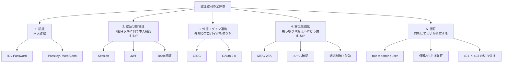
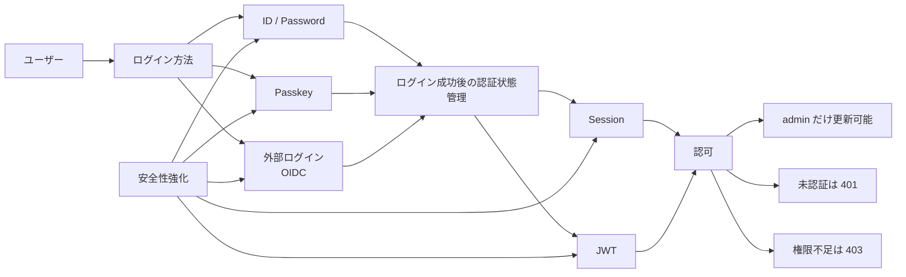
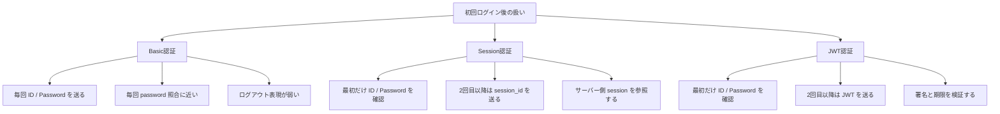
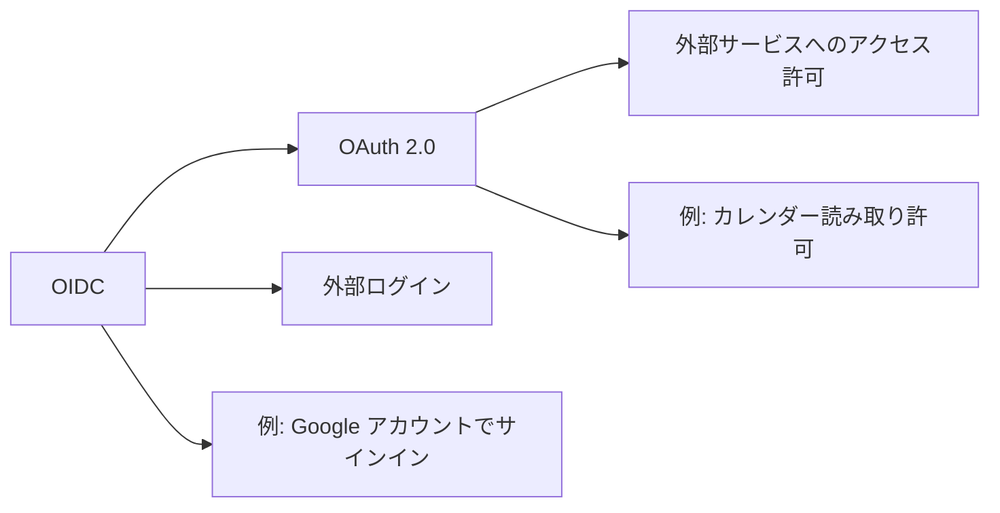
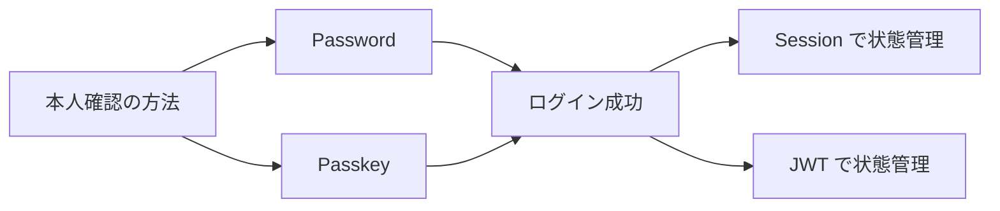

# 認証認可の全体像マップ

このドキュメントは、認証認可まわりの技術が「どの課題を解くものか」を俯瞰するための補助資料です。
README.md の仕様を直接変更するものではなく、Step 25 以降で認証認可を設計するときの整理用に使います。

## 1. まず全体像

認証認可で混ざりやすい論点は、大きく分けると次の 4 層です。

1. 誰であるか確認する
2. ログイン後の状態をどう保持するか
3. 外部の認証基盤とどう連携するか
4. 追加の安全対策をどう入れるか

## 2. 用語の位置づけ

### 認証

認証は「この人は誰か」を確認することです。

- `ID / Password`
  最も基本的な本人確認方法です
- `Passkey / WebAuthn`
  パスワードの代わりに、端末の秘密鍵と生体認証や PIN を使う本人確認方法です

### 認証状態管理

認証状態管理は「最初のログイン成功後、2回目以降に何を見て本人確認するか」です。

- `Session`
  サーバー側にログイン状態を保存し、ブラウザは `session_id` を Cookie で送ります
- `JWT`
  クライアントが署名付き token を持ち、サーバーは token 自体を検証します
- `Basic認証`
  毎回 `ID / Password` 相当を送る方式です。一般的なログイン画面付き Web アプリでは使いづらいです

### 外部ログイン連携

外部ログイン連携は「Google や Microsoft など、外部サービスのログインを借りるか」です。

- `OIDC`
  外部ログインで「誰がログインしたか」を扱うための標準です
- `OAuth 2.0`
  本来は認可の仕組みですが、実際には OIDC とセットで外部ログインの文脈に出てきます

### 安全性強化

安全性強化は「ログインできるだけで終わらず、事故を減らすための追加策」です。

- `MFA / 2FA`
  パスワードに加えて、認証アプリや SMS、セキュリティキーなどを求めます
- メール確認
  初回登録や重要変更時に本人確認を補強します
- 失効や強制ログアウト
  漏えい時の被害範囲を減らします

### 認可

認可は「本人確認できたあとに、何をしてよいか判定すること」です。

- 未認証なら `401 Unauthorized`
- 認証済みでも権限不足なら `403 Forbidden`
- 例: `admin` だけが `POST /api/books` `PUT /api/books/{id}` `DELETE /api/books/{id}` を実行できる

## 3. 技術ごとの関係

「OIDC と OAuth 2.0 を使うのか」「Session と JWT を使うのか」は、同じ比較ではありません。
役割が違うので、縦に積み上がることがあります。

この図で見ると、たとえば次の組み合わせがありえます。

- `ID / Password + Session + MFA`
- `ID / Password + JWT`
- `OIDC + Session`
- `OIDC + JWT`
- `Passkey + Session`

つまり `OIDC` と `Session/JWT` は競合ではなく、連携することがあります。

## 4. Basic認証と Session と JWT の違い

一番混ざりやすい 3 つを並べるとこうなります。

### Basic認証

- 何を送るか: 毎回 `Authorization: Basic ...`
- サーバーは何を見るか: 毎回 `ID / Password` 相当を検証
- 向いているもの: 簡易保護、内部向け API、暫定保護
- 向いていないもの: 一般的なログイン画面付き Web アプリ

### Session認証

- 何を送るか: Cookie の `session_id`
- サーバーは何を見るか: サーバー側に保存した session 情報
- 向いているもの: ブラウザ中心の Web アプリ

### JWT認証

- 何を送るか: `Authorization: Bearer <token>`
- サーバーは何を見るか: token の署名、期限、claims
- 向いているもの: API 中心、モバイル連携、外部クライアント連携

## 5. Session と JWT の比較

| 観点 | Session | JWT |
| --- | --- | --- |
| 2回目以降に送るもの | `session_id` | `JWT token` |
| サーバー側保存 | 必要 | 必須ではない |
| ログアウト | 比較的簡単 | 設計がやや難しい |
| 強制失効 | 比較的簡単 | blacklist や短命 token など追加設計が必要 |
| ブラウザ Web アプリ | 相性が良い | 可能だが設計要素が増える |
| モバイル / 外部 API 連携 | やや不利 | 相性が良い |
| 学習しやすさ | 比較的分かりやすい | やや抽象度が高い |

## 6. OIDC と OAuth 2.0 の関係

ここもよく混ざるので切り分けます。

- `OAuth 2.0`
  外部サービスの資源に対して「このアプリにどこまで許可するか」を扱う仕組みです
- `OIDC`
  `OAuth 2.0` の上に、ログインした利用者が「誰か」を扱う情報を追加した仕組みです

Google ログインのような文脈で必要になるのは、実務上は `OIDC` と考えておくと整理しやすいです。

## 7. Passkey の位置づけ

`Passkey` は Session や JWT の代替ではなく、`ID / Password` の代わりに使うログイン方法です。

- 置き換えるもの: パスワード入力
- 置き換えないもの: ログイン後の認証状態管理

つまり、`Passkey + Session` や `Passkey + JWT` という組み合わせになります。

## 8. MFA の位置づけ

`MFA` は単独の認証状態管理方式ではなく、既存のログイン方式を強くする追加手段です。

例:

- `Password + MFA + Session`
- `Password + MFA + JWT`
- `OIDC + MFA`
- `Passkey + MFA`

MFA は「1要素だけ漏れてもすぐ突破されない」状態を作ります。

## 9. 今回のアプリに当てはめるとどうなるか

現在のアプリは `Next.js + FastAPI + PostgreSQL` の構成で、Step 24 までに `users` テーブルと `password_hash` 保存基盤まで入っています。
その前提だと、まず比較対象になるのは `Session` と `JWT` です。

### 今回の第一候補

- ログイン方法: `ID / Password`
- 認証状態管理: `Session`
- 認可: `admin` のみ更新系 API を許可
- 安全性強化: まずは最小構成、将来 `MFA` を検討

### この方針が合いやすい理由

- 画面付き Web アプリとして理解しやすい
- `login` `logout` `me` を素直に設計しやすい
- Step 24 で作った `users` と `password_hash` をそのまま活かせる
- `Basic認証` より一般的なアプリ体験に近い

## 10. 今回の判断軸

今回の学習では、まず次を順に決めると整理しやすいです。

1. ログイン方法は `ID / Password` のままで進めるか
2. 認証状態管理は `Session` と `JWT` のどちらにするか
3. どの API を認証必須にするか
4. `admin` 以外の role をこの段階で入れるか
5. `MFA` や `OIDC` は今ではなく後続 Step に回すか

現時点では、最小構成としては次が最も自然です。

- `ID / Password + Session + role による認可`

これは「外部ログイン」や「パスワードレス」をまだ入れず、アプリ内認証の基本を先に理解する進め方です。
