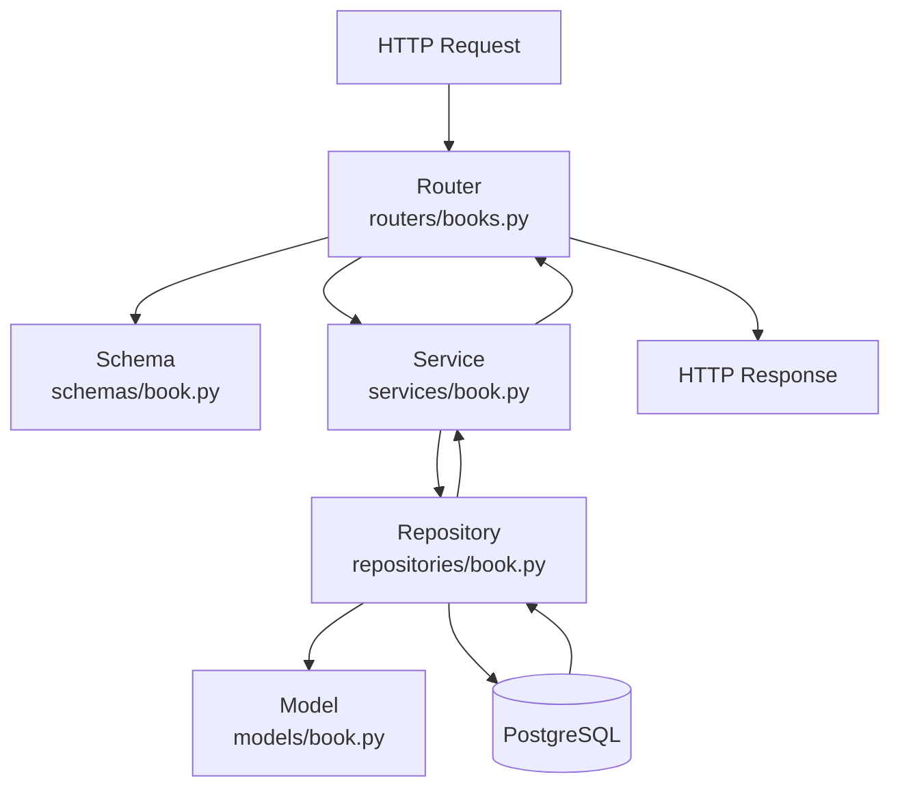
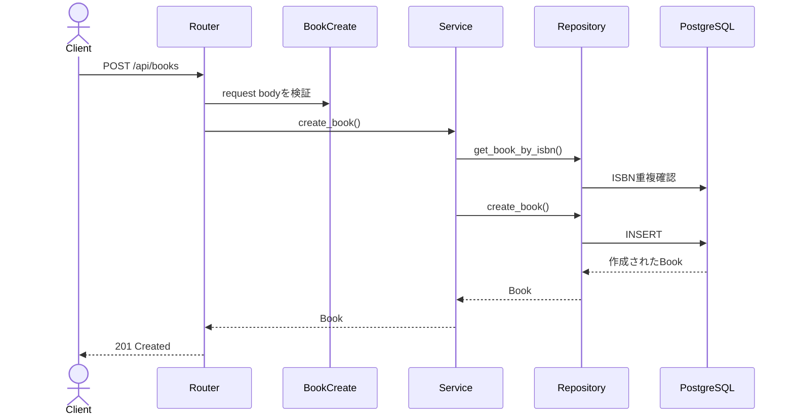
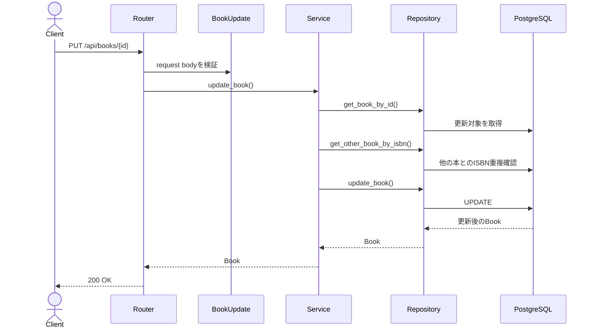

# Backendの層構造

## このファイルの目的

このファイルでは、今回のFastAPI backendで使っている層構造を説明します。

今回のbackendは、主に次の層に分けています。

```text
Router
Schema
Service
Repository
Model
Database
```

実際の処理は、上から下へ流れます。



## 各層の役割

| 層 | ファイル例 | 主な役割 |
| --- | --- | --- |
| Router | `backend/app/routers/books.py` | URL、HTTPメソッド、ステータスコード、HTTP例外を扱う |
| Schema | `backend/app/schemas/book.py` | APIの入力値と出力値の形を定義し、入力値を検証する |
| Service | `backend/app/services/book.py` | 業務ルールを扱う |
| Repository | `backend/app/repositories/book.py` | DBへの読み書きを扱う |
| Model | `backend/app/models/book.py` | DBテーブルの構造をPythonクラスとして定義する |
| Database | PostgreSQL | 実際のデータを保存する |

## Router層

Router層は、APIの入口です。

今回の例では `backend/app/routers/books.py` が該当します。

Router層が担当すること:

- どのURLで受け付けるかを決める
- `GET`、`POST`、`PUT` などのHTTPメソッドを決める
- 正常時のHTTPステータスコードを決める
- Service層で発生した例外を `404` や `409` などのHTTPエラーへ変換する
- FastAPIの `Depends(get_db)` でDBセッションを受け取る

具体例:

```python
@router.get("/{book_id}", response_model=BookResponse)
def get_book_endpoint(
    book_id: int,
    db: Session = Depends(get_db),
) -> Book:
    try:
        return get_book(db, book_id)
    except BookNotFoundError as error:
        raise HTTPException(
            status_code=status.HTTP_404_NOT_FOUND,
            detail="指定された本は見つかりません",
        ) from error
```

この例では、`GET /api/books/{book_id}` を受け取り、Service層の `get_book()` を呼び出しています。

本が存在しない場合、Service層では `BookNotFoundError` を発生させます。Router層はそれをHTTPの `404 Not Found` に変換します。

Router層が直接DB検索をしない理由:

- APIの入口としての責務に集中するため
- DB操作をRepository層へ分けるため
- 業務ルールをService層へ分けるため

## Schema層

Schema層は、APIで受け取るデータと返すデータの形を定義します。

今回の例では `backend/app/schemas/book.py` が該当します。

Schema層が担当すること:

- リクエストボディの形を定義する
- レスポンスの形を定義する
- 文字数、必須項目、数値の範囲などを検証する
- 空白だけの文字列を拒否する
- 空文字のISBNを `None` として扱う

具体例:

```python
class BookCreate(BaseModel):
    title: str = Field(min_length=1, max_length=255)
    author: str = Field(min_length=1, max_length=255)
    published_year: int | None = Field(default=None, ge=1)
    isbn: str | None = Field(default=None, max_length=20)
```

このSchemaにより、次のような入力ルールを保証できます。

- `title` は必須
- `author` は必須
- `published_year` は未入力または1以上の整数
- `isbn` は未入力または20文字以内

更新用Schemaの例:

```python
class BookUpdate(BookCreate):
    pass
```

現時点では、本の登録と更新で同じ入力項目を使うため、`BookUpdate` は `BookCreate` を継承しています。

将来、更新時だけ一部項目を任意にする場合は、`BookUpdate` を別定義に変更できます。

## Service層

Service層は、業務ルールを担当します。

今回の例では `backend/app/services/book.py` が該当します。

Service層が担当すること:

- ISBNが重複していないか確認する
- 存在しない本を検出する
- 作成日時や更新日時を設定する
- Repository層のDB操作を組み合わせる
- DB制約違反を業務上の例外に変換する

具体例:

```python
def update_book(db: Session, book_id: int, book_update: BookUpdate) -> Book:
    book = get_book(db, book_id)

    if (
        book_update.isbn is not None
        and get_other_book_by_isbn(db, book_update.isbn, book_id) is not None
    ):
        raise DuplicateIsbnError()

    now = datetime.now(UTC)

    try:
        return update_book_repository(
            db,
            book,
            book_update,
            updated_at=now,
        )
    except IntegrityError as error:
        db.rollback()
        raise DuplicateIsbnError() from error
```

この例では、更新前に次の確認をしています。

1. 更新対象の本が存在するか
2. 入力されたISBNが、別の本で使われていないか
3. 更新日時を現在時刻にする
4. Repository層へ更新処理を依頼する

Service層が必要な理由:

- Router層に業務ルールを書くと、API入口が複雑になる
- Repository層に業務ルールを書くと、DB操作とルールが混ざる
- Service層にまとめると、「この機能で何を保証するか」が読みやすくなる

## Repository層

Repository層は、DBアクセスを担当します。

今回の例では `backend/app/repositories/book.py` が該当します。

Repository層が担当すること:

- `SELECT` でデータを取得する
- `INSERT` でデータを登録する
- `UPDATE` でデータを更新する
- SQLAlchemyの `Session` を使ってDBへ問い合わせる
- DBから取得したSQLAlchemy Modelを返す

具体例:

```python
def get_book_by_id(db: Session, book_id: int) -> Book | None:
    return db.get(Book, book_id)
```

この関数は、Primary Keyである `id` を使って `books` テーブルから1件取得します。

更新処理の例:

```python
def update_book(
    db: Session,
    book: Book,
    book_update: BookUpdate,
    updated_at: datetime,
) -> Book:
    update_values = book_update.model_dump()

    for field_name, value in update_values.items():
        setattr(book, field_name, value)

    book.updated_at = updated_at
    db.commit()
    db.refresh(book)
    return book
```

この関数は、既存の `Book` Modelに新しい値を反映し、DBへ保存します。

Repository層では、基本的にHTTPステータスコードや画面表示のことは考えません。DBに対して何を読むか、何を書き込むかに集中します。

## Model層

Model層は、DBテーブルの構造をPythonクラスで表します。

今回の例では `backend/app/models/book.py` が該当します。

Model層が担当すること:

- テーブル名を定義する
- カラム名を定義する
- カラムの型を定義する
- `NOT NULL` や `UNIQUE` などのDB制約を定義する

具体例:

```python
class Book(Base):
    __tablename__ = "books"

    id = Column(Integer, primary_key=True, index=True)
    title = Column(String(255), nullable=False)
    author = Column(String(255), nullable=False)
    published_year = Column(Integer, nullable=True)
    isbn = Column(String(20), nullable=True, unique=True)
```

この設計では、Primary Keyは `id` です。

`isbn` はPrimary Keyではありません。`isbn` は未入力を許可するため、`nullable=True` にしています。ただし、入力された場合は重複しないように `unique=True` を設定しています。

## 具体例: 本を登録する流れ



処理の分担:

| 層 | この処理でやること |
| --- | --- |
| Router | `POST /api/books` を受け取る |
| Schema | 入力値を検証する |
| Service | ISBN重複を確認し、作成日時と更新日時を決める |
| Repository | DBへINSERTする |
| Model | `books` テーブルの形を表す |

## 具体例: 本を更新する流れ



更新時に重要な点:

- 更新対象の本が存在しない場合は `404`
- ISBNが他の本と重複する場合は `409`
- 入力値が不正な場合は `422`
- 更新成功時は `200 OK`

## 各層に書かないほうがよいこと

| 層 | 書かないほうがよいこと |
| --- | --- |
| Router | SQLAlchemyの細かいSELECT/UPDATE処理 |
| Schema | DB検索やISBN重複確認 |
| Service | HTTPレスポンスのHTMLや画面表示 |
| Repository | HTTPステータスコードやFastAPIの `HTTPException` |
| Model | APIのエラーメッセージや画面表示ルール |

## この構成で保証できること

- APIの入口、業務ルール、DB操作を分けて読める
- どこで入力検証しているか追いやすい
- どこでDBにアクセスしているか追いやすい
- 同じService処理を、Router以外からも確認しやすい
- 機能追加時に変更する場所を判断しやすい

## この構成だけでは保証できないこと

- 自動テストが十分にあること
- 複数ユーザーが同時更新した場合の競合解決
- 認証されたユーザーだけが操作できること
- DB障害時の高度な復旧

これらは別のStepや追加仕様で扱う内容です。

## 実装部分のコードレベル説明

このbackendを読むときは、HTTP入口からDBまでを次の順番で追います。

1. `backend/app/routers/books.py`
2. `backend/app/schemas/book.py`
3. `backend/app/services/book.py`
4. `backend/app/repositories/book.py`
5. `backend/app/models/book.py`
6. `backend/app/database.py`

### Routerで見ること

```python
@router.put("/{book_id}", response_model=BookResponse)
def update_book_endpoint(
    book_id: int,
    book_update: BookUpdate,
    db: Session = Depends(get_db),
) -> Book:
    return update_book(db, book_id, book_update)
```

Routerでは、デコレーターを最初に確認します。
`@router.get("")`、`@router.post("")`、`@router.put("/{book_id}")`、`@router.delete("/{book_id}")` が、URLとHTTPメソッドの入口です。

関数引数に `book_create: BookCreate` や `book_update: BookUpdate` がある場合、FastAPIはリクエスト本文をSchemaで検証します。
`db: Session = Depends(get_db)` がある場合、`database.py` の `get_db()` からDBセッションが渡されます。

Router内の `try/except` は、Service層の例外をHTTPステータスへ変換する場所です。
例えば `BookNotFoundError` は `404`、`DuplicateIsbnError` は `409` に変換します。

### Schemaで見ること

```python
class BookCreate(BaseModel):
    title: str = Field(min_length=1, max_length=255)
    author: str = Field(min_length=1, max_length=255)
    published_year: int | None = Field(default=None, ge=1)
```

Schemaでは、`Field(...)` と `field_validator` を確認します。
`Field(min_length=1, max_length=255)` は文字数制限、`Field(default=None, ge=1)` は未入力許可と数値範囲を表します。

`field_validator` は、型だけでは表せない整形や検証です。
このプロジェクトでは、空白だけの `title` / `author` を拒否し、空文字の `isbn` を `None` に変換します。

### Serviceで見ること

```python
def update_book(db: Session, book_id: int, book_update: BookUpdate) -> Book:
    book = get_book(db, book_id)
    return update_book_repository(db, book, book_update, updated_at=datetime.now(UTC))
```

Serviceでは、業務上の判断を確認します。
`create_book()` はISBN重複を確認してから作成し、`update_book()` は存在確認とISBN重複確認をしてから更新し、`delete_book()` は存在確認をしてから削除します。

Service層の例外は、まだHTTPエラーではありません。
`BookNotFoundError` や `DuplicateIsbnError` は、このプロジェクト内の業務例外です。
HTTPステータスへ変換するのはRouter層です。

### Repositoryで見ること

```python
def list_books(db: Session) -> list[Book]:
    statement = select(Book).order_by(Book.id)
    return list(db.scalars(statement).all())
```

Repositoryでは、実際のSQLAlchemy操作を確認します。
`select(Book).where(...)` はSELECT条件、`db.add(book)` はINSERT準備、`setattr(book, field_name, value)` はUPDATE対象の属性変更、`db.delete(book)` はDELETE準備です。

`db.commit()` が実行されるまで、登録・更新・削除はDBへ確定しません。
`db.refresh(book)` は、DB確定後の値をPythonオブジェクトへ再読み込みする処理です。

### Modelで見ること

```python
class Book(Base):
    __tablename__ = "books"
    id: Mapped[int] = mapped_column(Integer, primary_key=True, autoincrement=True)
    title: Mapped[str] = mapped_column(String(255), nullable=False)
```

Modelでは、DBテーブルの形を確認します。
`__tablename__` がテーブル名、`mapped_column(...)` が各カラム、`CheckConstraint` がDB制約です。

APIの入力項目とDBカラムは似ていますが、完全に同じ役割ではありません。
SchemaはAPIの境界で検証し、ModelはDBの保存構造と制約を表します。

### Databaseで見ること

```python
engine: Engine = create_engine(get_database_url(), pool_pre_ping=True)
SessionLocal = sessionmaker(bind=engine, autocommit=False, autoflush=False)

def get_db() -> Generator[Session, None, None]:
    db = SessionLocal()
    try:
        yield db
    finally:
        db.close()
```

`database.py` では、DB接続とセッションの作り方を確認します。
`engine` はDB接続の入口、`SessionLocal` はDB操作セッションを作る工場、`get_db()` はFastAPIへセッションを渡す依存関数です。

コードを読むときは、まずRouterの対象endpointを見つけ、その中で呼ばれるService関数へ進み、Service内で呼ばれるRepository関数を追い、最後にModelのカラム定義を見ると流れをつかみやすいです。
