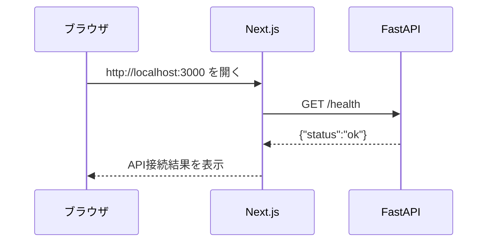
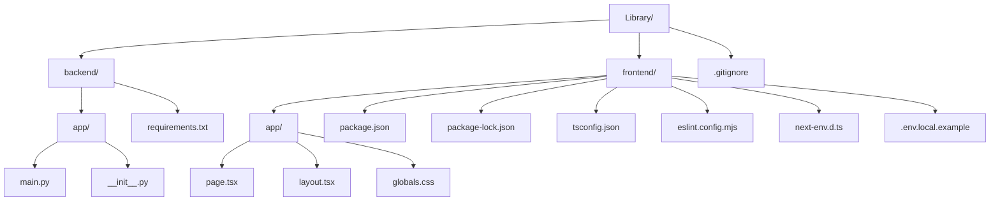
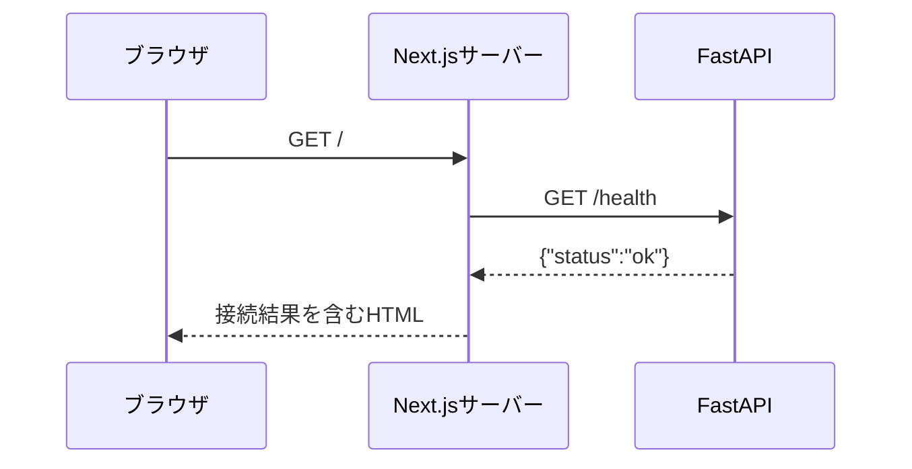
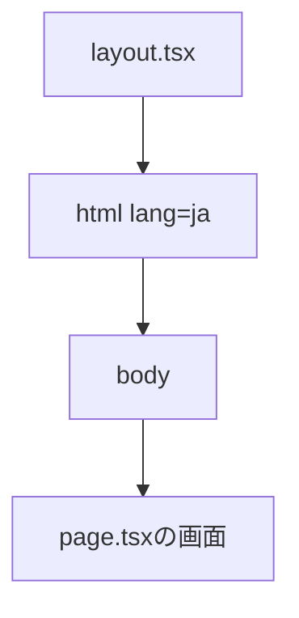

# Step 0: Next.jsとFastAPIの疎通確認

## このドキュメントの役割

本ドキュメントには、Step 0の操作手順、起動手順、学習に必要な技術的補足を記載します。

各ドキュメントの責務は次のとおりです。

| ドキュメント | 役割 |
| --- | --- |
| `README.md` | システムの方針と仕様 |
| `ELPLANATION/EXPLANATION_STEP{番号}.md` | 各Stepの操作・起動手順と技術的な補足説明 |
| `LEARNING_ROADMAP.md` | 学習する順序と各Stepの完了条件 |
| `LEARNING_PROGRESS.md` | 学習状況、理解度、問題と解決方法 |

## Step 0: ローカル起動

### 1. バックエンドを起動する

以下のコマンドは連結せず、1行入力するたびにEnterキーを押して実行します。

PowerShellでプロジェクトの `backend` ディレクトリへ移動します。

```powershell
cd backend
```

Pythonの仮想環境を作成します。仮想環境を使うと、このプロジェクトで利用するPythonパッケージを他のプロジェクトから分離できます。

```powershell
python -m venv .venv
```

初回作成時は、仮想環境内へpipを準備する `ensurepip` に時間がかかることがあります。コマンドの入力待ちを示すプロンプトが戻るまでは、処理を中断せずに待ちます。

仮想環境を有効にします。

```powershell
.\.venv\Scripts\Activate.ps1
```

必要なパッケージをインストールします。

```powershell
pip install -r requirements.txt
```

FastAPIを起動します。

```powershell
python -m uvicorn app.main:app --reload
```

起動後に次のURLを確認します。

| URL | 確認内容 |
| --- | --- |
| `http://localhost:8000/health` | `{"status":"ok"}` が表示される |
| `http://localhost:8000/docs` | Swagger UIが表示される |

### 2. フロントエンドを起動する

バックエンドを起動したまま、別のPowerShellを開きます。

以下のコマンドも、1行ずつ実行します。

```powershell
cd frontend
npm install
npm run dev
```

ブラウザで `http://localhost:3000` を開き、「API接続成功」と表示されることを確認します。

フロントエンドは `NEXT_PUBLIC_API_BASE_URL` で指定したFastAPIへ接続します。未設定の場合は `http://localhost:8000` を使用します。

## Step 0: 通信の流れ



### 各処理の担当

| 処理 | 担当 |
| --- | --- |
| 接続確認画面を構成する | `frontend/app/page.tsx` |
| `/health` を呼び出す | `frontend/app/page.tsx` の `getHealth` |
| `/health` のJSONを返す | `backend/app/main.py` の `health_check` |
| ブラウザに結果を表示する | Next.js |

### CORS

CORSは、異なるオリジン間のブラウザ通信を制御する仕組みです。

ローカル開発では、フロントエンドの `http://localhost:3000` とバックエンドの `http://localhost:8000` はポート番号が異なるため、別のオリジンとして扱われます。FastAPI側では、許可するフロントエンドのオリジンを明示しています。

## Step 0で追加したファイル

Step 0では、DBや本のCRUDはまだ実装していません。目的は、Next.jsとFastAPIがHTTPで通信できる最小構成を作ることです。



| ファイル | Step 0での役割 | 今の理解優先度 |
| --- | --- | --- |
| `backend/app/main.py` | FastAPIアプリと `/health` を定義する | 高 |
| `backend/requirements.txt` | Python依存パッケージを定義する | 高 |
| `frontend/app/page.tsx` | APIを呼び、接続結果を表示する | 高 |
| `frontend/app/layout.tsx` | 全画面共通のHTML構造を定義する | 中 |
| `frontend/app/globals.css` | 画面全体の見た目を定義する | 中 |
| `frontend/package.json` | npmパッケージとコマンドを定義する | 高 |
| `frontend/package-lock.json` | 実際に導入した依存バージョンを固定する | 役割だけ理解 |
| `frontend/tsconfig.json` | TypeScriptの検査方法を設定する | 役割だけ理解 |
| `frontend/eslint.config.mjs` | コード品質の検査ルールを設定する | 役割だけ理解 |
| `frontend/next-env.d.ts` | Next.js用の型情報をTypeScriptへ伝える | 役割だけ理解 |
| `frontend/.env.local.example` | 環境変数の記述例を示す | 中 |
| `.gitignore` | Gitで管理しないファイルを指定する | 中 |

## バックエンドのコード

### `backend/app/main.py`

このファイルは、Step 0におけるバックエンドの中心です。

#### FastAPIを読み込む

```python
from fastapi import FastAPI
```

`fastapi` パッケージから `FastAPI` クラスを読み込んでいます。このクラスからAPIアプリケーション本体を作ります。

#### CORS用の機能を読み込む

```python
from fastapi.middleware.cors import CORSMiddleware
```

ブラウザから異なるオリジンのAPIへアクセスできるようにするため、CORSミドルウェアを読み込んでいます。

ミドルウェアは、リクエストがAPI処理へ届く前や、レスポンスが利用者へ返る前に共通処理を挟む仕組みです。

#### FastAPIアプリを作る

```python
app = FastAPI(title="Library API")
```

`app` がFastAPIアプリケーション本体です。

`title` はSwagger UIに表示されるAPI名です。起動コマンドの `app.main:app` の最後の `app` は、この変数を指しています。

```text
app.main:app
│   │    └─ main.py内のapp変数
│   └────── mainモジュール
└────────── appパッケージ
```

#### CORSを設定する

```python
app.add_middleware(
    CORSMiddleware,
    allow_origins=["http://localhost:3000"],
    allow_credentials=True,
    allow_methods=["*"],
    allow_headers=["*"],
)
```

各設定の意味は次のとおりです。

| 設定 | 意味 |
| --- | --- |
| `CORSMiddleware` | CORSの確認とレスポンスヘッダー追加を行う |
| `allow_origins` | 通信を許可するフロントエンドのオリジン |
| `allow_credentials` | Cookieなどの認証情報を含む通信を許可する設定 |
| `allow_methods` | 許可するHTTPメソッド。`*` はすべて |
| `allow_headers` | 許可するHTTPヘッダー。`*` はすべて |

Step 0では学習を単純にするためメソッドとヘッダーをすべて許可しています。本番向けの詳細なCORS制限は今回の対象外です。

`allow_credentials=True` はCORS設定の意味を学ぶための一般的な設定ですが、本システムには認証機能を追加していません。

#### Health APIを定義する

```python
@app.get("/health")
def health_check() -> dict[str, str]:
    return {"status": "ok"}
```

このコードは2つの部分に分かれます。

```python
@app.get("/health")
```

これはデコレーターです。直後の関数を「`GET /health` を受け取ったときに実行する処理」としてFastAPIへ登録します。

```python
def health_check() -> dict[str, str]:
```

`health_check` 関数を定義しています。`-> dict[str, str]` は、文字列のキーと文字列の値を持つ辞書を返すという型ヒントです。

```python
return {"status": "ok"}
```

Pythonの辞書を返しています。FastAPIが自動的に次のJSONへ変換します。

```json
{
  "status": "ok"
}
```

このAPIはDBを確認していません。Step 0ではFastAPIプロセスが起動し、HTTPへ応答できることだけを確認します。

### `backend/app/__init__.py`

現在は空のファイルです。`app` ディレクトリをPythonパッケージとして扱う意図を明確にします。

`app.main` という形式で `main.py` を読み込む際の土台になります。Python 3では空でも動く場合がありますが、初心者がパッケージ境界を把握しやすいよう配置しています。

### `backend/requirements.txt`

```text
fastapi==0.136.1
uvicorn[standard]==0.46.0
```

Pythonで使用する外部パッケージとバージョンを定義します。

| パッケージ | 役割 |
| --- | --- |
| `fastapi` | APIのURL、入力、出力などを定義するWebフレームワーク |
| `uvicorn` | FastAPIアプリをHTTPサーバーとして起動するASGIサーバー |
| `[standard]` | 自動リロードなどに使う標準的な追加パッケージも導入する指定 |
| `==` | 同じバージョンを再現できるようバージョンを固定する指定 |

FastAPIだけでは待受ポートを開いてHTTP通信を受け付けません。UvicornがFastAPIアプリを読み込み、`localhost:8000` でリクエストを待ち受けます。

## フロントエンドのコード

### `frontend/app/page.tsx`

Next.jsのApp Routerでは、`app/page.tsx` が `/` の画面になります。

```text
frontend/app/page.tsx
            └─────── http://localhost:3000/
```

#### APIレスポンスの型

```typescript
type HealthResponse = {
  status: string;
};
```

FastAPIが返すJSONの形をTypeScriptで表しています。

```json
{"status": "ok"}
```

このJSONには `status` という文字列があるため、TypeScript側も `status: string` と定義します。

型は実行時にJSONを変換する機能ではありません。開発中に項目名の間違いなどを検出しやすくするための情報です。

#### 通信結果の型

```typescript
type HealthResult =
  | { connected: true; health: HealthResponse }
  | { connected: false };
```

API通信には成功と失敗の2状態があります。

| 状態 | データ |
| --- | --- |
| 成功 | `connected: true` とFastAPIからの `health` |
| 失敗 | `connected: false` |

`|` はどちらか一方という意味です。この形式にすると、`connected` を確認した後だけ `health` を安全に使えます。

#### APIを呼び出す関数

```typescript
async function getHealth(): Promise<HealthResult> {
```

`getHealth` はFastAPIへ通信する非同期関数です。

- `async`: 通信完了を待つ処理を含む関数
- `Promise<HealthResult>`: 将来 `HealthResult` を返すことを表す型

#### APIの接続先

```typescript
const apiBaseUrl =
  process.env.NEXT_PUBLIC_API_BASE_URL ?? "http://localhost:8000";
```

まず環境変数 `NEXT_PUBLIC_API_BASE_URL` を確認し、未設定なら `http://localhost:8000` を使います。

`??` は左側が `null` または `undefined` の場合に右側を使う演算子です。

接続先をコードへ完全に固定しないことで、将来APIのURLが変わっても環境変数で切り替えられます。

#### GETリクエスト

```typescript
const response = await fetch(`${apiBaseUrl}/health`, {
  cache: "no-store",
});
```

`fetch` はHTTPリクエストを送る標準的な関数です。URLは次のように組み立てられます。

```text
http://localhost:8000 + /health
= http://localhost:8000/health
```

HTTPメソッドを指定していないためGETになります。

`await` はレスポンスが返るまで、この関数の続きの処理を待ちます。`cache: "no-store"` は、以前の結果を再利用せず毎回APIへ確認する指定です。

#### HTTPステータスの確認

```typescript
if (!response.ok) {
  return { connected: false };
}
```

`response.ok` はHTTPステータスが200番台なら `true` になります。400番台や500番台なら、接続確認失敗として扱います。

サーバーからレスポンスが届いていても、ステータスがエラーなら成功扱いにしないための処理です。

#### JSONを読み取る

```typescript
return {
  connected: true,
  health: await response.json(),
};
```

`response.json()` はレスポンス本文のJSONをJavaScriptの値へ変換します。

FastAPIの `{"status":"ok"}` が、画面側で `result.health.status` として利用できるようになります。

#### 通信例外を扱う

```typescript
} catch {
  return { connected: false };
}
```

FastAPIが起動していない、URLが間違っているなど、HTTPレスポンス自体を受け取れなかった場合に実行されます。

Step 0では利用者向けに接続失敗を表示することが目的なので、詳細なエラー内容は画面へ出していません。エラー設計はCRUD実装時に改めて扱います。

#### 画面を作る関数

```typescript
export default async function Home() {
  const result = await getHealth();
```

`Home` は `/` に表示するReactコンポーネントです。

- `export default`: このファイルの代表となる値としてNext.jsへ公開する
- `async`: API通信の完了を待つために使用する
- `await getHealth()`: 画面を作る前に接続結果を取得する

この `page.tsx` はClient Componentの指定がないため、現在はサーバー側で実行されるServer Componentです。そのため、FastAPIへの `fetch` はNext.jsサーバーから送られます。

ブラウザのNetworkタブでは、ブラウザからFastAPIへの `/health` が直接見えない場合があります。ブラウザはNext.jsへ `/` を要求し、Next.jsが内部でFastAPIへ `/health` を要求するためです。



#### 成功画面と失敗画面

```typescript
if (result.connected) {
```

通信成功なら「API接続成功」と `status` を表示します。失敗なら「API接続失敗」を表示します。

`result.connected` の判定により、成功時だけ `result.health.status` を参照できます。これは先ほど定義した `HealthResult` 型の効果です。

### `frontend/app/layout.tsx`

`layout.tsx` は複数画面で共通になる外枠です。今後 `/books` や `/books/new` を追加しても、このレイアウトの内側に表示されます。

#### 型だけを読み込む

```typescript
import type { Metadata } from "next";
import type { ReactNode } from "react";
```

`import type` はTypeScriptの型情報だけを読み込む指定です。

| 型 | 用途 |
| --- | --- |
| `Metadata` | ページタイトルなどのメタデータ |
| `ReactNode` | レイアウト内に表示できるReact要素 |

#### 共通CSSを読み込む

```typescript
import "./globals.css";
```

アプリ全体へ適用するCSSを読み込みます。

#### メタデータ

```typescript
export const metadata: Metadata = {
  title: "図書管理システム",
  description: "Next.js、FastAPI、PostgreSQLを学ぶ図書管理システム",
};
```

ブラウザのタブ名や検索エンジン向けの説明に使われます。

#### 共通HTML

```tsx
<html lang="ja">
  <body>{children}</body>
</html>
```

`children` の位置に各画面が入ります。トップページでは、`page.tsx` の `Home` が `children` になります。



### `frontend/app/globals.css`

アプリ全体へ適用する見た目を定義します。

| セレクター | 対象 | 主な役割 |
| --- | --- | --- |
| `:root` | HTML全体 | フォント、背景色、文字色 |
| `*` | すべての要素 | サイズ計算を分かりやすくする |
| `body` | 画面全体 | ブラウザ標準の余白を除去する |
| `main` | メイン領域 | 幅、中央配置、枠、背景 |
| `h1` | 見出し | 上側の余白を除去する |
| `.status` | 接続結果欄 | 余白、背景色、角丸 |
| `.success` | 成功見出し | 緑色 |
| `.error` | 失敗見出し | 赤色 |

CSSの詳細はStep 0の主目的ではありません。現時点では「HTML要素や `className` に見た目を割り当てている」と理解できれば十分です。

## フロントエンドの設定ファイル

### `frontend/package.json`

Node.jsプロジェクトの基本情報、実行コマンド、依存パッケージを定義します。

#### scripts

| コマンド | 実際に実行される処理 | 用途 |
| --- | --- | --- |
| `npm run dev` | `next dev` | 開発サーバーを起動する |
| `npm run build` | `next build` | 本番用にコンパイルできるか確認する |
| `npm run start` | `next start` | build済みアプリを起動する |
| `npm run lint` | `eslint .` | コードの問題を検査する |

#### dependencies

| パッケージ | 役割 |
| --- | --- |
| `next` | ルーティングやビルドを含むNext.js本体 |
| `react` | UIをコンポーネントで構築するライブラリ |
| `react-dom` | Reactの画面をブラウザのDOMへ反映する |

#### devDependencies

型検査、Lint、開発支援に必要なパッケージです。アプリの機能そのものより、正しいコードを書くために使います。

### `frontend/package-lock.json`

`npm install` が実際に選んだ全パッケージの正確なバージョンと依存関係を記録します。

`package.json` は直接利用する主要パッケージを表し、`package-lock.json` はそのパッケージが内部で利用するものまで固定します。

このファイルはnpmが自動更新するため、通常は手作業で編集しません。Gitには含めます。

### `frontend/tsconfig.json`

TypeScriptの検査・変換方法を設定します。

Step 0で特に重要なのは次の設定です。

| 設定 | 意味 |
| --- | --- |
| `strict: true` | 型の曖昧さを厳しく検査する |
| `noEmit: true` | TypeScript自身は変換後ファイルを出力しない |
| `jsx: "react-jsx"` | TSXをReactの画面コードとして扱う |
| `plugins: [{ "name": "next" }]` | Next.js用の型検査を有効にする |
| `exclude: ["node_modules"]` | 外部パッケージを自分のコードとして検査しない |

その他の細かな設定は、TypeScriptやビルドを深く学ぶ段階で扱えば十分です。

### `frontend/eslint.config.mjs`

ESLintは、型が正しくても保守性やReactの使い方に問題があるコードを検出します。

```javascript
import nextVitals from "eslint-config-next/core-web-vitals";
import nextTs from "eslint-config-next/typescript";
```

Next.js公式のWeb品質ルールとTypeScriptルールを利用しています。

Step 0の実装中には、try/catch内でJSXを直接構築していたコードがこのLintで検出されました。通信処理から結果を返し、画面生成をtry/catchの外へ分離することで解消しました。

### `frontend/next-env.d.ts`

Next.jsがTypeScriptへ必要な型情報を伝えるためのファイルです。

```typescript
/// <reference types="next" />
/// <reference types="next/image-types/global" />
```

Next.js固有の型や画像インポートの型を利用可能にします。

このファイルはNext.jsが自動生成・更新します。コメントにも記載されているとおり、手作業では編集しません。

### `frontend/.env.local.example`

```env
NEXT_PUBLIC_API_BASE_URL=http://localhost:8000
```

環境変数の名前と設定例を共有するファイルです。

| ファイル | 用途 | Git管理 |
| --- | --- | --- |
| `.env.local.example` | 設定例。秘密情報を入れない | する |
| `.env.local` | 各開発環境で実際に使う値 | しない |

現在はコードに同じURLのフォールバックがあるため、`.env.local` がなくても動作します。

## 自動生成されるディレクトリとファイル

コマンド実行後、直接作成していないディレクトリが増えます。これらの多くはツールが必要に応じて生成したものです。

| 名前 | 生成する処理 | 内容 | Git管理 |
| --- | --- | --- | --- |
| `backend/.venv/` | `python -m venv .venv` | Python本体への参照とインストール済みパッケージ | しない |
| `backend/app/__pycache__/` | Pythonコードの実行 | Pythonが高速に再利用するコンパイル済み情報 | しない |
| `frontend/node_modules/` | `npm install` | npmから導入したパッケージ本体 | しない |
| `frontend/.next/` | `npm run dev`、`npm run build` | Next.jsのビルド結果とキャッシュ | しない |
| `frontend/package-lock.json` | `npm install` | npm依存バージョンの固定情報 | する |

`.venv` と `node_modules` はサイズが大きく、`requirements.txt` と `package-lock.json` から再生成できます。そのためGitへ保存しません。

### `.gitignore`

Gitで追跡しないファイルやディレクトリを指定します。

```text
__pycache__/
*.py[cod]
.venv/
.env
.env.local
frontend/.next/
frontend/node_modules/
```

主な理由は次の3つです。

1. コマンドで再生成できる
2. PCごとに内容が異なる
3. 環境変数には秘密情報が含まれる可能性がある

## Step 0ではまだ扱わないもの

次の内容は、後続Stepで必要になった時点で説明します。

| 内容 | 扱う予定 |
| --- | --- |
| PostgreSQL接続と `DATABASE_URL` | Step 1 |
| SQLAlchemyとDBセッション | Step 1 |
| Alembicとマイグレーション | Step 1、Step 2 |
| `Book` モデルとDBテーブル | Step 2 |
| Pydanticによる本データの検証 | Step 3 |
| CRUD用のrouters、crud、schemas | Step 3以降 |
| フォームの状態管理 | Step 6 |
| APIテストの詳細 | Step 9 |

## Step 0: 確認手順

1. FastAPIを起動する
2. Next.jsを起動する
3. `http://localhost:3000` を開く
4. 「API接続成功」と表示されることを確認する
5. `http://localhost:8000/health` のJSONを確認する
6. `http://localhost:8000/docs` のSwagger UIを確認する

## トラブルシューティング

### venv作成中にKeyboardInterruptが表示される

次のようなトレースバックは、仮想環境内へpipを準備する `ensurepip` の実行中に、Ctrl+Cなどで処理が中断されたことを示します。

```text
self._setup_pip(context)
...
KeyboardInterrupt
```

これはPythonやvenv固有のエラーではなく、処理が外部から中断されたことを表します。

まず、仮想環境内のPythonとpipが作成済みか確認します。

```powershell
.\.venv\Scripts\python.exe --version
.\.venv\Scripts\python.exe -m pip --version
Test-Path .\.venv\Scripts\Activate.ps1
```

Pythonとpipが正常に表示され、`Test-Path` が `True` の場合、仮想環境は利用できます。次のコマンドから再開します。

```powershell
.\.venv\Scripts\python.exe -m pip install -r requirements.txt
```

pipが存在しない、コマンドが失敗する、または `Test-Path` が `False` の場合は、途中生成された `.venv` を削除してから作り直します。Pythonとpipだけが存在しても、有効化スクリプトが欠けている場合があります。

```powershell
Remove-Item -Recurse -Force .venv
python -m venv .venv
```

作成中はPowerShellのプロンプトが戻るまで待ちます。ウイルス対策ソフトによる新規ファイルの検査などで、初回だけ時間がかかる場合があります。

## 実装部分のコードレベル説明

Step 0は疎通確認なので、読む順番は「FastAPIの入口」「Next.jsの画面」「ブラウザ表示」です。

### `backend/app/main.py`

```python
app = FastAPI(title="Library API")

app.add_middleware(
    CORSMiddleware,
    allow_origins=["http://localhost:3000", "http://127.0.0.1:3000"],
    allow_credentials=True,
    allow_methods=["*"],
    allow_headers=["*"],
)

@app.get("/health")
def health_check() -> dict[str, str]:
    return {"status": "ok"}
```

`app = FastAPI(title="Library API")` はFastAPIアプリ本体を作る行です。
以降の `@app.get(...)` や `app.add_middleware(...)` は、この `app` に設定を追加しています。

`app.add_middleware(CORSMiddleware, ...)` は、ブラウザからAPIを呼ぶためのCORS設定です。
`allow_origins` に含まれるURLからの通信だけを許可します。
`allow_methods=["*"]` と `allow_headers=["*"]` により、開発中はGET以外のHTTPメソッドやJSON送信ヘッダーも許可します。

`@app.get("/health")` は `GET /health` の入口です。
`health_check()` は引数を受け取らず、`{"status": "ok"}` という辞書を返します。
FastAPIはこの辞書をJSONレスポンスに変換し、正常系では `200 OK` を返します。

### `frontend/app/page.tsx`

```tsx
const response = await fetch(`${API_BASE_URL}/health`);

if (!response.ok) {
  return <main>API error</main>;
}

const data = await response.json();
return <main>{data.status}</main>;
```

トップページでは、バックエンドの `/health` を呼び出して結果を画面に表示します。
APIのURLを組み立て、`fetch()` でGETリクエストを送り、`response.ok` でHTTPステータスが成功かどうかを確認します。

成功した場合は `response.json()` でJSONを読み取り、画面表示用の値に変換します。
通信に失敗した場合は `catch` に入り、失敗用の表示を返します。

初学者は、`fetch()`、`response.ok`、`response.json()`、成功時JSX、失敗時JSXの順に追うと処理を理解しやすくなります。
