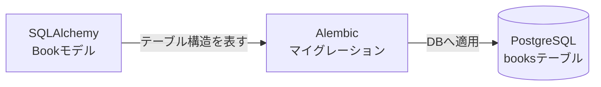

# Step 2: booksテーブルの作成

## このStepで行うこと

SQLAlchemyのモデル定義から、Alembicのマイグレーションを通してPostgreSQLに `books` テーブルを作成します。

## データの流れ



## ファイルの役割

| ファイル | 役割 |
| --- | --- |
| `backend/app/models/book.py` | `books` テーブルに対応するSQLAlchemyモデル |
| `backend/app/models/__init__.py` | モデルをまとめて読み込む入口 |
| `backend/alembic/env.py` | Alembicがモデル情報を読み込む設定 |
| `backend/alembic/versions/bd2452b4d62c_add_books_table.py` | `books` テーブル作成用マイグレーション |

## 作成したテーブル

`books` テーブルには次のカラムを作成しました。

| カラム | 型 | 主な制約 |
| --- | --- | --- |
| `id` | integer | primary key、自動採番 |
| `title` | varchar(255) | not null |
| `author` | varchar(255) | not null |
| `published_year` | integer | null可、1以上 |
| `isbn` | varchar(20) | null可、unique |
| `created_at` | timestamp with time zone | not null |
| `updated_at` | timestamp with time zone | not null |

## 確認したコマンド

マイグレーションを適用します。

```powershell
cd backend
.\.venv\Scripts\python.exe -m alembic upgrade head
```

テーブル構造を確認します。

```powershell
& "C:\Program Files\PostgreSQL\17\bin\psql.exe" -U postgres -h localhost -p 5432 -d library -c "\d books"
```

マイグレーションを取り消して再適用できることも確認しました。

```powershell
.\.venv\Scripts\python.exe -m alembic downgrade base
.\.venv\Scripts\python.exe -m alembic upgrade head
```

## 学ぶポイント

- SQLAlchemyモデルは、PythonコードでDBテーブル構造を表す
- Alembicマイグレーションは、DB構造の変更履歴を残す
- `upgrade` は変更をDBへ適用する
- `downgrade` は変更を取り消す
- `NULL` を許可すると、その項目が未入力でも保存できる
- `UNIQUE` は同じ値の重複登録を防ぐ

## 実装部分のコードレベル説明

### `backend/app/models/book.py`

```python
class Book(Base):
    __tablename__ = "books"
    __table_args__ = (
        CheckConstraint(
            "published_year IS NULL OR published_year >= 1",
            name="ck_books_published_year_positive",
        ),
    )

    id: Mapped[int] = mapped_column(Integer, primary_key=True, autoincrement=True)
    title: Mapped[str] = mapped_column(String(255), nullable=False)
    author: Mapped[str] = mapped_column(String(255), nullable=False)
    published_year: Mapped[int | None] = mapped_column(Integer, nullable=True)
    isbn: Mapped[str | None] = mapped_column(String(20), unique=True, nullable=True)
```

`Book` クラスは `Base` を継承しています。
これにより、SQLAlchemyは `Book` をDBテーブルに対応するモデルとして扱います。

`__tablename__ = "books"` は、このモデルがPostgreSQLの `books` テーブルに対応することを示します。
Python上では `Book`、DB上では `books` という名前で扱います。

`id: Mapped[int] = mapped_column(Integer, primary_key=True, autoincrement=True)` は主キーです。
`primary_key=True` により1件を識別する列になり、`autoincrement=True` によりDBが自動で番号を採番します。

`title` と `author` は `String(255)` かつ `nullable=False` です。
これはDBレベルで未入力を許可しないことを意味します。
API側の入力検証だけでなく、DB側でも不完全なレコードを防ぐ二重の防御になります。

`published_year` は `int | None` かつ `nullable=True` です。
未入力の場合は `NULL` として保存できます。
ただし `CheckConstraint("published_year IS NULL OR published_year >= 1")` により、値が入る場合は1以上だけを許可します。

`isbn` は `String(20)`、`unique=True`、`nullable=True` です。
`NULL` は許可するためISBN未入力の本は複数登録できますが、ISBNが入力された場合は同じ値を複数登録できません。

`created_at` と `updated_at` は `DateTime(timezone=True)` です。
API利用者が直接入力する値ではなく、service層が現在日時を設定します。

### `backend/alembic/versions/bd2452b4d62c_add_books_table.py`

```python
def upgrade() -> None:
    op.create_table(
        "books",
        sa.Column("id", sa.Integer(), autoincrement=True, nullable=False),
        sa.Column("title", sa.String(length=255), nullable=False),
        sa.Column("author", sa.String(length=255), nullable=False),
        sa.Column("published_year", sa.Integer(), nullable=True),
        sa.Column("isbn", sa.String(length=20), nullable=True),
    )

def downgrade() -> None:
    op.drop_table("books")
```

`upgrade()` はDBへ変更を適用する関数です。
`op.create_table("books", ...)` の中で、`Book` モデルに対応する列、主キー、UNIQUE制約、CHECK制約を作成します。

`downgrade()` は変更を戻す関数です。
`op.drop_table("books")` により、`upgrade()` で作った `books` テーブルを削除します。

初学者が読む順番は、`Book` クラスの列定義、`__table_args__` の制約、マイグレーションの `upgrade()`、`downgrade()` です。
