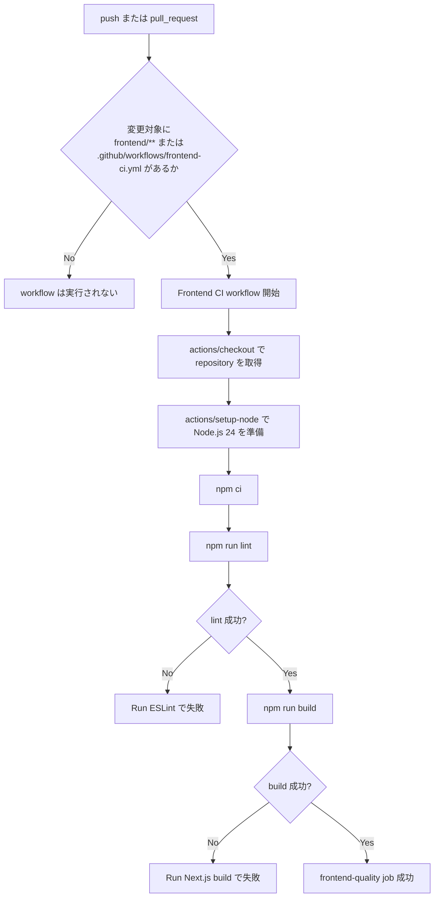

# Step 20: frontend の CI 導入

## このStepでやったこと

Step 20 では、`frontend` でローカル実行していた lint と build を GitHub Actions に移し、画面側の基本品質を継続的に確認できるようにした。  
今回は backend CI と分離し、frontend だけの変更でも独立して失敗箇所を追える構成にした。

## 追加・変更したファイル

| ファイル | 役割 |
| --- | --- |
| `.github/workflows/frontend-ci.yml` | GitHub Actions 上で frontend の install、lint、build を順番に実行する workflow |
| `ELPLANATION/EXPLANATION_STEP20.md` | Step 20 の意図、workflow の読み方、確認コマンド、GitHub 上の確認手順を残す |
| `LEARNING_PROGRESS.md` | Step 19 を完了扱いに更新し、Step 20 の進捗を記録する |
| `LEARNING_ROADMAP.md` | CI導入チェックリストの Step 19 完了状態を反映する |

## GitHub Actions の処理フロー



この flow で確認したいことは次の通り。

- frontend 変更時だけ CI を動かし、backend CI と責務を分ける
- `npm ci` で lockfile ベースの再現可能な install を行う
- `npm run lint` で ESLint の違反を検出する
- `npm run build` で Next.js の型チェックと本番ビルドを確認する

## 実装部分のコードレベル説明

### `.github/workflows/frontend-ci.yml`

```yaml
name: Frontend CI

on:
  push:
    paths:
      - ".github/workflows/frontend-ci.yml"
      - "frontend/**"
  pull_request:
    paths:
      - ".github/workflows/frontend-ci.yml"
      - "frontend/**"
```

このコードで何が起きているか

- 入口は GitHub 上の `push` と `pull_request`
- `paths` を絞ることで、`frontend` に関係ない変更では workflow を起動しない
- backend 用の workflow と分けることで、「Python 側の失敗」か「Next.js 側の失敗」かを run 単位で切り分けやすくしている
- 保証できることは、frontend 変更時にだけ CI が走ること
- 保証できないことは、ブラウザ上の動作そのもの。画面操作は Step 21 の E2E CI で扱う

### `.github/workflows/frontend-ci.yml`

```yaml
jobs:
  frontend-quality:
    runs-on: ubuntu-latest
    defaults:
      run:
        working-directory: frontend

    steps:
      - name: Checkout repository
        uses: actions/checkout@v5

      - name: Set up Node.js
        uses: actions/setup-node@v4
        with:
          node-version: "24"
          cache: "npm"
          cache-dependency-path: frontend/package-lock.json

      - name: Install dependencies
        run: npm ci

      - name: Run ESLint
        run: npm run lint

      - name: Run Next.js build
        run: npm run build
```

このコードで何が起きているか

- `frontend-quality` job がこの workflow の本体
- `working-directory: frontend` を指定しているので、各 `run` は `frontend` ディレクトリを起点に実行される
- `actions/checkout@v5` は repository のコード取得を担当する
- `actions/setup-node@v4` は Node.js 24 を準備し、`frontend/package-lock.json` をキーに npm cache を使う
- `npm ci` は lockfile に固定された依存関係をそのまま install する
- `npm run lint` は `frontend/package.json` の `lint` script を呼び出し、ESLint の違反を検出する
- `npm run build` は Next.js の本番 build を実行し、TypeScript エラーや build 時エラーを検出する
- 正常系では install → lint → build の順に進む
- 異常系では最初に失敗した step で job が停止するため、失敗箇所を step 名で判断できる

### `frontend/package.json`

```json
"scripts": {
  "dev": "next dev",
  "build": "next build",
  "start": "next start",
  "lint": "eslint .",
  "pretest:e2e": "next build",
  "test:e2e": "powershell -ExecutionPolicy Bypass -File ./scripts/run-e2e.ps1"
}
```

このコードで何が起きているか

- CI から直接呼ぶのは `lint` と `build`
- `lint` は `eslint .` を実行し、frontend 配下の TypeScript / Next.js コードを静的解析する
- `build` は `next build` を実行し、production build が成立するかを確認する
- 今回の Step 20 では `test:e2e` は使わない
- 理由は、この Step の責務が「静的解析と build の自動化」であり、ブラウザ操作を含む E2E は Step 21 で Docker Compose と合わせて扱うため

## ローカル確認コマンド

目的: frontend の ESLint が通ることを確認する  
実行ディレクトリ: `C:\Users\rnm21\AI_Coding_study\Library\frontend`

```powershell
npm run lint
```

目的: frontend の本番 build が通ることを確認する  
実行ディレクトリ: `C:\Users\rnm21\AI_Coding_study\Library\frontend`

```powershell
npm run build
```

## GitHub 上で行う確認手順

### push して Actions を実行する手順

1. `.github/workflows/frontend-ci.yml` と関連ドキュメントを commit して GitHub に push する
2. GitHub の repository 画面で `Actions` タブを開く
3. 一覧に `Frontend CI` workflow が表示されることを確認する
4. 最新 run を開き、`frontend-quality` job が開始されていることを確認する
5. `Install dependencies` `Run ESLint` `Run Next.js build` の順に step が進むことを確認する

### GitHub 上で確認する画面と期待結果

- 確認画面: repository の `Actions` タブ
  - 期待結果: `Frontend CI` の workflow run が追加されている
- 確認画面: workflow run 詳細画面
  - 期待結果: `frontend-quality` job が表示されている
- 確認画面: job の step 一覧
  - 期待結果: `Set up Node.js` `Install dependencies` `Run ESLint` `Run Next.js build` が順番に成功する
- 失敗時の見方:
  - `Install dependencies` が失敗した場合は `package-lock.json` と `package.json` の整合性を疑う
  - `Run ESLint` が失敗した場合は frontend のコード違反を疑う
  - `Run Next.js build` が失敗した場合は TypeScript エラー、import エラー、build 時の実装不整合を疑う

## Playwright テストと証跡

- 本 Step では Playwright テストは実行していない
- 理由は、今回の確認対象が workflow による lint / build の自動化であり、画面操作の挙動確認を含まないため
- Playwright を使う E2E 確認と証跡保存は Step 21 の CI で扱う

## このStepで理解してほしいこと

- frontend CI は backend CI と分離してもよいこと
- `npm ci` は lockfile 前提で再現性を高める install 方式であること
- `npm run build` を CI に入れることで、lint では拾えない build 時エラーも早めに見つけられること
- step 名を分けると、GitHub Actions 上で失敗箇所を追いやすくなること
