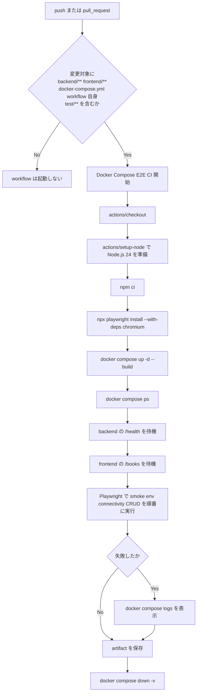

# Step 21: Docker Compose と Playwright を使う CI 導入

## このStepでやったこと

Step 21 では、Docker Compose で `frontend` `backend` `db` をまとめて起動し、その上で Playwright の E2E を GitHub Actions から実行できる workflow を追加した。  
Step 20 が frontend 単体の lint / build だったのに対し、この Step では「複数サービスを起動した状態で CRUD が最後まで通るか」を継続的に確認する。

## 追加・変更したファイル

| ファイル | 役割 |
| --- | --- |
| `.github/workflows/e2e-ci.yml` | GitHub Actions 上で Docker Compose 起動、待機、Playwright 実行、artifact 保存、停止処理までを行う workflow |
| `frontend/e2e/support/evidence.ts` | Playwright の証跡保存先を環境変数で切り替える helper |
| `frontend/e2e/docker-compose-smoke.spec.ts` | Step 14 の証跡保存先を helper 経由で解決するよう変更 |
| `frontend/e2e/docker-compose-env-migration.spec.ts` | Step 15 の証跡保存先を helper 経由で解決するよう変更 |
| `frontend/e2e/docker-compose-connectivity.spec.ts` | Step 16 の証跡保存先を helper 経由で解決するよう変更 |
| `frontend/e2e/docker-compose-books-crud.spec.ts` | Step 17 の証跡保存先を helper 経由で解決するよう変更 |
| `ELPLANATION/EXPLANATION_STEP21.md` | Step 21 の意図、workflow の読み方、確認コマンド、GitHub 上の確認手順を残す |
| `LEARNING_PROGRESS.md` | Step 20 を完了扱いに更新し、Step 21 の進捗を記録する |
| `LEARNING_ROADMAP.md` | CI 導入チェックリストの Step 20 / Step 21 の状態を更新する |

## GitHub Actions の処理フロー



この flow で分かること:

- Step 21 の workflow は frontend 単体ではなく、Compose 上のアプリ全体を確認する
- 起動直後にすぐ E2E を流すのではなく、backend と frontend の待機 step を分けている
- 失敗時は Playwright だけでなく `docker compose logs` も残るため、frontend / backend / db のどこを疑うか切り分けやすい
- 証跡は GitHub Actions の artifact に保存し、runner が破棄されても後から確認できる
- 停止処理は `if: always()` で必ず通すため、テスト失敗時でも Compose が残り続けない

## 実装部分のコードレベル説明

### `.github/workflows/e2e-ci.yml`

```yaml
name: Docker Compose E2E CI

on:
  push:
    paths:
      - ".github/workflows/e2e-ci.yml"
      - "docker-compose.yml"
      - "backend/**"
      - "frontend/**"
      - "test/**"
  pull_request:
    paths:
      - ".github/workflows/e2e-ci.yml"
      - "docker-compose.yml"
      - "backend/**"
      - "frontend/**"
      - "test/**"
```

このコードで何が起きているか:

- 入口: GitHub 上での `push` または `pull_request`
- 引数: 変更されたファイル群
- 戻り値: GitHub Actions の workflow 実行結果
- `backend/**` `frontend/**` `docker-compose.yml` `test/**` を監視することで、E2E に影響する変更だけで workflow を起動する
- Step 20 の frontend CI と違い、アプリ全体の結合確認なので frontend だけでなく backend と Compose 定義も対象に含める
- 正常系では Compose を起動して Playwright まで進む
- 異常系では path 条件を満たさない場合に workflow 自体が起動しない

### `.github/workflows/e2e-ci.yml`

```yaml
jobs:
  docker-compose-e2e:
    runs-on: ubuntu-latest
    timeout-minutes: 30
    defaults:
      run:
        working-directory: frontend
```

このコードで何が起きているか:

- 入口: workflow が path 条件を満たして起動したあと
- state: `docker-compose-e2e` という 1 job に Step 21 の処理をまとめる
- `runs-on: ubuntu-latest` により GitHub hosted runner 上で Docker と Playwright を使う
- `timeout-minutes: 30` は、起動待ちや browser install が長引いても無限に走り続けないようにする上限
- `working-directory: frontend` を既定にしたため、`npm ci` や `npx playwright test` を `frontend` 基準で実行できる
- Compose 関連の step だけは `working-directory: .` を明示し、repository ルートの `docker-compose.yml` を読む

### `.github/workflows/e2e-ci.yml`

```yaml
      - name: Install frontend dependencies
        run: npm ci

      - name: Install Playwright browsers
        run: npx playwright install --with-deps chromium

      - name: Start Docker Compose services
        working-directory: .
        run: docker compose up -d --build
```

このコードで何が起きているか:

- 入口: checkout と Node.js セットアップ完了後
- 引数: `frontend/package-lock.json`、Playwright の設定、`docker-compose.yml`
- 戻り値: 依存関係 install 成否、browser install 成否、Compose 起動成否
- `npm ci` は lockfile に固定された依存関係を再現し、ローカルと CI の差分を減らす
- `npx playwright install --with-deps chromium` は browser 本体と Ubuntu で必要な依存パッケージを入れる
- `docker compose up -d --build` は frontend / backend / db の 3 サービスを build してバックグラウンド起動する
- backend では Compose の `command` により `alembic upgrade head && uvicorn ...` が実行されるため、migration 手順も CI に含まれる
- 異常系では image build 失敗、container 起動失敗、Playwright browser install 失敗のいずれかでここで止まる

### `.github/workflows/e2e-ci.yml`

```yaml
      - name: Wait for backend health endpoint
        shell: pwsh
        run: |
          $deadline = (Get-Date).AddMinutes(3)
          while ((Get-Date) -lt $deadline) {
            try {
              $response = Invoke-WebRequest -Uri "http://127.0.0.1:8000/health" -UseBasicParsing -TimeoutSec 5
              if ($response.StatusCode -eq 200) {
                exit 0
              }
            }
            catch {
            }
            Start-Sleep -Seconds 2
          }
          throw "Backend health endpoint did not become ready in time."
```

このコードで何が起きているか:

- 入口: Compose 起動完了後
- 引数: runner 上で公開された `http://127.0.0.1:8000/health`
- 戻り値: backend 準備完了なら成功、3 分以内に応答しなければ失敗
- backend の migration や application start が終わる前に E2E を始めると、偶発的な失敗が増える
- そのため `Invoke-WebRequest` を一定間隔で繰り返し、200 応答を返すまで待つ
- この step が落ちた場合は backend container 起動、db 接続、migration のどこかを疑う

### `.github/workflows/e2e-ci.yml`

```yaml
      - name: Run Docker Compose Playwright tests
        env:
          PLAYWRIGHT_BASE_URL: http://127.0.0.1:3000
          DOCKER_PUBLIC_API_BASE_URL: http://127.0.0.1:8000
          PLAYWRIGHT_EVIDENCE_DIR: ../test/evidence/step21-playwright
        run: >
          npx playwright test
          e2e/docker-compose-smoke.spec.ts
          e2e/docker-compose-env-migration.spec.ts
          e2e/docker-compose-connectivity.spec.ts
          e2e/docker-compose-books-crud.spec.ts
          --reporter=html
```

このコードで何が起きているか:

- 入口: backend と frontend の待機 step がどちらも成功したあと
- 引数: Playwright の base URL、API base URL、証跡保存先、4 本の Compose 向け spec
- 戻り値: Playwright のテスト結果と HTML レポート
- `docker-compose-smoke` で画面到達、`docker-compose-env-migration` で Compose 環境、`docker-compose-connectivity` で browser からの API 疎通、`docker-compose-books-crud` で CRUD 全体を確認する
- `PLAYWRIGHT_EVIDENCE_DIR` を Step 21 用の path に差し替えることで、既存 spec を複製せずに CI 用証跡だけ保存先を切り替えている
- `--reporter=html` により `frontend/playwright-report` が生成され、Actions artifact として回収できる
- 正常系では 4 本すべて成功して workflow が先へ進む
- 異常系では落ちた spec 名から、画面起動前なのか、browser から API へ届かないのか、CRUD のどの操作が壊れたのかを切り分ける

### `frontend/e2e/support/evidence.ts`

```ts
import path from "node:path";

export function resolveEvidenceDir(defaultRelativePath: string): string {
  return path.resolve(
    process.env.PLAYWRIGHT_EVIDENCE_DIR ?? defaultRelativePath,
  );
}
```

このコードで何が起きているか:

- 入口: 各 Playwright spec で証跡保存先を決めるとき
- 引数: その spec の既定保存先
- 戻り値: 環境変数があればその path、なければ既定 path を絶対 path にした文字列
- Step 17 までは spec ごとに保存先が固定だったため、CI で同じテストを再利用すると Step 17 の証跡ディレクトリへ出力されてしまう
- この helper で `PLAYWRIGHT_EVIDENCE_DIR` を優先し、ローカル確認時は既定 path、CI 時は Step 21 用 path に切り替えられる
- 保証できることは「保存先の切り替え」であり、ファイル名の重複そのものを自動回避するわけではない

### `frontend/e2e/docker-compose-books-crud.spec.ts`

```ts
const apiBaseUrl =
  process.env.DOCKER_PUBLIC_API_BASE_URL ?? "http://127.0.0.1:8000";
const evidenceDir = resolveEvidenceDir("../test/evidence/step17-playwright");
```

このコードで何が起きているか:

- 入口: Compose 向け CRUD E2E の初期化時
- 引数: CI またはローカルから渡された環境変数
- state: API 呼び出し先と screenshot 保存先
- `DOCKER_PUBLIC_API_BASE_URL` は Playwright の API client が backend を直接呼ぶ URL
- `resolveEvidenceDir()` によって、Step 17 の既定証跡と Step 21 の CI 証跡を同じ spec で使い分ける
- 以降の `deleteBooksByIsbn()`、`saveEvidence()`、UI 上の作成・更新・削除処理はその path を前提に動く

## ローカル確認コマンド

目的: frontend の TypeScript / Playwright spec 変更後も lint が通ることを確認する  
実行ディレクトリ: `C:\Users\rnm21\AI_Coding_study\Library\frontend`

```powershell
npm run lint
```

目的: frontend の依存関係が揃っていることを確認する  
実行ディレクトリ: `C:\Users\rnm21\AI_Coding_study\Library\frontend`

```powershell
npm ci
```

目的: Docker Compose で 3 サービスを build して起動する  
実行ディレクトリ: `C:\Users\rnm21\AI_Coding_study\Library`

```powershell
docker compose up -d --build
```

目的: Compose 上で Step 21 相当の E2E を実行する  
実行ディレクトリ: `C:\Users\rnm21\AI_Coding_study\Library\frontend`

```powershell
$env:PLAYWRIGHT_BASE_URL="http://127.0.0.1:3000"
$env:DOCKER_PUBLIC_API_BASE_URL="http://127.0.0.1:8000"
$env:PLAYWRIGHT_EVIDENCE_DIR="..\test\evidence\step21-playwright"
npx playwright test e2e/docker-compose-smoke.spec.ts e2e/docker-compose-env-migration.spec.ts e2e/docker-compose-connectivity.spec.ts e2e/docker-compose-books-crud.spec.ts --reporter=html
```

目的: Compose のコンテナを停止して volume も片付ける  
実行ディレクトリ: `C:\Users\rnm21\AI_Coding_study\Library`

```powershell
docker compose down -v
```

## Playwrightテスト内容と保存した証跡

- `frontend/e2e/docker-compose-smoke.spec.ts`: `/books` 画面へ到達できることを確認する
- `frontend/e2e/docker-compose-env-migration.spec.ts`: Compose 環境変数で画面表示まで進めることを確認する
- `frontend/e2e/docker-compose-connectivity.spec.ts`: browser から `backend` の `/health` と `/api/books` を呼べることを確認する
- `frontend/e2e/docker-compose-books-crud.spec.ts`: 作成、更新、削除までを UI から最後まで確認する
- ローカル確認時の証跡保存先: `C:\Users\rnm21\AI_Coding_study\Library\test\evidence\step21-playwright`
- ローカル確認時の HTML レポート保存先: `C:\Users\rnm21\AI_Coding_study\Library\frontend\playwright-report`
- GitHub Actions 上の証跡保存方法: `step21-playwright-evidence` artifact と `step21-playwright-report` artifact

## GitHub上で行う操作手順

### push して Actions を実行する手順

1. `.github/workflows/e2e-ci.yml` と関連ファイルを commit して GitHub に push する
2. GitHub の repository 画面で `Actions` タブを開く
3. 一覧に `Docker Compose E2E CI` が表示されることを確認する
4. 最新 run を開き、`docker-compose-e2e` job が開始されていることを確認する
5. `Install frontend dependencies` `Install Playwright browsers` `Start Docker Compose services` `Run Docker Compose Playwright tests` が順番に実行されることを確認する

### GitHub上で確認する画面と期待結果

- 確認画面: repository の `Actions` タブ
  - 期待結果: `Docker Compose E2E CI` の workflow run が表示される
- 確認画面: workflow run 詳細
  - 期待結果: `docker-compose-e2e` job が表示される
- 確認画面: job の step 一覧
  - 期待結果: backend 待機、frontend 待機、Playwright 実行、artifact upload、停止処理まで進む
- 確認画面: `Artifacts`
  - 期待結果: `step21-playwright-evidence` と `step21-playwright-report` を download できる

## 失敗時の見方

- `Start Docker Compose services` が失敗した場合: Dockerfile、依存関係 install、build context、Compose 定義を疑う
- `Wait for backend health endpoint` が失敗した場合: db 起動、`DATABASE_URL`、migration、backend 起動ログを疑う
- `Wait for frontend books page` が失敗した場合: frontend container 起動、port 公開、Next.js 起動ログを疑う
- `docker-compose-connectivity.spec.ts` が失敗した場合: browser から backend への CORS / URL / network を疑う
- `docker-compose-books-crud.spec.ts` が失敗した場合: UI 操作、router、API、DB 更新処理のどこで壊れたかを Playwright trace と screenshot で追う

## このStepで保証できること / できないこと

- 保証できることは、Compose 上で起動した `frontend` `backend` `db` に対して主要な CRUD が CI 上でも自動確認できること
- 保証できることは、失敗時に Playwright レポートと Compose ログから切り分けの材料を残せること
- 保証できないことは、GitHub 上の workflow 成功そのものをローカル編集だけで証明すること
- そのため最終的な完了確認は、push 後に GitHub Actions で `Docker Compose E2E CI` が成功することを見て行う
