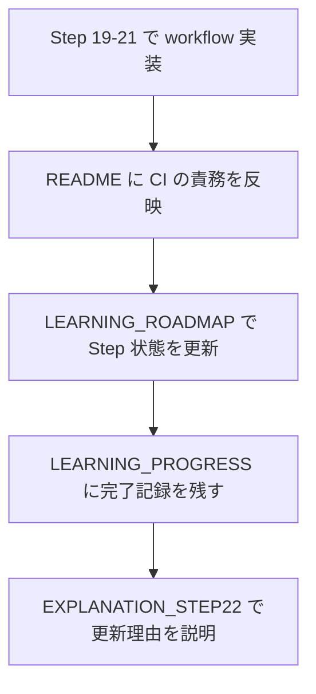

# Step 22: CI 運用内容のドキュメント反映

## このStepでやったこと

Step 22 では、Step 19 から Step 21 で追加した GitHub Actions の内容を、`README.md`、`LEARNING_ROADMAP.md`、`LEARNING_PROGRESS.md` に反映した。  
実装そのものは前Stepまでで終わっているため、このStepの目的は「今の repository がどの CI を持ち、どこまで自動確認しているか」を README 基準で追えるようにすることだった。

## 追加・変更したファイル

| ファイル | 役割 |
| --- | --- |
| `README.md` | 現在の対象範囲、テスト方針、フォルダ構成、Docker・CI 関連ファイル一覧を最新状態へ更新する |
| `LEARNING_ROADMAP.md` | CI 導入チェックリストで Step 21 / Step 22 を完了扱いに更新する |
| `LEARNING_PROGRESS.md` | 進捗表、現在地、Step別記録に Step 21 / Step 22 の結果を残す |
| `ELPLANATION/EXPLANATION_STEP22.md` | このStepでどの文書をどう更新したかを説明する |

## ドキュメント更新の流れ



この flow で分かること:

- 実装後に README を更新しないと、仕様の正本と実装がずれる
- Roadmap は「何が完了したか」を見る場所、Progress は「どう進めたか」を見る場所として役割を分けている
- Step 22 はコード追加よりも、既存 workflow を読み解ける文脈を残すことに重点がある

## 実装部分のコードレベル説明

### `README.md`

```md
- GitHub Actions では backend 用に `ruff check` `ruff format --check` `pytest` を自動実行する
- GitHub Actions では frontend 用に `npm run lint` `npm run build` を自動実行する
- GitHub Actions では Docker Compose 上で Playwright の smoke / env-migration / connectivity / CRUD を自動実行する
- ローカル確認は実装中の切り分けと再現を担当し、CI確認は push / pull_request ごとの継続的な再確認を担当する
```

このコードで何が起きているか:

- 入口: README の「テスト方針」を読むとき
- 引数: 追加した 3 本の workflow の役割
- 戻り値: 「どの確認をローカルで行い、どの確認を CI で自動化しているか」という仕様理解
- backend / frontend / E2E を分けて書くことで、失敗時にどの workflow を見ればよいか追いやすくしている
- 正常系では README だけで品質確認の責務分担を説明できる
- 異常系では、この記述が欠けると Step 19 から Step 21 の追加意図を README から追えない

### `README.md`

```md
├── .github/
│   └── workflows/
│       ├── backend-ci.yml
│       ├── frontend-ci.yml
│       └── e2e-ci.yml
```

このコードで何が起きているか:

- 入口: README のフォルダ構成を見るとき
- state: repository ルートに workflow があることを明示する
- `.github/workflows` を構成図に含めることで、CI が外部の設定ではなく repository 管理下のコードだと分かる
- 保証できることは「workflow の置き場所を README から追えること」
- 保証できないことは「workflow の中身」そのものなので、詳細は `ELPLANATION/EXPLANATION_STEP19.md` から `ELPLANATION/EXPLANATION_STEP21.md` で読む前提にしている

### `LEARNING_ROADMAP.md`

```md
- [x] Step 21: Docker Compose と Playwright を使う CI 導入
- [x] Step 22: CI 運用内容のドキュメント反映
```

このコードで何が起きているか:

- 入口: 学習順序と完了状態を確認するとき
- 戻り値: CI 導入フェーズが完了したという状態
- Step 21 と Step 22 を連続で完了扱いにすることで、「実装」と「文書反映」の両方が終わったことを 1 か所で確認できる
- 異常系では、Roadmap と Progress の状態がずれると現在地を誤認しやすくなる

### `LEARNING_PROGRESS.md`

```md
| 21 | Docker Compose と Playwright を使う CI 導入 | 完了 | 3 | 2026-06-24 | 2026-06-24 | 未作成（.git未検出） |
| 22 | CI 運用内容のドキュメント反映 | 完了 | 3 | 2026-06-24 | 2026-06-24 | 未作成（.git未検出） |
```

このコードで何が起きているか:

- 入口: 学習進捗表を読むとき
- 引数: Step番号、ステータス、理解度、日付
- 戻り値: Step 21 と Step 22 の完了履歴
- Step 21 は GitHub 上の最終 run 未確認でも、今回はユーザー判断で完了扱いにした前提を下の Step別記録に残している
- Step 22 は README / Roadmap / Progress の更新が主作業なので、実装コードではなく文書整合の完了をもって閉じている

## 確認に使ったコマンド

目的: Step 21 / Step 22 の記載位置と workflow 関連文言を洗い出す  
実行ディレクトリ: `C:\Users\rnm21\AI_Coding_study\Library`

```powershell
rg -n "STEP ?21|STEP ?22|Step ?21|Step ?22|CI|GitHub Actions|workflow|Playwright" README.md LEARNING_ROADMAP.md LEARNING_PROGRESS.md ELPLANATION/EXPLANATION_STEP21.md
```

目的: 更新後の差分対象を確認する  
実行ディレクトリ: `C:\Users\rnm21\AI_Coding_study\Library`

```powershell
git diff -- README.md LEARNING_ROADMAP.md LEARNING_PROGRESS.md ELPLANATION/EXPLANATION_STEP22.md
```

## Playwrightテスト内容と証跡

- このStepでは Playwright テストは実行していない
- 理由は、画面や API の挙動変更ではなく、README と学習管理ドキュメントの更新だけを行ったため
- 既存の E2E 証跡の参照先は `test/evidence/step17-playwright` と `test/evidence/step21-playwright`

## 学んだこと

- CI を追加したあとに README を更新しないと、仕様の正本が古くなる
- backend CI、frontend CI、Docker Compose E2E CI を分けて書くと、失敗時の調査入口を説明しやすい
- 学習用プロジェクトでは、実装だけでなく「どこに何が書いてあるか」を残すこと自体が理解の補助になる
