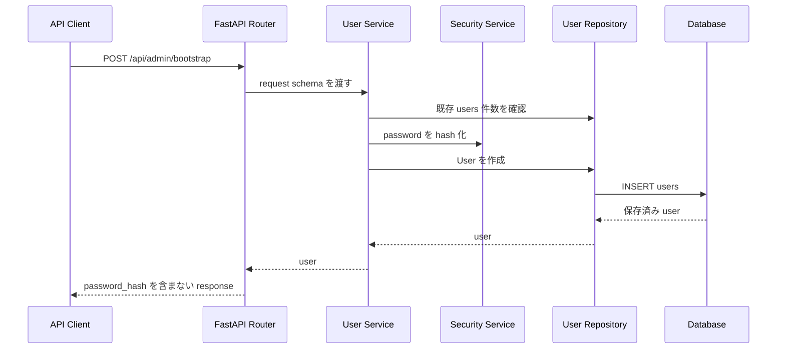

# Step 24: users テーブルとパスワード管理基盤

## この Step でやること

Step 24 では、ログイン機能そのものではなく、その前提になる利用者保存基盤を追加する。
具体的には、`users` テーブル、パスワードハッシュ化、初期管理者を1回だけ作成する API、確認用テストを追加した。

## この Step で追加・変更したファイル

| ファイル | 役割 |
| --- | --- |
| `backend/app/models/user.py` | `users` テーブルに対応する SQLAlchemy model |
| `backend/app/schemas/user.py` | 初期管理者作成APIの request / response schema |
| `backend/app/repositories/user.py` | `users` テーブルへの CRUD のうち Step 24 で必要な最小 DB 操作 |
| `backend/app/services/security.py` | `scrypt` を使ったパスワードハッシュ化と照合 |
| `backend/app/services/user.py` | 初期管理者作成の業務ルール |
| `backend/app/routers/admin.py` | `POST /api/admin/bootstrap` の FastAPI router |
| `backend/alembic/versions/1f8e0b6e6a24_add_users_table.py` | `users` テーブル追加 migration |
| `backend/tests/test_users_api.py` | backend の `pytest` による API / ハッシュ確認 |
| `frontend/e2e/admin-bootstrap-api.spec.ts` | Playwright による初期管理者作成API確認 |
| `README.md` | Step 24 時点の認証準備仕様を反映 |
| `ELPLANATION/EXPLANATION_STEP24.md` | 今回のコード説明、確認手順、証跡整理 |

## 実装の流れ



## コードレベル説明

### `backend/app/models/user.py`

```python
class User(Base):
    __tablename__ = "users"

    id: Mapped[int] = mapped_column(Integer, primary_key=True, autoincrement=True)
    email: Mapped[str] = mapped_column(String(255), unique=True, nullable=False)
    username: Mapped[str] = mapped_column(String(50), unique=True, nullable=False)
    password_hash: Mapped[str] = mapped_column(String(255), nullable=False)
    role: Mapped[str] = mapped_column(String(20), nullable=False)
    is_active: Mapped[bool] = mapped_column(nullable=False, default=True)
```

このコードで何が起きているか:

- `users` テーブルの列定義を SQLAlchemy で表している
- `email` と `username` はどちらも `UNIQUE` で、重複利用者を防ぐ
- `password_hash` には平文ではなくハッシュ済み文字列だけを保存する
- `role` は Step 24 時点では `admin` を入れる前提で、Step 26 の認可に使う準備になる
- `is_active` は将来の無効化対応に備えた列で、Step 24 では `True` 固定で作成する

### `backend/app/schemas/user.py`

```python
class UserBootstrapRequest(BaseModel):
    email: str = Field(min_length=1, max_length=255)
    username: str = Field(min_length=1, max_length=50)
    password: str = Field(min_length=8, max_length=72)
```

このコードで何が起きているか:

- API の入口で受け取る JSON の形を固定している
- `password` に最小長を入れて、短すぎる値は route handler に入る前に `422` へする
- `field_validator` で空白だけの値を弾き、`email` は小文字へ正規化する
- response 側の `UserResponse` には `password_hash` を含めず、外部へ秘密情報を返さない

### `backend/app/services/security.py`

```python
def hash_password(password: str) -> str:
    salt = token_bytes(SALT_BYTES)
    derived_key = scrypt(
        password.encode("utf-8"),
        salt=salt,
        n=SCRYPT_N,
        r=SCRYPT_R,
        p=SCRYPT_P,
        dklen=SCRYPT_DKLEN,
    )
```

このコードで何が起きているか:

- パスワード文字列そのものは保存せず、ランダムな `salt` と一緒に `scrypt` で導出鍵を作る
- 返り値は `algorithm$n$r$p$salt$key` 形式の文字列で、後から照合できるようにしている
- `verify_password()` は保存済みハッシュを分解し、同じ条件で再計算した結果を `compare_digest()` で比較する
- 保証できること:
  パスワード平文を DB に残さない
- 保証できないこと:
  これだけではログイン状態管理や権限判定までは行わない

### `backend/app/services/user.py`

```python
def bootstrap_admin_user(db: Session, user_create: UserBootstrapRequest) -> User:
    if count_users(db) > 0:
        raise BootstrapAlreadyCompletedError()

    return create_user_repository(
        db,
        user_create,
        password_hash=hash_password(user_create.password),
        role=ADMIN_ROLE,
        created_at=now,
        updated_at=now,
    )
```

このコードで何が起きているか:

- 入口は router から渡される `db` と `UserBootstrapRequest`
- 最初に `count_users()` を呼び、利用者が1件でも存在するなら `BootstrapAlreadyCompletedError` を送出する
- `hash_password()` を呼んで password を hash 化してから repository へ渡す
- 戻り値は作成済み `User` model
- 正常系:
  利用者0件なら `admin` ロールの user を1件作成する
- 異常系:
  利用者が既に存在する場合は bootstrap 不可、`email` / `username` 重複時は識別子重複エラーとして扱う

### `backend/app/routers/admin.py`

```python
@router.post(
    "/bootstrap",
    response_model=UserResponse,
    status_code=status.HTTP_201_CREATED,
)
def bootstrap_admin_endpoint(
    user_create: UserBootstrapRequest,
    db: Session = Depends(get_db),
) -> User:
```

このコードで何が起きているか:

- FastAPI の入口として `POST /api/admin/bootstrap` を定義している
- request body は `UserBootstrapRequest`、response は `UserResponse`
- `Depends(get_db)` で DB session を受け取る
- service 層から `BootstrapAlreadyCompletedError` を受けたら `409 Conflict`
- 重複識別子でも `409 Conflict`
- FastAPI / Pydantic の validation に落ちた場合は `422 Unprocessable Entity`

### `backend/alembic/versions/1f8e0b6e6a24_add_users_table.py`

```python
op.create_table(
    "users",
    sa.Column("email", sa.String(length=255), nullable=False),
    sa.Column("username", sa.String(length=50), nullable=False),
    sa.Column("password_hash", sa.String(length=255), nullable=False),
    ...
    sa.UniqueConstraint("email"),
    sa.UniqueConstraint("username"),
)
```

このコードで何が起きているか:

- Alembic が DB に対して `users` テーブルを追加する
- model の定義だけでは実 DB は変わらないので、migration が必要
- `upgrade()` が適用、`downgrade()` が取り消しの入口になる

### `backend/tests/test_users_api.py`

```python
def test_bootstrap_admin_user_can_run_only_once(client: TestClient) -> None:
    first_response = client.post("/api/admin/bootstrap", json=bootstrap_payload())
    second_response = client.post("/api/admin/bootstrap", json=bootstrap_payload(...))
    assert second_response.status_code == 409
```

このコードで何が起きているか:

- `pytest` と FastAPI `TestClient` で API を直接確認している
- 1回目の作成は `201`、2回目は `409` になることを確認する
- 別テストでは DB に保存された `password_hash` を取り出して `verify_password()` で照合し、平文保存されていないことも確認する

### `frontend/e2e/admin-bootstrap-api.spec.ts`

```ts
const firstResponse = await request.post("/api/admin/bootstrap", {
  data: {
    email: "playwright-admin@example.com",
    username: "playwright-admin",
    password: "PlaywrightPass123",
  },
});
```

このコードで何が起きているか:

- Playwright の `request` fixture を使い、ブラウザ画面ではなく API を直接叩いている
- 1回目の `201` と2回目の `409` を 1 本の spec で確認する
- 返ってきた JSON と status を `test/evidence/step24-playwright/01-admin-bootstrap-response.json` へ保存する
- Step 24 は UI がまだないため、Playwright は API レベルの証跡取得に使っている

## 動作確認コマンド

目的:
backend の lint を確認する

実行ディレクトリ:
`C:\Users\rnm21\AI_Coding_study\Library\backend`

```powershell
.\.venv\Scripts\ruff.exe check .
```

目的:
backend の format 状態を確認する

実行ディレクトリ:
`C:\Users\rnm21\AI_Coding_study\Library\backend`

```powershell
.\.venv\Scripts\ruff.exe format --check .
```

目的:
backend の API テストを確認する

実行ディレクトリ:
`C:\Users\rnm21\AI_Coding_study\Library\backend`

```powershell
.\.venv\Scripts\python.exe -m pytest tests
```

目的:
一時 SQLite に migration を適用して `users` テーブル追加が壊れていないことを確認する

実行ディレクトリ:
`C:\Users\rnm21\AI_Coding_study\Library\backend`

```powershell
$env:DATABASE_URL='sqlite+pysqlite:///step24_playwright.db'
.\.venv\Scripts\alembic.exe upgrade head
```

目的:
Playwright で初期管理者作成APIを確認する

実行ディレクトリ:
`C:\Users\rnm21\AI_Coding_study\Library\backend`

```powershell
$ErrorActionPreference = 'Stop'
$env:DATABASE_URL = 'sqlite+pysqlite:///step24_playwright.db'
.\.venv\Scripts\alembic.exe upgrade head
Start-Process -FilePath '.\.venv\Scripts\python.exe' -ArgumentList '-m', 'uvicorn', 'app.main:app', '--host', '127.0.0.1', '--port', '8002' -WorkingDirectory (Get-Location) -WindowStyle Hidden
```

目的:
Step 24 用 Playwright spec を実行する

実行ディレクトリ:
`C:\Users\rnm21\AI_Coding_study\Library\frontend`

```powershell
$env:PLAYWRIGHT_BASE_URL='http://127.0.0.1:8002'
npx playwright test e2e/admin-bootstrap-api.spec.ts
```

## Playwright 証跡

- `test/evidence/step24-playwright/01-admin-bootstrap-response.json`

## この Step で保証できること

- `users` テーブルを migration で作成できる
- 初期管理者作成APIで password をハッシュ化して保存できる
- 初期管理者作成APIは1回だけ成功し、2回目以降は `409 Conflict` になる
- API レスポンスに `password_hash` を含めない

## この Step だけでは保証できないこと

- 利用者がログインして認証状態を保持できること
- ロールごとに操作可否を切り替えること
- frontend にログイン画面や未認証時の遷移が存在すること

これらは Step 25 以降で追加する。
