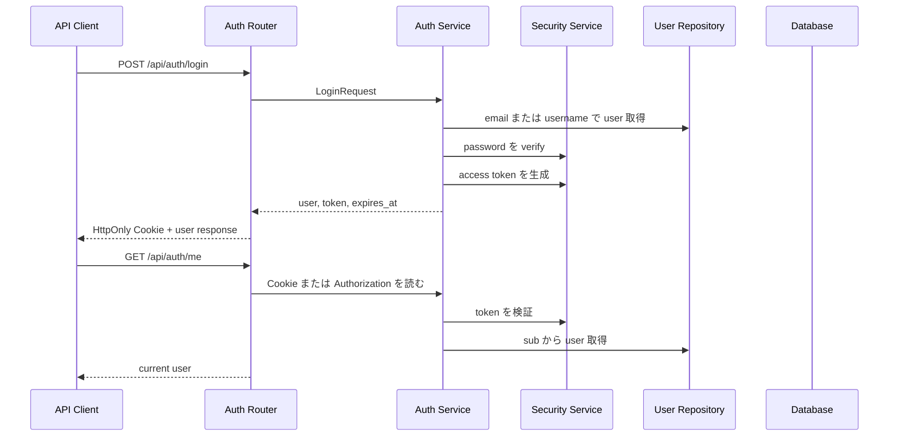

# Step 25: ログイン API と認証状態管理

## この Step でやること

Step 25 では、Step 24 で用意した `users` テーブルを使って、利用者が資格情報でログインできる状態まで進める。

今回の追加対象は次の3本です。

- `POST /api/auth/login`
- `POST /api/auth/logout`
- `GET /api/auth/me`

Step 25 では、認証情報の保存先として `HttpOnly` Cookie を使い、中身は署名付き JWT 形式のアクセストークンにする。まだ `books` API には認証必須を付けず、認証必須化と認可は Step 26 で扱う。

## 追加・変更したファイル

| ファイル | 役割 |
| --- | --- |
| `backend/app/schemas/auth.py` | ログインAPIの request / response schema |
| `backend/app/services/auth.py` | ログイン処理、現在ユーザー取得、Cookie / Bearer token 読み取り |
| `backend/app/services/security.py` | JWT の生成と検証、既存のパスワードハッシュ処理 |
| `backend/app/repositories/user.py` | `sub` から `users.id` を引くための DB 操作追加 |
| `backend/app/routers/auth.py` | `login` `logout` `me` の FastAPI router |
| `backend/app/main.py` | auth router の登録 |
| `backend/tests/test_auth_api.py` | backend の `pytest` による認証API確認 |
| `frontend/e2e/auth-api.spec.ts` | Playwright による API フロー確認 |
| `README.md` | Step 25 時点の認証仕様を反映 |
| `LEARNING_PROGRESS.md` | Step 25 の完了記録 |
| `LEARNING_ROADMAP.md` | Step 25 のチェック反映 |

## 処理の流れ



## コードレベル説明

### `backend/app/schemas/auth.py`

```python
class LoginRequest(BaseModel):
    login_id: str = Field(min_length=1, max_length=255)
    password: str = Field(min_length=8, max_length=72)

class LoginResponse(BaseModel):
    user: UserResponse
    expires_at: datetime
```

このコードで何が起きているか

- `LoginRequest` は `POST /api/auth/login` の入口で受け取る JSON 形状を定義している
- `login_id` は `email` でも `username` でもよいので、名前を `email` 固定にしていない
- `password` は Step 24 と同じく最短 8 文字にしている
- `field_validator` で前後空白だけの入力を弾き、`login_id` は小文字化する
- `LoginResponse` は成功時レスポンスで、トークン本体ではなく `user` と有効期限だけを返す
- トークンは本文ではなく Cookie に入れるので、フロントから直接読み出せない

### `backend/app/services/security.py`

```python
def create_access_token(user_id: int, email: str, role: str) -> tuple[str, int]:
    issued_at = int(time())
    expires_at = issued_at + TOKEN_EXPIRATION_SECONDS
    payload = {
        "sub": str(user_id),
        "email": email,
        "role": role,
        "iat": issued_at,
        "exp": expires_at,
    }
```

このコードで何が起きているか

- 入口は `user_id` `email` `role` で、戻り値は `token` と `expires_at`
- JWT の header / payload を JSON 化し、Base64URL 化し、HMAC-SHA256 で署名している
- `sub` に `users.id` を文字列で入れ、`GET /api/auth/me` で本人を引き直せるようにしている
- `exp` を入れるので、期限切れトークンは `decode_access_token()` で失敗する
- 既存の `hash_password()` `verify_password()` はそのまま残し、Step 24 の責務も維持している
- 保証できること:
  トークン改ざんと期限切れを検出できる
- 保証できないこと:
  Step 25 時点では失効リストを持たないので、発行済みJWTをサーバー側で即時失効させることはできない

### `backend/app/services/auth.py`

```python
def login_user(db: Session, login_request: LoginRequest) -> tuple[User, str, datetime]:
    user = _find_user_for_login(db, login_request.login_id)
    if user is None or not user.is_active:
        raise AuthenticationError()

    if not verify_password(login_request.password, user.password_hash):
        raise AuthenticationError()
```

このコードで何が起きているか

- 入口は `db` と `LoginRequest`、戻り値は `User` `token` `expires_at`
- `login_id` を `email` として探し、見つからなければ `username` として探す
- 利用者がいない、`is_active=False`、パスワード不一致のどれでも `AuthenticationError` に統一する
- 「メールアドレスが違うのか、パスワードが違うのか」を外へ出さないことで、存在確認のヒントを減らしている
- `get_current_user()` は `Authorization: Bearer ...` と Cookie の両方を読める
- `decode_access_token()` に失敗した場合、または `sub` から引いた user が存在しない場合は `401 Unauthorized` を返す
- この関数を共通処理にしたので、Step 26 で books API に認証必須を付けるときも同じ依存を使い回せる

### `backend/app/routers/auth.py`

```python
@router.post("/login", response_model=LoginResponse)
def login_endpoint(
    login_request: LoginRequest,
    response: Response,
    db: Session = Depends(get_db),
) -> LoginResponse:
```

このコードで何が起きているか

- `login_endpoint()` の入口は `LoginRequest` と `db`
- `login_user()` が成功したら `response.set_cookie()` で `library_access_token` を保存する
- Cookie には `httponly=True` `samesite="lax"` を付けている
- 正常系は `200 OK`、資格情報不一致は `401 Unauthorized`
- `logout_endpoint()` は `delete_cookie()` を呼ぶだけで `204 No Content`
- `me_endpoint()` は `Depends(get_current_user)` で current user を受け取り、そのまま `CurrentUserResponse` に詰める
- 初学者が読む順番は `login_endpoint()` → `login_user()` → `create_access_token()` → `me_endpoint()` → `get_current_user()` の順が追いやすい

### `backend/tests/test_auth_api.py`

```python
def test_logout_clears_cookie_and_blocks_me(client: TestClient) -> None:
    bootstrap_admin_user(client)
    client.post("/api/auth/login", json=login_payload())
    logout_response = client.post("/api/auth/logout")
    unauthenticated_me_response = client.get("/api/auth/me")
```

このコードで何が起きているか

- `pytest` と FastAPI `TestClient` で認証フローを直接確認している
- 先に `POST /api/admin/bootstrap` で初期管理者を作ってから、ログインAPIを叩く
- `test_login_returns_cookie_and_me_returns_current_user()` では Cookie と `GET /api/auth/me` の正常系を確認する
- `test_login_allows_username_as_login_id()` では `username` ログインを確認する
- `test_login_rejects_invalid_credentials()` では `401` を確認する
- `test_logout_clears_cookie_and_blocks_me()` ではログアウト後に `401` へ戻ることを確認する

### `frontend/e2e/auth-api.spec.ts`

```ts
const loginResponse = await request.post(`${apiBaseUrl}/api/auth/login`, {
  data: {
    login_id: "step25-admin@example.com",
    password: "Step25Pass123",
  },
});
```

このコードで何が起きているか

- Playwright の `request` fixture を使い、画面ではなくAPIフローを通しで確認している
- `bootstrap` → `login` → `me` → `logout` → `401` の順で実行する
- Playwright の request context が Cookie を保持するため、`/api/auth/me` がログイン後に成功する
- 最後に結果JSONを `test/evidence/step25-playwright/01-auth-api-flow.json` へ保存する
- UIはまだ無いが、認証状態の保持がCookieで成立しているかをブラウザ相当のコンテキストで確認できる

## 動作確認コマンド

目的:
backend の lint を確認する
実行ディレクトリ:
`C:\Users\rnm21\AI_Coding_study\Library\backend`

```powershell
.\.venv\Scripts\ruff.exe check .
```

目的:
backend の format 状態を確認する
実行ディレクトリ:
`C:\Users\rnm21\AI_Coding_study\Library\backend`

```powershell
.\.venv\Scripts\ruff.exe format --check .
```

目的:
backend の API テストを実行する
実行ディレクトリ:
`C:\Users\rnm21\AI_Coding_study\Library\backend`

```powershell
.\.venv\Scripts\python.exe -m pytest
```

目的:
Step 25 用の一時SQLite DBに migration を適用する
実行ディレクトリ:
`C:\Users\rnm21\AI_Coding_study\Library\backend`

```powershell
$env:DATABASE_URL='sqlite:///./step25_playwright.db'
.\.venv\Scripts\alembic.exe upgrade head
```

目的:
Step 25 用 Playwright spec を実行する
実行ディレクトリ:
`C:\Users\rnm21\AI_Coding_study\Library\backend`

```powershell
$ErrorActionPreference='Stop'
$frontendDir = Resolve-Path ..\frontend
$env:DATABASE_URL='sqlite:///./step25_playwright.db'
.\.venv\Scripts\alembic.exe upgrade head
$backendProcess = Start-Process -FilePath .\.venv\Scripts\python.exe -ArgumentList '-m', 'uvicorn', 'app.main:app', '--host', '127.0.0.1', '--port', '8000' -WorkingDirectory (Get-Location) -WindowStyle Hidden -PassThru
try {
    Push-Location $frontendDir
    npm.cmd exec playwright test e2e/auth-api.spec.ts
}
finally {
    Pop-Location
    Stop-Process -Id $backendProcess.Id -Force
}
```

## Playwright 証跡

- `test/evidence/step25-playwright/01-auth-api-flow.json`

## この Step で確認できること

- 初期管理者作成後に `email` または `username` でログインできる
- ログイン成功時に Cookie と利用者情報が返る
- 認証済み状態で `GET /api/auth/me` を呼べる
- ログアウト後は認証状態が消え、`401 Unauthorized` に戻る

## この Step だけでは確認できないこと

- books API が認証必須かどうか
- `admin` 以外のロール分岐
- 権限不足時に `403 Forbidden` を返す認可判定

これらは Step 26 で追加する。
