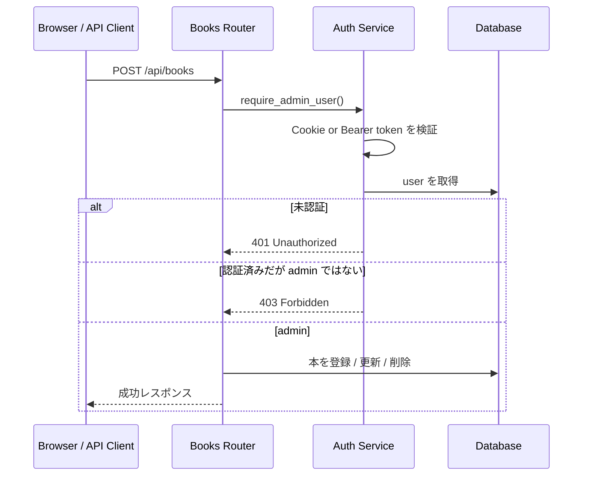

# Step 26: 認可と認証必須 API 化

## この Step でやること

Step 26 では、認証済みなら何でもできる状態をやめて、本の更新系操作だけを `admin` に限定する。

今回の方針は次の通りです。

- `GET /api/books` と `GET /api/books/{id}` は公開のまま
- `POST /api/books` `PUT /api/books/{id}` `DELETE /api/books/{id}` は認証済み `admin` だけ許可
- 未認証は `401 Unauthorized`
- 認証済みだが `admin` でない場合は `403 Forbidden`
- frontend では管理者以外に登録・編集・削除の導線を表示しない

## 追加・変更したファイル

| ファイル | 役割 |
| --- | --- |
| `backend/app/services/auth.py` | 現在ユーザー取得に加えて `admin` 判定 dependency を追加 |
| `backend/app/routers/books.py` | books API の更新系操作へ認可 dependency を適用 |
| `backend/tests/conftest.py` | books API と user 追加テストを同じ test DB で扱えるよう整理 |
| `backend/tests/test_books_api.py` | 公開参照、未認証 `401`、非 `admin` `403`、管理者成功を確認 |
| `frontend/lib/server-auth.ts` | server-side で `GET /api/auth/me` を呼び、現在ユーザーを取得 |
| `frontend/types/auth.ts` | 現在ユーザーの型定義 |
| `frontend/lib/api.ts` | `401` `403` のエラーメッセージと Cookie 送信設定を追加 |
| `frontend/app/books/page.tsx` | 管理者だけに「本を登録」導線を表示 |
| `frontend/app/books/BooksList.tsx` | 管理者だけに編集・削除導線を表示 |
| `frontend/app/books/new/page.tsx` | 管理者以外には説明メッセージだけを表示 |
| `frontend/app/books/[id]/edit/page.tsx` | 管理者以外には編集画面を出さない |
| `frontend/e2e/books-authorization.spec.ts` | 未認証表示と管理者表示の差分を Playwright で証跡化 |
| `README.md` | 保護対象 API と frontend 表示方針を仕様へ反映 |

## 処理の流れ



## コードレベル説明

### `backend/app/services/auth.py`

```python
def require_admin_user(current_user: User = Depends(get_current_user)) -> User:
    if current_user.role != ADMIN_ROLE:
        raise HTTPException(
            status_code=status.HTTP_403_FORBIDDEN,
            detail="この操作は管理者だけが実行できます",
        )
```

このコードで何が起きているか:

- `get_current_user()` で「認証済みか」を先に確認する
- その後 `role` を見て、`admin` 以外なら `403 Forbidden` を返す
- これにより `401` と `403` を router ごとに重複実装せずに共通化できる

### `backend/app/routers/books.py`

```python
@router.post("", response_model=BookResponse, status_code=status.HTTP_201_CREATED)
def create_book_endpoint(
    book_create: BookCreate,
    db: Session = Depends(get_db),
    _: object = Depends(require_admin_user),
) -> Book:
```

このコードで何が起きているか:

- books API の更新系 endpoint に `Depends(require_admin_user)` を追加している
- これにより route handler の本体へ入る前に認証・認可を通す
- `GET` 系には付けていないため、一覧と詳細は公開のまま残る

### `backend/tests/test_books_api.py`

```python
def test_non_admin_user_cannot_write_books(
    client: TestClient,
    db_session: Session,
) -> None:
    member_auth = create_non_admin_user(db_session)
    headers = {"Cookie": member_auth["cookie"]}
```

このコードで何が起きているか:

- test DB へ `member` ロールの利用者を直接追加している
- そのユーザーの JWT を発行し、Cookie として更新系 books API に渡す
- `401` だけでなく、認証済みだが権限不足の `403` も backend で確認できる

### `frontend/lib/server-auth.ts`

```ts
export async function fetchCurrentUser(): Promise<CurrentUser | null> {
  const cookieStore = await cookies();
  const accessTokenCookie = cookieStore.get(AUTH_COOKIE_NAME);
```

このコードで何が起きているか:

- Next.js の server-side 実行中に `library_access_token` Cookie を読む
- Cookie がある場合だけ backend の `GET /api/auth/me` を呼ぶ
- 失敗時は例外を画面まで伝播させず `null` を返し、公開画面を壊さない

### `frontend/app/books/page.tsx`

```tsx
const [result, currentUser] = await Promise.all([
  fetchBooks(),
  fetchCurrentUser(),
]);
const canManageBooks = isAdminUser(currentUser);
```

このコードで何が起きているか:

- 本一覧データと現在ユーザーを同時に取得する
- `canManageBooks` が `true` のときだけ「本を登録」「編集」「削除」を表示する
- 管理者でない場合も一覧表示自体は継続し、保護範囲の説明だけを足す

### `frontend/e2e/books-authorization.spec.ts`

```ts
await expect(page.getByRole("link", { name: "本を登録" })).toHaveCount(0);
await expect(
  page.getByRole("heading", { name: "管理操作には管理者ログインが必要です" }),
).toBeVisible();
```

このコードで何が起きているか:

- 未認証状態では管理導線が見えないことを画面で確認している
- その後 API で管理者ログインしてから再度 `/books` を開き、導線が出ることを確認する
- Step 26 では login UI が無いため、認証は API で作り、画面差分を E2E で証跡化している

## 動作確認コマンド

目的:
backend の lint を確認する

実行ディレクトリ:
`C:\Users\rnm21\AI_Coding_study\Library\backend`

```powershell
.\.venv\Scripts\ruff.exe check .
```

目的:
backend の API テストを実行する

実行ディレクトリ:
`C:\Users\rnm21\AI_Coding_study\Library\backend`

```powershell
.\.venv\Scripts\python.exe -m pytest
```

目的:
frontend の lint を確認する

実行ディレクトリ:
`C:\Users\rnm21\AI_Coding_study\Library\frontend`

```powershell
npm.cmd run lint
```

目的:
frontend の本番ビルドを確認する

実行ディレクトリ:
`C:\Users\rnm21\AI_Coding_study\Library\frontend`

```powershell
npm.cmd run build
```

目的:
Step 26 用の一時 SQLite DB を migration し、backend と frontend を起動した状態で Playwright を実行する

実行ディレクトリ:
`C:\Users\rnm21\AI_Coding_study\Library`

```powershell
$ErrorActionPreference='Stop'
$backendDir = Resolve-Path '.\backend'
$frontendDir = Resolve-Path '.\frontend'
$evidenceDir = '.\test\evidence\step26-playwright'
New-Item -ItemType Directory -Force -Path $evidenceDir | Out-Null
$env:DATABASE_URL='sqlite:///./step26_playwright.db'
Remove-Item -LiteralPath (Join-Path $backendDir 'step26_playwright.db') -ErrorAction SilentlyContinue
Push-Location $backendDir
try {
    .\.venv\Scripts\alembic.exe upgrade head
}
finally {
    Pop-Location
}
$backendProcess = Start-Process -FilePath (Join-Path $backendDir '.venv\Scripts\python.exe') -ArgumentList '-m', 'uvicorn', 'app.main:app', '--host', '127.0.0.1', '--port', '8000' -WorkingDirectory $backendDir -WindowStyle Hidden -PassThru
$frontendProcess = Start-Process -FilePath 'npm.cmd' -ArgumentList 'start', '--', '--hostname', '127.0.0.1', '--port', '3011' -WorkingDirectory $frontendDir -WindowStyle Hidden -PassThru
try {
    $env:PLAYWRIGHT_EVIDENCE_DIR = (Resolve-Path $evidenceDir).Path
    Push-Location $frontendDir
    try {
        npm.cmd exec playwright test e2e/books-authorization.spec.ts
    }
    finally {
        Pop-Location
    }
}
finally {
    Stop-Process -Id $frontendProcess.Id -Force
    Stop-Process -Id $backendProcess.Id -Force
}
```

## Playwright 証跡

- `test/evidence/step26-playwright/01-books-public-view.png`
- `test/evidence/step26-playwright/02-books-admin-view.png`
- `test/evidence/step26-playwright/03-books-authorization.json`

## この Step で確認できること

- 本の一覧・詳細を公開したまま、更新系 API だけを保護できる
- 未認証と権限不足を `401` / `403` で分けられる
- frontend で管理者以外に管理導線を見せない方針を実装できる

## この Step だけでは確認できないこと

- 変更系操作を誰が実行したかを追跡する監査ログ
- 認証失敗・権限不足の構造化ログ
- 複数ロールを増やしたときの細かい権限マトリクス

これらは Step 27 以降で追加する。
