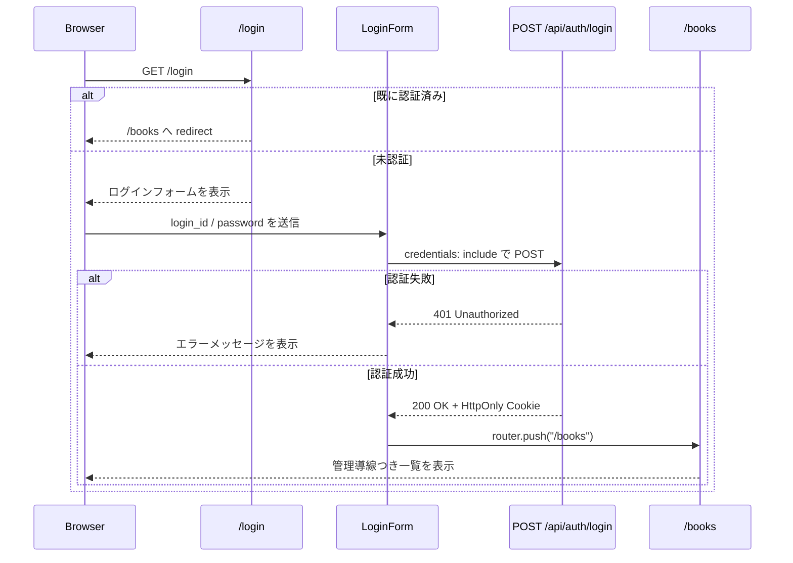

# Step 27: ログイン画面

## この Step でやること

Step 27 では、Step 25 で追加した認証 API をブラウザの画面操作へつなぎ、未認証利用者が `/login` から管理者ログインできる状態を作る。2026-06-25 の調整で、frontend の `/books` へ未認証で入った場合も `/login` へリダイレクトするようにした。

今回の方針は次の通りです。

- `/login` を新設する
- `login_id` と `password` を入力して `POST /api/auth/login` を呼ぶ
- ログイン失敗時は API の `401` メッセージを画面へ出す
- ログイン成功時は `/books` へ遷移する
- すでに認証済みなら `/login` を表示せず `/books` へ戻す
- `/books` や権限不足画面から `/login` へ移動できるようにする
- `/books` は未認証のまま表示せず `/login` へリダイレクトする

## 追加・変更したファイル

| ファイル | 役割 |
| --- | --- |
| `frontend/app/login/page.tsx` | ログイン画面の server component。認証済みなら `/books` へリダイレクトする |
| `frontend/components/LoginForm.tsx` | ログインフォームの client component。入力状態、送信、エラー表示、遷移を担当する |
| `frontend/lib/api.ts` | `loginUser()` を追加し、frontend から認証 API を呼べるようにする |
| `frontend/types/auth.ts` | ログイン request / response の型を追加する |
| `frontend/app/books/page.tsx` | 未認証時にログイン導線を表示する |
| `frontend/app/books/new/page.tsx` | 権限不足時にログイン画面へのリンクを表示する |
| `frontend/app/books/[id]/edit/page.tsx` | 権限不足時にログイン画面へのリンクを表示する |
| `frontend/app/globals.css` | ログイン画面用のレイアウトとヘッダー操作群のスタイルを追加する |
| `frontend/e2e/login-page.spec.ts` | ログイン画面の正常系・異常系・認証済みリダイレクトを Playwright で確認する |
| `README.md` | `/login` 画面と認証導線の仕様を反映する |
| `LEARNING_PROGRESS.md` | Step 27 の完了記録と次の Step を更新する |
| `LEARNING_ROADMAP.md` | Step 27 のチェック状態を更新する |

## 処理の流れ



## コードレベル説明

### `frontend/app/login/page.tsx`

```tsx
const currentUser = await fetchCurrentUser();

if (currentUser !== null) {
  redirect("/books");
}
```

このコードで何が起きているか:

- `fetchCurrentUser()` を server-side で呼び、既存の Cookie から現在ユーザーを確認する
- 認証済みなら `/login` を見せずに `/books` へ戻す
- Step 27 の入口は公開のままだが、不要な再ログイン画面を避ける設計にしている

### `frontend/components/LoginForm.tsx`

```tsx
const result = await loginUser({
  login_id: loginId,
  password,
});

if (!result.ok) {
  setMessage(result.message);
  setIsSubmitting(false);
  return;
}
```

このコードで何が起きているか:

- フォーム送信時に `login_id` と `password` を整形して `loginUser()` へ渡す
- `isSubmitting` で二重送信を防ぎ、失敗時は `role="alert"` のメッセージへ反映する
- 成功時は `router.push("/books")` と `router.refresh()` を呼び、server-side の管理者判定を最新 Cookie で再評価させる

### `frontend/lib/api.ts`

```ts
export async function loginUser(
  loginInput: LoginInput,
): Promise<ApiResult<LoginResponse>> {
  const response = await fetch(`${getApiBaseUrl()}/api/auth/login`, {
    method: "POST",
    credentials: "include",
```

このコードで何が起きているか:

- browser 実行時は `NEXT_PUBLIC_API_BASE_URL`、server 実行時は `INTERNAL_API_BASE_URL` を使う既存方針をそのまま使う
- `credentials: "include"` を付けることで、backend が返した `HttpOnly` Cookie をブラウザへ保存できる
- `401` のときは backend の `detail` をそのまま拾い、ログイン失敗理由を UI へ返す

### `frontend/app/books/page.tsx`

```tsx
const currentUser = await fetchCurrentUser();

if (currentUser === null) {
  redirect("/login");
}
```

このコードで何が起きているか:

- server-side で現在ユーザーを確認し、未認証なら `/login` へ返す
- これにより `/books` をログイン後の入口として扱える
- 認証済みなら一覧取得へ進み、管理者だけに「本を登録」を出す

### `frontend/e2e/login-page.spec.ts`

```ts
await page.getByLabel("ログインID").fill("step27-admin@example.com");
await page.getByLabel("パスワード").fill("WrongPass123");
await page.getByRole("button", { name: "ログインする" }).click();
```

このコードで何が起きているか:

- まず誤ったパスワードを入れ、`401` のエラーメッセージが画面へ出ることを確認する
- 次に正しいパスワードで再送し、`/books` へ戻って管理導線が表示されることを確認する
- 最後に認証済みのまま `/login` を再訪し、`/books` へリダイレクトされることを確認する

## 動作確認コマンド

目的:
frontend の lint を確認する

実行ディレクトリ:
`C:\Users\rnm21\AI_Coding_study\Library\frontend`

```powershell
npm.cmd run lint
```

目的:
frontend の本番ビルドを確認する

実行ディレクトリ:
`C:\Users\rnm21\AI_Coding_study\Library\frontend`

```powershell
npm.cmd run build
```

目的:
Step 27 用の一時 SQLite DB を migration し、backend と frontend を起動した状態で Playwright を実行する

実行ディレクトリ:
`C:\Users\rnm21\AI_Coding_study\Library`

```powershell
$ErrorActionPreference='Stop'
$backendDir = Resolve-Path '.\backend'
$frontendDir = Resolve-Path '.\frontend'
$evidenceDir = '.\test\evidence\step27-playwright'
New-Item -ItemType Directory -Force -Path $evidenceDir | Out-Null
$env:DATABASE_URL='sqlite:///./step27_playwright.db'
Remove-Item -LiteralPath (Join-Path $backendDir 'step27_playwright.db') -ErrorAction SilentlyContinue
Push-Location $backendDir
try {
    .\.venv\Scripts\alembic.exe upgrade head
}
finally {
    Pop-Location
}
$backendProcess = Start-Process -FilePath (Join-Path $backendDir '.venv\Scripts\python.exe') -ArgumentList '-m', 'uvicorn', 'app.main:app', '--host', '127.0.0.1', '--port', '8000' -WorkingDirectory $backendDir -WindowStyle Hidden -PassThru
$frontendProcess = Start-Process -FilePath 'npm.cmd' -ArgumentList 'start', '--', '--hostname', '127.0.0.1', '--port', '3011' -WorkingDirectory $frontendDir -WindowStyle Hidden -PassThru
try {
    $env:PLAYWRIGHT_EVIDENCE_DIR = (Resolve-Path $evidenceDir).Path
    Push-Location $frontendDir
    try {
        npm.cmd exec playwright test e2e/login-page.spec.ts
    }
    finally {
        Pop-Location
    }
}
finally {
    Stop-Process -Id $frontendProcess.Id -Force
    Stop-Process -Id $backendProcess.Id -Force
}
```

## Playwright 証跡

- `test/evidence/step27-playwright/01-login-error.png`
- `test/evidence/step27-playwright/02-books-after-login.png`
- `test/evidence/step27-playwright/03-login-page-flow.json`

## この Step で確認できること

- 認証 API をブラウザのフォーム送信へ接続できる
- 失敗時に backend のログインエラーを画面へ返せる
- ログイン成功後に `/books` で管理導線が表示される
- 認証済み利用者を `/login` に残さず `/books` へ戻せる

## この Step だけでは確認できないこと

- 変更操作の監査ログ
- 失敗操作の構造化ログ
- 複数ロールの詳細な権限差分

これらは Step 28 以降で追加する。
