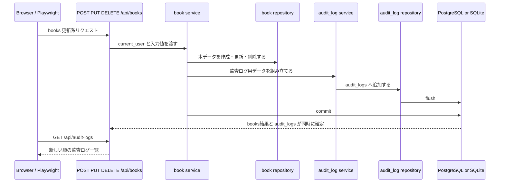

# Step 28: 監査ログ

## この Step でやること

Step 28 では、本の作成、更新、削除が成功したときに、誰がいつどの本へどの操作をしたかを `audit_logs` へ残す。通常のアプリログとは分けて、後から履歴を追える最小構成を追加する。

今回の方針は次の通りです。

- books の `POST` `PUT` `DELETE` を監査対象にする
- 監査ログには実行者、操作種別、対象ID、対象タイトル、実行時刻を保存する
- 削除後も追跡できるように、対象タイトルをスナップショットとして残す
- books 更新と監査ログ保存は同じ transaction で commit する
- 監査ログの一覧取得は `GET /api/audit-logs` とし、`admin` だけに許可する

## 追加・変更したファイル

| ファイル | 役割 |
| --- | --- |
| `backend/app/models/audit_log.py` | `audit_logs` テーブルのSQLAlchemy model |
| `backend/alembic/versions/78e3f4a1b2c9_add_audit_logs_table.py` | `audit_logs` テーブルを作る migration |
| `backend/app/repositories/audit_log.py` | 監査ログの保存と一覧取得 |
| `backend/app/services/audit_log.py` | books 向け監査ログの組み立て |
| `backend/app/routers/audit_logs.py` | `GET /api/audit-logs` のAPI入口 |
| `backend/app/services/book.py` | books 更新系成功時に監査ログを保存する |
| `backend/app/repositories/book.py` | books 更新系の commit 境界を service 側へ寄せる |
| `backend/tests/test_audit_logs_api.py` | 監査ログAPIの権限制御、保存順、失敗時非記録を確認する |
| `backend/tests/test_books_api.py` | books CRUD 後に監査ログが増えることを確認する |
| `frontend/e2e/audit-logs-api.spec.ts` | Playwright で監査ログのE2E確認を行う |
| `README.md` | 監査ログの仕様とAPI、DB設計を反映する |
| `LEARNING_ROADMAP.md` | Step 28 の完了状態を反映する |
| `LEARNING_PROGRESS.md` | Step 28 の記録と次の Step を更新する |

## 処理の流れ



## コードレベル説明

### `backend/app/models/audit_log.py`

```python
class AuditLog(Base):
    __tablename__ = "audit_logs"
    __table_args__ = (
        CheckConstraint(
            "action IN ('create', 'update', 'delete')",
            name="ck_audit_logs_action_valid",
        ),
    )
```

このコードで何が起きているか:

- `audit_logs` テーブルの構造を定義する
- `action` は `create` `update` `delete` だけに制限し、監査対象外の値が入らないようにする
- `actor_user_id` と `actor_email` は NULL を許可し、将来のシステム実行や未特定実行者にも拡張できる形にしている
- `target_id` と `target_title` は削除後も対象を追えるよう、books とは別カラムで保持する

### `backend/app/services/book.py`

```python
book = create_book_repository(
    db,
    book_create,
    created_at=now,
    updated_at=now,
)
record_book_audit_log(
    db,
    actor=actor,
    action=AUDIT_ACTION_CREATE,
    book_id=book.id,
    book_title=book.title,
)
db.commit()
```

このコードで何が起きているか:

- books の更新系 service は、これまで repository 内でしていた `commit()` をやめて service 側へ寄せた
- まず本データを `flush` してIDを確定し、その同じ transaction の中で監査ログを追加する
- 最後に `db.commit()` を1回だけ実行することで、「本だけ保存された」「監査ログだけ保存された」という途中状態を避ける
- `IntegrityError` が起きた場合は `db.rollback()` し、`DuplicateIsbnError` へ変換して監査ログも残さない

### `backend/app/services/audit_log.py`

```python
return create_audit_log_repository(
    db,
    actor_user_id=actor.id if actor is not None else None,
    actor_email=actor.email if actor is not None else None,
    action=action,
    target_type=BOOK_TARGET_TYPE,
    target_id=book_id,
    target_title=book_title,
    occurred_at=occurred_at,
)
```

このコードで何が起きているか:

- books service から受け取った `User` と本情報を、監査ログ用の保存形式へ変換する
- Step 28 時点の対象種別は `book` だけなので `BOOK_TARGET_TYPE` を固定で使う
- 実行者が存在しない将来ケースでも落ちないように、`actor` は `None` を許容する
- repository 側では `flush()` までに留め、commitは呼び出し元serviceに任せる

### `backend/app/routers/audit_logs.py`

```python
@router.get("", response_model=list[AuditLogResponse])
def list_audit_logs_endpoint(
    db: Session = Depends(get_db),
    _: object = Depends(require_admin_user),
) -> list[AuditLog]:
    return list_audit_logs(db)
```

このコードで何が起きているか:

- `GET /api/audit-logs` の入口を追加する
- `require_admin_user` を dependency に使い、未認証は `401`、非 `admin` は `403` にする
- 正常系では新しい順の `AuditLogResponse` 配列を返す
- 監査ログの閲覧まで管理者に限定し、books 更新系と同じ保護範囲にそろえる

### `frontend/e2e/audit-logs-api.spec.ts`

```ts
const auditLogsResponse = await request.get(`${apiBaseUrl}/api/audit-logs`);
expect(auditLogsResponse.status()).toBe(200);
const auditLogsBody = await auditLogsResponse.json();

expect(auditLogsBody).toHaveLength(3);
expect(auditLogsBody.map((auditLog: { action: string }) => auditLog.action)).toEqual([
  "delete",
  "update",
  "create",
]);
```

このコードで何が起きているか:

- Playwright の APIRequestContext を使い、bootstrap、login、books 作成、更新、削除、監査ログ取得を1本で確認する
- 一覧が新しい順で返ることを `delete` `update` `create` の順で検証する
- 最後に JSON 証跡を `test/evidence/step28-playwright` へ保存し、後から実行結果を見返せるようにする

## 動作確認コマンド

目的:
backend の lint を確認する

実行ディレクトリ:
`C:\Users\rnm21\AI_Coding_study\Library\backend`

```powershell
.\.venv\Scripts\ruff.exe check .
```

目的:
backend の format を確認する

実行ディレクトリ:
`C:\Users\rnm21\AI_Coding_study\Library\backend`

```powershell
.\.venv\Scripts\ruff.exe format --check .
```

目的:
backend の API テストを確認する

実行ディレクトリ:
`C:\Users\rnm21\AI_Coding_study\Library\backend`

```powershell
.\.venv\Scripts\python.exe -m pytest
```

目的:
Step 28 用の一時 SQLite DB を migration し、backend を起動した状態で Playwright の監査ログ API テストを実行する

実行ディレクトリ:
`C:\Users\rnm21\AI_Coding_study\Library\backend`

```powershell
$ErrorActionPreference='Stop'
$backendDir = Resolve-Path '.'
$frontendDir = Resolve-Path '..\frontend'
$stepEvidenceDir = Resolve-Path '..\test\evidence\step28-playwright'
New-Item -ItemType Directory -Force -Path $stepEvidenceDir | Out-Null
$env:DATABASE_URL='sqlite:///./step28_playwright.db'
Remove-Item -LiteralPath (Join-Path $backendDir 'step28_playwright.db') -ErrorAction SilentlyContinue
.\.venv\Scripts\alembic.exe upgrade head
$backendPort='8010'
$backendProcess = Start-Process -FilePath .\.venv\Scripts\python.exe -ArgumentList '-m', 'uvicorn', 'app.main:app', '--host', '127.0.0.1', '--port', $backendPort -WorkingDirectory $backendDir -WindowStyle Hidden -PassThru
try {
    $deadline = (Get-Date).AddSeconds(30)
    do {
        try {
            $response = Invoke-WebRequest -UseBasicParsing -Uri "http://127.0.0.1:$backendPort/health" -TimeoutSec 2
            if ($response.StatusCode -eq 200) { break }
        }
        catch {}
        Start-Sleep -Milliseconds 500
    } while ((Get-Date) -lt $deadline)
    if ((Get-Date) -ge $deadline) { throw 'Backend did not become ready.' }
    $env:PLAYWRIGHT_EVIDENCE_DIR = $stepEvidenceDir
    $env:PLAYWRIGHT_API_BASE_URL = "http://127.0.0.1:$backendPort"
    Push-Location $frontendDir
    try {
        npm.cmd exec playwright test e2e/audit-logs-api.spec.ts
    }
    finally {
        Pop-Location
    }
}
finally {
    if ($backendProcess -ne $null) {
        Stop-Process -Id $backendProcess.Id -Force -ErrorAction SilentlyContinue
    }
}
```

## Playwright 証跡

- `test/evidence/step28-playwright/01-audit-logs-api-flow.json`

## この Step で確認できること

- books の作成、更新、削除成功時に監査ログが追加される
- 監査ログへ実行者、対象、操作種別、時刻が保存される
- 失敗した更新操作では監査ログが増えない
- 管理者だけが監査ログ一覧を取得できる

## この Step だけでは確認できないこと

- request 単位の構造化ログ
- 共通例外ハンドラによる `500` レスポンス統一
- `request_id` による障害追跡

これらは Step 29 で追加する。
