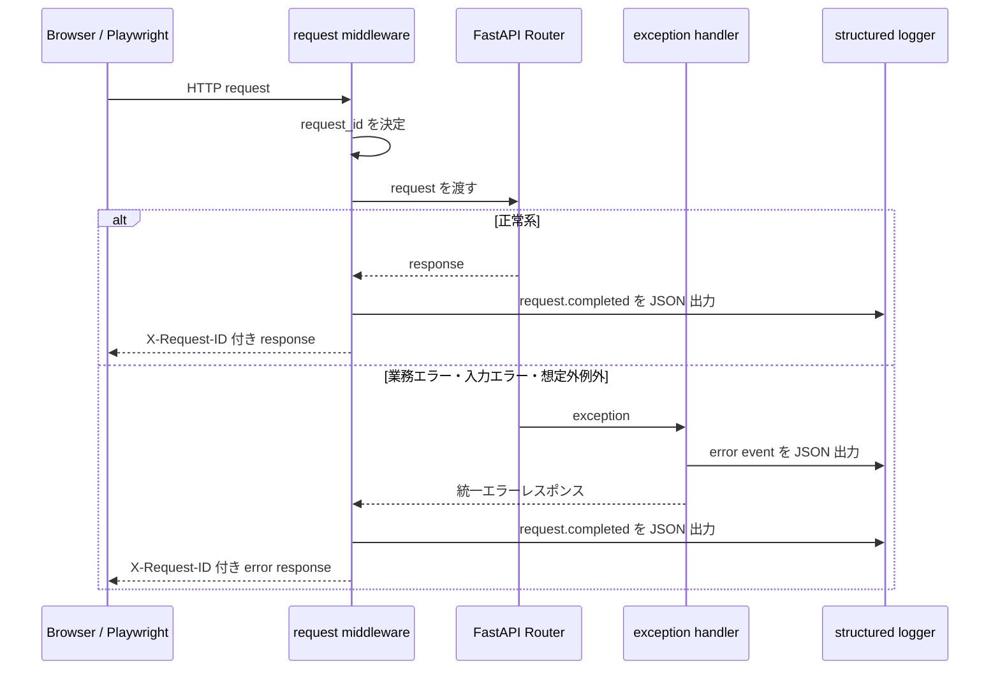

# Step 29: 構造化ログと例外ハンドリング統一

## この Step でやること

Step 29 では、認証失敗、権限不足、入力エラー、想定外例外を request 単位で追跡しやすくするために、backend 全体のログ形式とエラーレスポンス形式を統一する。

今回の方針は次の通りです。

- すべての HTTP リクエストに `request_id` を割り当てる
- レスポンスヘッダー `X-Request-ID` に同じ値を返す
- エラーレスポンス本文を `detail` `error_code` `request_id` に統一する
- 入力エラーでは `errors` 配列も返し、どこで失敗したかを追えるようにする
- 想定外例外では内部ログにだけ例外詳細を残し、利用者向けレスポンスは固定メッセージにする
- request 完了ログを JSON 形式で出力し、`method` `path` `status_code` `duration_ms` をそろえる

## 追加・変更したファイル

| ファイル | 役割 |
| --- | --- |
| `backend/app/observability.py` | `request_id` 付与、レスポンスヘッダー設定、構造化ログ出力 |
| `backend/app/errors.py` | 業務向け共通例外クラス |
| `backend/app/schemas/error.py` | 統一エラーレスポンスの schema |
| `backend/app/main.py` | request middleware と共通 exception handler |
| `backend/app/services/auth.py` | 認証・認可失敗を `AppError` に寄せる |
| `backend/app/routers/books.py` | `404` `409` を共通例外へ変換する |
| `backend/app/routers/auth.py` | ログイン失敗を共通例外へ変換する |
| `backend/app/routers/admin.py` | bootstrap 関連の競合エラーを共通例外へ変換する |
| `backend/tests/test_error_handling_api.py` | `request_id`、統一エラー形式、構造化ログを確認する |
| `frontend/e2e/error-handling-api.spec.ts` | Playwright で統一エラー形式と `X-Request-ID` を確認する |
| `README.md` | エラーレスポンス仕様、ログ仕様、Step 29 完了内容を反映する |
| `LEARNING_ROADMAP.md` | Step 29 の完了状態を反映する |
| `LEARNING_PROGRESS.md` | Step 29 の記録と次の Step を更新する |

## 処理の流れ



## コードレベル説明

### `backend/app/observability.py`

```python
def log_request_completed(
    request: Request,
    response: Response,
    started_at: float,
) -> None:
    duration_ms = round((perf_counter() - started_at) * 1000, 2)
    log_event(
        logging.INFO,
        "request.completed",
        request_id=get_request_id(request),
        method=request.method,
        path=request.url.path,
        status_code=response.status_code,
        duration_ms=duration_ms,
    )
```

このコードで何が起きているか:

- request の開始時刻から経過時間を計算し、`duration_ms` として残す
- すべての API で `request.completed` という同じ event 名を使い、ログ形式を固定する
- `request_id` `method` `path` `status_code` を毎回残すため、障害調査時に比較しやすい
- `log_event()` は最終的に JSON 文字列を 1 行で出力するので、後からログ集約基盤へ流し込みやすい

### `backend/app/errors.py`

```python
class AppError(Exception):
    def __init__(
        self,
        *,
        status_code: int,
        detail: str,
        error_code: str,
    ) -> None:
        super().__init__(detail)
        self.status_code = status_code
        self.detail = detail
        self.error_code = error_code
```

このコードで何が起きているか:

- router や service から共通 handler へ渡すための最小例外型を定義する
- 利用者向けメッセージは `detail`、調査や分岐用の固定識別子は `error_code` に分ける
- `401` `403` `404` `409` の個別例外クラスは、この `AppError` をベースにしている
- これにより router ごとに JSONResponse を手書きせずに済む

### `backend/app/main.py`

```python
@app.exception_handler(Exception)
async def unhandled_exception_handler(
    request: Request,
    exc: Exception,
) -> JSONResponse:
    log_event(
        logging.ERROR,
        "request.unhandled_exception",
        request_id=get_request_id(request),
        method=request.method,
        path=request.url.path,
        status_code=500,
        error_code="internal_server_error",
        exception_type=type(exc).__name__,
        message=str(exc),
    )
    return create_error_response(
        request=request,
        status_code=500,
        detail="サーバー内部でエラーが発生しました",
        error_code="internal_server_error",
    )
```

このコードで何が起きているか:

- 想定外例外が起きたときに、内部ログへだけ例外型と例外メッセージを出す
- 利用者には固定の `500` メッセージだけを返し、内部実装や機密情報を漏らさない
- 返す本文は `create_error_response()` で統一し、`request_id` も必ず含める
- `AppError`、`HTTPException`、`RequestValidationError` にも専用 handler を定義し、すべて同じ形式へ寄せている

### `backend/app/services/auth.py`

```python
def require_admin_user(current_user: User = Depends(get_current_user)) -> User:
    if current_user.role != ADMIN_ROLE:
        raise AuthorizationError()

    return current_user
```

このコードで何が起きているか:

- `admin` 以外の利用者を `403 Forbidden` 相当の共通例外へ変換する
- 認可失敗を dependency の段階で止めるため、各 router 内で同じ if 文を書かなくてよい
- 例外変換先が `AppError` になったので、レスポンス形式とログ形式が books 以外の API でもそろう

### `backend/tests/test_error_handling_api.py`

```python
assert response.json() == {
    "detail": "認証が必要です",
    "error_code": "authentication_required",
    "request_id": response.headers["X-Request-ID"],
}
```

このコードで何が起きているか:

- `401` `403` `422` `500` の代表例で、本文とヘッダーの `request_id` が一致することを確認する
- `caplog` も使い、`request.completed` が JSON 形式で出力されることをテストする
- `500` テストでは router 側の関数を一時的に差し替え、想定外例外のハンドリングだけを狙って確認する

## 動作確認コマンド

目的:
backend の lint を確認する

実行ディレクトリ:
`C:\Users\rnm21\AI_Coding_study\Library\backend`

```powershell
.\.venv\Scripts\ruff.exe check .
```

目的:
backend の format を確認する

実行ディレクトリ:
`C:\Users\rnm21\AI_Coding_study\Library\backend`

```powershell
.\.venv\Scripts\ruff.exe format --check .
```

目的:
backend の API テストを確認する

実行ディレクトリ:
`C:\Users\rnm21\AI_Coding_study\Library\backend`

```powershell
.\.venv\Scripts\python.exe -m pytest
```

目的:
Step 29 用の一時 SQLite DB を migration し、backend を起動した状態で Playwright のエラーハンドリング API テストを実行する

実行ディレクトリ:
`C:\Users\rnm21\AI_Coding_study\Library\backend`

```powershell
$ErrorActionPreference='Stop'
$backendDir = Resolve-Path '.'
$frontendDir = Resolve-Path '..\frontend'
$stepEvidenceDir = Resolve-Path '..\test\evidence\step29-playwright'
New-Item -ItemType Directory -Force -Path $stepEvidenceDir | Out-Null
$env:DATABASE_URL='sqlite:///./step29_playwright.db'
Remove-Item -LiteralPath (Join-Path $backendDir 'step29_playwright.db') -ErrorAction SilentlyContinue
.\.venv\Scripts\alembic.exe upgrade head
$backendPort='8011'
$backendProcess = Start-Process -FilePath .\.venv\Scripts\python.exe -ArgumentList '-m', 'uvicorn', 'app.main:app', '--host', '127.0.0.1', '--port', $backendPort -WorkingDirectory $backendDir -WindowStyle Hidden -PassThru
try {
    $deadline = (Get-Date).AddSeconds(30)
    do {
        try {
            $response = Invoke-WebRequest -UseBasicParsing -Uri "http://127.0.0.1:$backendPort/health" -TimeoutSec 2
            if ($response.StatusCode -eq 200) { break }
        }
        catch {}
        Start-Sleep -Milliseconds 500
    } while ((Get-Date) -lt $deadline)
    if ((Get-Date) -ge $deadline) { throw 'Backend did not become ready.' }
    $env:PLAYWRIGHT_EVIDENCE_DIR = $stepEvidenceDir
    $env:PLAYWRIGHT_API_BASE_URL = "http://127.0.0.1:$backendPort"
    Push-Location $frontendDir
    try {
        npm.cmd exec playwright test e2e/error-handling-api.spec.ts
    }
    finally {
        Pop-Location
    }
}
finally {
    if ($backendProcess -ne $null) {
        Stop-Process -Id $backendProcess.Id -Force -ErrorAction SilentlyContinue
    }
}
```

## Playwright 証跡

- `test/evidence/step29-playwright/01-error-handling-api-flow.json`

## この Step で確認できること

- `request_id` がレスポンスヘッダーとエラーレスポンス本文へ入る
- `401` `403` `409` `422` `500` を固定形式で返せる
- 想定外例外でも利用者向けメッセージを固定し、内部ログには例外詳細を残せる
- request 完了ログが同じキー構成で出力される

## この Step だけでは確認できないこと

- 外部ログ集約基盤への転送
- 分散トレーシング
- 複数サービス間での `request_id` 連携

これらは将来の運用拡張で追加する。
