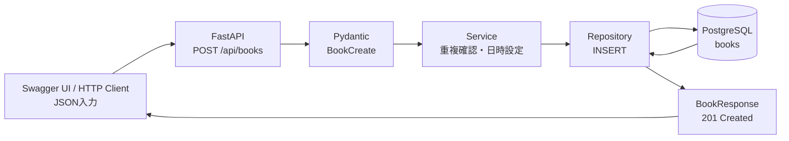

# Step 3: 本の新規登録API

## このStepで行うこと

FastAPIで `POST /api/books` を作成し、JSON入力をPydanticで検証してからSQLAlchemyでPostgreSQLの `books` テーブルへ保存します。

## データの流れ



## Mermaid図の各STEP

### 1. Swagger UI / HTTP Client: JSON入力

利用者や開発者が、本の情報をJSONとしてAPIへ送ります。

このStepでは、次のようなデータがリクエストボディになります。

```json
{
  "title": "Webアプリ開発入門",
  "author": "山田太郎",
  "published_year": 2026,
  "isbn": "9780000000000"
}
```

ここではまだDB保存は行われません。APIへ「この内容で本を登録してほしい」と依頼している段階です。

### 2. FastAPI: POST /api/books

`backend/app/routers/books.py` の `create_book_endpoint()` がHTTPリクエストを受け取ります。

このStepの役割は、HTTPの入口として次の処理へ橋渡しすることです。

- URLが `/api/books` であることを受け付ける
- HTTPメソッドが `POST` であることを受け付ける
- リクエストボディを `BookCreate` として受け取る
- DBセッションを取得する
- Service層の登録処理を呼び出す
- 成功時は `201 Created` を返す
- ISBN重複時は `409 Conflict` を返す

ルーターには複雑なDB処理を書かず、APIの入口として薄く保ちます。

### 3. Pydantic: BookCreate

`backend/app/schemas/book.py` の `BookCreate` が入力値を検証します。

このStepでは、JSONが仕様どおりかを確認します。

- `title` があるか
- `title` が1文字以上255文字以内か
- `author` があるか
- `author` が1文字以上255文字以内か
- `title` と `author` が空白だけではないか
- `published_year` が指定されている場合、1以上か
- `isbn` が指定されている場合、20文字以内か
- `isbn` が空文字なら `None` に変換するか

ここで不正な入力が見つかると、FastAPIが `422 Unprocessable Entity` を返します。不正な値はService層やRepository層まで進みません。

### 4. Service: 重複確認・日時設定

`backend/app/services/book.py` の `create_book()` が、登録前の業務ルールを処理します。

このStepでは、単純な入力チェックではなく、DB状態も関係する判断を行います。

- ISBNが入力されている場合、同じISBNの本がすでにあるか確認する
- 同じISBNがあれば `DuplicateIsbnError` を発生させる
- `created_at` と `updated_at` に現在時刻を設定する
- Repository層へDB登録を依頼する

ISBN重複は「入力値の形が悪い」のではなく、「今のDB状態と競合している」ため `409 Conflict` として扱います。

### 5. Repository: INSERT

`backend/app/repositories/book.py` の `create_book()` がDBへの保存を担当します。

このStepでは、SQLAlchemyの `Book` モデルを作り、DBへINSERTします。

- `Book` オブジェクトを作る
- `db.add(book)` で登録対象にする
- `db.commit()` でDBへ保存を確定する
- `db.refresh(book)` でDB採番後の `id` などを取り直す
- 保存済みの `Book` を返す

Repository層はDBアクセスに集中します。HTTPステータスや入力検証の細かい判断はここには置きません。

### 6. PostgreSQL: books

PostgreSQLの `books` テーブルにデータが保存されます。

このStepでは、Step 2で作成したテーブル定義と制約が効きます。

- `id` は自動採番される
- `title` と `author` は `NOT NULL`
- `published_year` は `NULL` または1以上
- `isbn` は `NULL` または一意
- `created_at` と `updated_at` は `NOT NULL`

API側で検証していても、DB側の制約は最後の防御として残ります。

### 7. BookResponse: 201 Created

登録に成功すると、保存された `Book` が `BookResponse` の形に変換されてJSONとして返ります。

レスポンスには、リクエスト時には存在しなかった値も含まれます。

- `id`
- `created_at`
- `updated_at`

成功時のHTTPステータスは `201 Created` です。これは「新しいデータを作成した」ことを表します。

## ファイルの役割

| ファイル | 役割 |
| --- | --- |
| `backend/app/schemas/book.py` | 登録リクエストとレスポンスのPydanticスキーマ |
| `backend/app/repositories/book.py` | `books` テーブルへのDBアクセス処理 |
| `backend/app/services/book.py` | ISBN重複確認、日時設定、登録処理の調整 |
| `backend/app/routers/books.py` | `POST /api/books` のAPIエンドポイント |
| `backend/app/main.py` | booksルーターの登録 |

## 実装したAPI

`POST /api/books`

リクエスト例:

```json
{
  "title": "Webアプリ開発入門",
  "author": "山田太郎",
  "published_year": 2026,
  "isbn": "9780000000000"
}
```

成功時は `201 Created` で、登録された本をJSONで返します。

## 入力検証

- `title` は必須、1文字以上255文字以内
- `author` は必須、1文字以上255文字以内
- `title` と `author` は空白だけを許可しない
- `published_year` は任意、指定する場合は1以上
- `isbn` は任意、20文字以内
- `isbn` が空文字または空白だけの場合は `NULL` として扱う

## エラー処理

- 入力値が仕様を満たさない場合はFastAPIが `422 Unprocessable Entity` を返す
- 同じISBNがすでに登録されている場合は `409 Conflict` を返す
- ISBN未入力は `NULL` として保存するため、ISBN未入力の本は複数登録できる

## 確認したこと

一時的に `uvicorn` を起動し、HTTP経由で次を確認しました。

- 正常な入力で `201 Created` が返る
- 必須項目が不正な場合に `422` が返る
- ISBN重複時に `409` が返る
- ISBN未入力の本を複数登録できる

確認用に登録したデータは確認後に削除しました。

## 学ぶポイント

- PydanticスキーマはAPIの入力と出力の形を表す
- SQLAlchemyモデルはDBテーブルの形を表す
- APIルーターはHTTPの入口として薄く保つ
- Service層に業務ルールを置く
- Repository層にDBアクセスを置く
- `201` は新規作成成功を表す
- `409` は現在のDB状態と競合したことを表す
- `422` は入力値が仕様を満たさないことを表す

## 実装部分のコードレベル説明

### `backend/app/schemas/book.py`

```python
class BookCreate(BaseModel):
    title: str = Field(min_length=1, max_length=255)
    author: str = Field(min_length=1, max_length=255)
    published_year: int | None = Field(default=None, ge=1)
    isbn: str | None = Field(default=None, max_length=20)
```

`BookCreate` は `POST /api/books` のリクエスト本文を表す型です。
`title` と `author` は `Field(min_length=1, max_length=255)` により、1文字以上255文字以内に制限しています。
`published_year` は `int | None` なので未入力を許可し、値がある場合は `ge=1` で1以上に制限します。
`isbn` は `str | None` で、最大20文字です。

`strip_required_text()` は `title` と `author` の前後空白を取り除きます。
空白だけの入力は `""` になるため、`ValueError` を発生させて `422 Unprocessable Entity` にします。

`normalize_isbn()` は `isbn` の前後空白を取り除きます。
空文字になった場合は `None` を返すため、DBには空文字ではなく `NULL` として保存されます。

`BookResponse` はAPIレスポンスの型です。
`model_config = ConfigDict(from_attributes=True)` により、SQLAlchemyの `Book` オブジェクトからPydanticレスポンスへ変換できます。

### `backend/app/repositories/book.py`

```python
def create_book(
    db: Session,
    book_create: BookCreate,
    created_at: datetime,
    updated_at: datetime,
) -> Book:
    book = Book(
        **book_create.model_dump(),
        created_at=created_at,
        updated_at=updated_at,
    )
    db.add(book)
    db.commit()
    db.refresh(book)
    return book
```

`get_book_by_isbn(db, isbn)` はISBN重複確認用です。
`select(Book).where(Book.isbn == isbn)` でSQLの `WHERE isbn = ...` に相当する条件を作り、最初の1件を返します。
見つからなければ `None` です。

`create_book(db, book_create, created_at, updated_at)` はDBへのINSERTを担当します。
`book_create.model_dump()` でPydanticモデルを辞書にし、`Book(**...)` でSQLAlchemyモデルを作ります。
その後、`db.add(book)`、`db.commit()`、`db.refresh(book)` の順に進みます。
`commit()` でDBに確定し、`refresh()` でDBが採番した `id` などをPythonオブジェクトへ反映します。

### `backend/app/services/book.py`

```python
def create_book(db: Session, book_create: BookCreate) -> Book:
    if book_create.isbn is not None and get_book_by_isbn(db, book_create.isbn) is not None:
        raise DuplicateIsbnError()

    now = datetime.now(UTC)
    return create_book_repository(
        db,
        book_create,
        created_at=now,
        updated_at=now,
    )
```

`create_book(db, book_create)` は業務ルールの入口です。
まず `book_create.isbn is not None` の場合だけ `get_book_by_isbn()` を呼び、同じISBNがあれば `DuplicateIsbnError` を発生させます。

重複がなければ `datetime.now(UTC)` で現在時刻を作り、repositoryの `create_book_repository()` へ渡します。
DBのUNIQUE制約でも重複が検出される可能性があるため、`IntegrityError` を捕まえて `db.rollback()` し、同じく `DuplicateIsbnError` に変換します。

### `backend/app/routers/books.py`

```python
@router.post("", response_model=BookResponse, status_code=status.HTTP_201_CREATED)
def create_book_endpoint(
    book_create: BookCreate,
    db: Session = Depends(get_db),
) -> Book:
    try:
        return create_book(db, book_create)
    except DuplicateIsbnError as error:
        raise HTTPException(
            status_code=status.HTTP_409_CONFLICT,
            detail="同じISBNの本がすでに登録されています",
        ) from error
```

`create_book_endpoint()` はHTTPの入口です。
引数 `book_create: BookCreate` により、FastAPIがリクエストJSONをPydanticで検証します。
検証に失敗した場合、この関数本体に入る前に `422` が返ります。

関数内ではservice層の `create_book()` を呼び出します。
成功時は `Book` オブジェクトを返し、`response_model=BookResponse` によりJSONへ変換されます。
`status_code=status.HTTP_201_CREATED` により、正常登録時のHTTPステータスは `201` になります。

`DuplicateIsbnError` が発生した場合は、routerで `HTTPException(status_code=409, ...)` に変換します。
これにより、service層はHTTPを知らず、router層だけがHTTPステータスを決める構造になります。

初学者が読む順番は、`BookCreate`、`create_book_endpoint()`、serviceの `create_book()`、repositoryの `create_book()`、`BookResponse` です。
