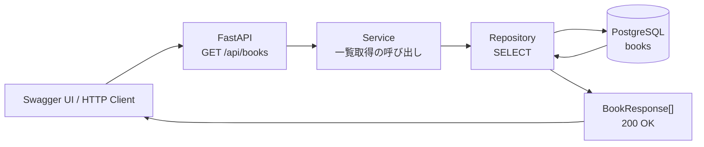

# Step 4: 本の一覧取得API

## このStepで行うこと

FastAPIで `GET /api/books` を作成し、PostgreSQLの `books` テーブルに保存されている本を一覧としてJSONで返します。

## データの流れ



## Mermaid図の各STEP

### 1. Swagger UI / HTTP Client

ここはAPIを呼び出す側です。

Step 4では、利用者や開発者がSwagger UIなどから `GET /api/books` を呼び出します。Step 3の新規登録APIと違い、タイトルや著者などのJSONは送りません。

```http
GET /api/books
```

この時点では、「保存されている本を一覧でください」とAPIへ依頼しています。

### 2. FastAPI: GET /api/books

ここはHTTPリクエストの入口です。

`backend/app/routers/books.py` の `list_books_endpoint()` が担当します。

```python
@router.get("", response_model=list[BookResponse])
def list_books_endpoint(db: Session = Depends(get_db)) -> list[Book]:
    return list_books(db)
```

この関数の役割は次のとおりです。

- `GET /api/books` を受け付ける
- DBセッションを受け取る
- service層の `list_books()` を呼び出す
- 結果を `list[BookResponse]` として返す

routerにはDB検索の細かい処理を書かず、APIの入口として薄く保ちます。

### 3. Service: 一覧取得の呼び出し

ここはアプリケーション側の処理を置く層です。

`backend/app/services/book.py` の `list_books()` が担当します。

```python
def list_books(db: Session) -> list[Book]:
    return list_books_repository(db)
```

Step 4では、Step 3ほど複雑な業務ルールはありません。Step 3ではISBN重複チェックや日時設定が必要でしたが、Step 4は一覧取得だけなので、service層はrepository層への橋渡しに近いです。

それでもservice層を残しているのは、今後、検索条件、並び順、ページネーションなどの仕様が追加されたときに、DBアクセス以外の判断をここへ置けるようにするためです。

### 4. Repository: SELECT

ここはDBアクセスを担当する層です。

`backend/app/repositories/book.py` の `list_books()` が担当します。

```python
def list_books(db: Session) -> list[Book]:
    statement = select(Book).order_by(Book.id)
    return list(db.scalars(statement).all())
```

ここで初めてDBから本を取得します。

- `select(Book)` で `books` テーブルから本を取得するSQLを作る
- `.order_by(Book.id)` でID昇順に並べる
- `db.scalars(statement).all()` で実際にDBへ問い合わせる
- 結果を `list[Book]` として返す

Step 3のrepositoryは `INSERT` でしたが、Step 4のrepositoryは `SELECT` です。

### 5. PostgreSQL: books

ここが実際のデータ保存場所です。

Step 2で作成した `books` テーブルから、登録済みの本を取得します。たとえばDBに複数の本があれば、repository層はそれらをPythonの `Book` オブジェクトのリストとして受け取ります。

本が1件もない場合、DB検索結果は空になります。この場合もエラーではありません。

### 6. BookResponse[]: 200 OK

最後に、取得した `Book` のリストをAPIレスポンスとして返します。

routerでは `response_model=list[BookResponse]` を指定しているため、FastAPIがSQLAlchemyモデルをAPI用のJSON形式に変換します。

返るJSONは次のような形です。

```json
[
  {
    "id": 1,
    "title": "Webアプリ開発入門",
    "author": "山田太郎",
    "published_year": 2026,
    "isbn": "9780000000000",
    "created_at": "2026-06-16T12:00:00Z",
    "updated_at": "2026-06-16T12:00:00Z"
  }
]
```

本が0件なら次のように返ります。

```json
[]
```

0件は異常ではなく正常な結果なので、`404 Not Found` ではなく `200 OK` で空配列を返します。

全体を短く書くと、Step 4の処理は次の流れです。

```text
GET /api/books
↓
routerが受け取る
↓
serviceに一覧取得を依頼する
↓
repositoryがDBへSELECTする
↓
PostgreSQLからbooksを取得する
↓
BookResponseの配列としてJSONを返す
```

## ファイルの役割

| ファイル | 役割 |
| --- | --- |
| `backend/app/schemas/book.py` | `BookResponse` でレスポンスJSONの形を定義する |
| `backend/app/repositories/book.py` | `books` テーブルから本を一覧取得する |
| `backend/app/services/book.py` | 一覧取得処理の呼び出し口を用意する |
| `backend/app/routers/books.py` | `GET /api/books` のAPIエンドポイントを定義する |

## 実装したAPI

`GET /api/books`

成功時は `200 OK` で、本の配列を返します。

```json
[
  {
    "id": 1,
    "title": "Webアプリ開発入門",
    "author": "山田太郎",
    "published_year": 2026,
    "isbn": "9780000000000",
    "created_at": "2026-06-16T12:00:00Z",
    "updated_at": "2026-06-16T12:00:00Z"
  }
]
```

登録済みの本がない場合は、エラーではなく空配列 `[]` を返します。

## 確認したこと

- `python -m compileall app` で構文エラーがないこと
- `GET /api/books` が `200 OK` を返すこと
- 本が0件の場合に空配列 `[]` が返ること
- 登録済みの本がJSON配列で返ること

## 学ぶポイント

- `GET` はデータを取得するためのHTTPメソッド
- 複数レコードはJSON配列として返す
- Pydanticのレスポンスモデルにより、DBモデルをAPI用JSONへ変換できる
- データが0件であることは異常ではないため、空配列で表現する

## 実装部分のコードレベル説明

### `backend/app/repositories/book.py`

```python
def list_books(db: Session) -> list[Book]:
    statement = select(Book).order_by(Book.id)
    return list(db.scalars(statement).all())
```

`list_books(db)` はDBから本を一覧取得する関数です。
`statement = select(Book).order_by(Book.id)` で `books` テーブルから全件を取得し、`id` 昇順に並べます。

`db.scalars(statement).all()` は、SQLAlchemyの実行結果から `Book` オブジェクトだけを取り出します。
最後に `list(...)` で通常のPythonリストにして返します。
本が0件の場合も例外にはならず、空のリスト `[]` が返ります。

### `backend/app/services/book.py`

```python
def list_books(db: Session) -> list[Book]:
    return list_books_repository(db)
```

`list_books(db)` はservice層の入口ですが、Step4時点では追加の業務ルールがありません。
そのため、repository層の `list_books_repository(db)` をそのまま呼び出して返します。

このように一見薄い関数でもservice層を用意しておくと、将来「削除済みを除外する」「表示可能な本だけ返す」などの業務ルールを追加する場所が明確になります。

### `backend/app/routers/books.py`

```python
@router.get("", response_model=list[BookResponse])
def list_books_endpoint(db: Session = Depends(get_db)) -> list[Book]:
    return list_books(db)
```

`list_books_endpoint(db: Session = Depends(get_db))` は `GET /api/books` のHTTP入口です。
`Depends(get_db)` により、リクエストごとにDBセッションが作られ、この関数へ渡されます。

戻り値の型は `list[Book]` ですが、デコレーターに `response_model=list[BookResponse]` を指定しています。
FastAPIは返された `Book` オブジェクトのリストを `BookResponse` の配列へ変換してJSONにします。

正常系では常に `200 OK` です。
0件の場合も `[]` を返すだけなので、`404` にはしません。

初学者が読む順番は、routerの `list_books_endpoint()`、serviceの `list_books()`、repositoryの `list_books()`、schemaの `BookResponse` です。
