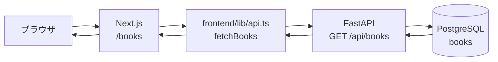

# Step 5: 本の一覧画面

## このStepで行うこと

Next.jsで `/books` 画面を作成し、FastAPIの `GET /api/books` から取得した本の一覧を画面に表示します。

トップページ `/` は `/books` へリダイレクトし、本の一覧画面をアプリケーションの最初の画面にします。

## データの流れ



## ファイルの役割

| ファイル | 役割 |
| --- | --- |
| `frontend/types/book.ts` | APIから返る本データのTypeScript型 `Book` を定義する |
| `frontend/lib/api.ts` | FastAPIとの通信処理をUIコンポーネントから分離する |
| `frontend/app/books/page.tsx` | 本の一覧、0件時の案内、APIエラーを表示する |
| `frontend/app/books/loading.tsx` | `/books` の読み込み中表示を定義する |
| `frontend/app/page.tsx` | `/` から `/books` へリダイレクトする |
| `frontend/app/globals.css` | 本の一覧画面用の見た目を定義する |

## `frontend/types/book.ts` の詳しい説明

このファイルは、FastAPIから返ってくる本データの形をフロントエンド側で共有するための型定義ファイルです。

```ts
export type Book = {
  id: number;
  title: string;
  author: string;
  published_year: number | null;
  isbn: string | null;
  created_at: string;
  updated_at: string;
};
```

この型は、通信そのものを成功させるために必要なものではありません。`fetch()` は型定義がなくてもAPIを呼び出せます。

ただし、`Book` 型があることで、フロントエンド内部で本データを扱うときに次のメリットがあります。

- `book.title` や `book.author` など、存在する項目をエディタが補完できる
- `book.titel` のようなプロパティ名の書き間違いをTypeScriptが検出できる
- `published_year` や `isbn` が `null` になる可能性を画面側で意識できる
- 一覧画面、登録画面、編集画面などで同じ本データの形を使い回せる
- APIレスポンスの想定形をフロントエンド側にも明示できる

一方で、この型はAPIから返ってきた実データを実行時に検証するものではありません。

たとえば `Book` 型では `title: string` と定義していても、FastAPIが誤って `title` を返さなかった場合、TypeScriptだけでは実行時に検出できません。`response.json()` の結果を `Book[]` として扱うことで、フロントエンド側が「これは本の配列として扱う」と宣言している状態です。

つまり、`types/book.ts` が保証する範囲は次のとおりです。

| 観点 | 保証できるか | 説明 |
| --- | --- | --- |
| フロントエンド内のプロパティ名の書き間違い | できる | `book.titel` のようなミスを検出できる |
| `null` の可能性の見落とし | ある程度できる | `string | null` として扱える |
| APIが本当にその形で返しているか | できない | 実行時のJSON検証はしていない |
| 画面やAPI関数間で型を共有すること | できる | `Book` 型を複数箇所から使える |

APIから返ってきた実データまで厳密に検証したい場合は、将来的に `zod` などの実行時バリデーションを追加します。今回のStepでは、まずAPI仕様とTypeScript型を合わせて、フロントエンド内部で安全に扱うことを目的にしています。

## `frontend/lib/api.ts` の詳しい説明

このファイルは、FastAPIとの通信処理をまとめるためのファイルです。画面ファイルに `fetch()` のURL、HTTPステータス判定、JSON変換、エラー処理を直接書かないようにしています。

### `Book` 型の読み込み

```ts
import type { Book } from "@/types/book";
```

`types/book.ts` で定義した `Book` 型を読み込んでいます。

`import type` はTypeScriptの型チェック専用のimportです。実行時のJavaScriptには残らないため、画面表示や通信の処理そのものには影響しません。

### APIのベースURL

```ts
const API_BASE_URL =
  process.env.NEXT_PUBLIC_API_BASE_URL ?? "http://localhost:8000";
```

FastAPIの接続先URLを決めています。

- `NEXT_PUBLIC_API_BASE_URL` が設定されている場合は、その値を使う
- 設定されていない場合は、開発環境用に `http://localhost:8000` を使う

これにより、環境ごとにAPIのURLを変えられます。

### `ApiResult<T>`

```ts
export type ApiResult<T> =
  | { ok: true; data: T }
  | { ok: false; message: string };
```

API通信の成功と失敗を同じ形で扱うための型です。

成功した場合は `ok: true` と `data` を返します。失敗した場合は `ok: false` と `message` を返します。

`T` は中身の型を後から指定するための書き方です。今回の `fetchBooks()` では `Book[]` を指定しているので、成功時の `data` は本の配列になります。

```ts
Promise<ApiResult<Book[]>>
```

これは「非同期処理の結果として、成功時は `Book[]`、失敗時はエラーメッセージを返す」という意味です。

### `fetchBooks()`

```ts
export async function fetchBooks(): Promise<ApiResult<Book[]>> {
```

`fetchBooks()` は、FastAPIの `GET /api/books` を呼び出して本の一覧を取得する関数です。

画面ファイル `frontend/app/books/page.tsx` はこの関数を呼び出すだけでよく、APIのURLや通信失敗時の細かい処理を知る必要がありません。

### API呼び出し

```ts
const response = await fetch(`${API_BASE_URL}/api/books`, {
  cache: "no-store",
});
```

`GET /api/books` を呼び出しています。

`cache: "no-store"` は、Next.jsに対して「キャッシュ済みの古い結果ではなく、毎回APIへ取りに行く」ことを指示しています。本の一覧は登録後に更新されるため、最新状態を見たい画面ではこの指定が分かりやすいです。

### HTTPエラーの処理

```ts
if (!response.ok) {
  return {
    ok: false,
    message: "Failed to load books from the API.",
  };
}
```

`response.ok` は、HTTPステータスが `200` 系の場合に `true` になります。

`404` や `500` などの場合は `false` になるため、画面側で表示できるエラー情報として返します。

### JSONの読み取り

```ts
const books: Book[] = await response.json();
return { ok: true, data: books };
```

FastAPIから返ってきたJSONを読み取り、`Book[]` として扱います。

ここでは実データの検証はしていません。`Book[]` は「このJSONを本の配列として扱う」というTypeScript上の宣言です。

### 接続失敗の処理

```ts
} catch {
  return {
    ok: false,
    message: "Could not connect to the API.",
  };
}
```

FastAPIが起動していない、API URLが間違っている、ネットワーク的に接続できない、といった場合は `catch` に入ります。

この場合も画面側で表示できるように、`ok: false` とエラーメッセージを返します。

## 画面ファイルからの呼び出し関係

`frontend/app/books/page.tsx` は、`Book` 型を直接importしていません。

画面ファイルは `fetchBooks()` だけを呼び出します。

```ts
import { fetchBooks } from "@/lib/api";
```

呼び出し関係は次のようになります。

```text
frontend/app/books/page.tsx
  -> frontend/lib/api.ts の fetchBooks()
      -> frontend/types/book.ts の Book 型
      -> FastAPI の GET /api/books
```

`fetchBooks()` の戻り値が `ApiResult<Book[]>` と定義されているため、画面側では `result.data` が本の配列であることをTypeScriptが理解できます。

## 実装した動作

- TypeScriptで `Book` 型を定義した
- `fetchBooks()` で `GET /api/books` を呼び出す
- `/books` に登録済みの本を一覧表示する
- APIが `[]` を返した場合は、0件時の案内を表示する
- API通信に失敗した場合は、エラーメッセージを表示する
- `/books/loading.tsx` で通信中の表示を用意する
- `/` へアクセスした場合は `/books` へ移動する

## 処理の流れ

1. ブラウザで `/books` にアクセスする
2. `frontend/app/books/page.tsx` が表示処理を開始する
3. `fetchBooks()` が `GET /api/books` を呼び出す
4. FastAPIがPostgreSQLから本の一覧を取得する
5. FastAPIがJSON配列を返す
6. Next.jsが取得結果に応じて一覧、0件表示、エラー表示のいずれかを表示する

## 確認したこと

- `npm run lint` でESLintエラーがないこと
- `npm run build` でNext.jsの本番ビルドが成功すること
- `/books` がHTTP `200` で表示できること
- `GET /api/books` が本の配列を返すこと
- 本が0件の場合に空配列 `[]` を通常の結果として扱えること

## 動作確認で利用したコマンド

### フロントエンドの静的確認

`frontend` ディレクトリで実行します。

```powershell
npm run lint
```

ESLintでNext.jsとTypeScriptのコードに問題がないか確認します。

```powershell
npm run build
```

Next.jsの本番ビルドを実行し、TypeScriptの型チェックとビルドが成功することを確認します。

### Next.js開発サーバーの起動

`frontend` ディレクトリで実行します。

```powershell
npm run dev -- --hostname 127.0.0.1 --port 3000
```

Next.jsの開発サーバーを起動します。起動後、次のURLで一覧画面を確認します。

```text
http://127.0.0.1:3000/books
```

今回の確認では、バックグラウンド起動のためにPowerShellの `Start-Process` も使用しました。

```powershell
Start-Process -FilePath npm.cmd -ArgumentList @('run','dev','--','--hostname','127.0.0.1','--port','3000') -WorkingDirectory 'c:\Users\rnm21\AI_Coding_study\Library\frontend' -WindowStyle Hidden
```

### FastAPIサーバーの起動

`backend` ディレクトリで実行します。

```powershell
.\.venv\Scripts\python.exe -m uvicorn app.main:app --host 127.0.0.1 --port 8000
```

今回の確認では、バックグラウンド起動のためにPowerShellの `Start-Process` も使用しました。

```powershell
Start-Process -FilePath 'c:\Users\rnm21\AI_Coding_study\Library\backend\.venv\Scripts\python.exe' -ArgumentList @('-m','uvicorn','app.main:app','--host','127.0.0.1','--port','8000') -WorkingDirectory 'c:\Users\rnm21\AI_Coding_study\Library\backend' -WindowStyle Hidden
```

### APIの疎通確認

FastAPIが起動している状態で実行します。

```powershell
Invoke-WebRequest -Uri http://127.0.0.1:8000/health -UseBasicParsing
```

`200 OK` が返ることを確認します。

```powershell
Invoke-WebRequest -Uri http://127.0.0.1:8000/api/books -UseBasicParsing
```

本が0件の場合は `[]` が返ることを確認します。

### 画面の疎通確認

Next.jsが起動している状態で実行します。

```powershell
Invoke-WebRequest -Uri http://127.0.0.1:3000/books -UseBasicParsing
```

`200 OK` が返ることを確認します。

### 画面表示の確認

HTTPステータスだけでは、画面に意図した内容が表示されているかまでは確認できません。そのため、Edgeのヘッドレス実行でスクリーンショットを保存して表示内容も確認しました。

最初に次のコマンドでスクリーンショットを取得しました。

```powershell
& 'C:\Program Files (x86)\Microsoft\Edge\Application\msedge.exe' --headless --disable-gpu --screenshot='C:\Users\rnm21\AI_Coding_study\Library\tmp_books_screen.png' --window-size=1280,800 http://127.0.0.1:3000/books
```

この時点ではNext.jsの `loading.tsx` が表示されており、画面には `Loading books from the API.` が表示されていました。

次に、読み込み後の画面を確認するため、待機時間を付けて再度スクリーンショットを取得しました。

```powershell
& 'C:\Program Files (x86)\Microsoft\Edge\Application\msedge.exe' --headless --disable-gpu --virtual-time-budget=5000 --screenshot='C:\Users\rnm21\AI_Coding_study\Library\tmp_books_screen_after_wait.png' --window-size=1280,800 http://127.0.0.1:3000/books
```

このスクリーンショットで、`Book list` と0件時の表示 `No books registered`、`Registered books will appear here.` が表示されることを確認しました。

## 学ぶポイント

- Next.jsでは `app/books/page.tsx` が `/books` の画面になる
- APIレスポンス用の型を定義すると、画面側で扱うデータが分かりやすくなる
- API通信処理を `lib` に分けると、UIコンポーネントを表示処理に集中させやすい
- 0件はエラーではなく、正常な空の一覧として扱う
- API失敗時は画面の状態としてエラーを表示する

## 実装部分のコードレベル説明

### `frontend/types/book.ts`

```ts
export type Book = {
  id: number;
  title: string;
  author: string;
  published_year: number | null;
  isbn: string | null;
  created_at: string;
  updated_at: string;
};
```

`Book` 型は、FastAPIの `BookResponse` に対応するTypeScript型です。
`id`、`title`、`author`、`published_year`、`isbn`、`created_at`、`updated_at` を持ちます。
`published_year` と `isbn` はAPIで `null` になる可能性があるため、TypeScriptでも `number | null`、`string | null` にしています。

この型があることで、一覧画面で `book.title` や `book.isbn` を扱うときに、存在しないプロパティ名を使うミスを検出できます。

### `frontend/lib/api.ts`

```ts
export async function fetchBooks(): Promise<ApiResult<Book[]>> {
  try {
    const response = await fetch(`${API_BASE_URL}/api/books`, {
      cache: "no-store",
    });

    if (!response.ok) {
      return { ok: false, message: "本の一覧取得に失敗しました。" };
    }

    const books: Book[] = await response.json();
    return { ok: true, data: books };
  } catch {
    return { ok: false, message: "APIに接続できませんでした。" };
  }
}
```

`ApiResult<T>` はAPI通信の結果を表す共通型です。
成功時は `{ ok: true; data: T }`、失敗時は `{ ok: false; message: string }` です。
画面側は `result.ok` を見れば、成功と失敗を分岐できます。

`fetchBooks()` は `GET /api/books` を呼び出す関数です。
`fetch(`${API_BASE_URL}/api/books`, { cache: "no-store" })` により、常にAPIから最新の一覧を取得します。

`response.ok` が `false` の場合は、HTTPステータスが `200` 系ではないため、画面表示用のエラーメッセージを返します。
成功した場合は `await response.json()` でJSON配列を読み取り、`Book[]` として返します。
ネットワークエラーなどで `fetch()` 自体が失敗した場合は `catch` に入り、APIへ接続できないという結果を返します。

### `frontend/app/books/page.tsx`

```tsx
export default async function BooksPage() {
  const result = await fetchBooks();

  if (!result.ok) {
    return <section className="status status-error">{result.message}</section>;
  }

  return <BooksList initialBooks={result.data} />;
}
```

`BooksPage()` は `/books` に対応する画面Componentです。
最初に `const result = await fetchBooks()` を実行し、API通信結果を取得します。

`!result.ok` の場合は、一覧ではなくエラー表示用のJSXを返します。
`result.ok` の場合は、ヘッダーと一覧表示を返します。

Step5時点では、取得した `Book[]` を `map()` で1件ずつ表示します。
各本について、タイトル、著者、出版年、ISBNを表示し、`published_year` や `isbn` が `null` の場合は `Not set` と表示します。

Step8以降の現在の実装では、一覧本体は `BooksList` Client Componentへ分離されています。
ただし、データ取得の入口が `BooksPage()`、API通信が `fetchBooks()`、受け取る型が `Book[]` である点は同じです。

初学者が読む順番は、`Book` 型、`ApiResult<T>`、`fetchBooks()`、`BooksPage()` の `result.ok` 分岐、一覧表示の `map()` です。
