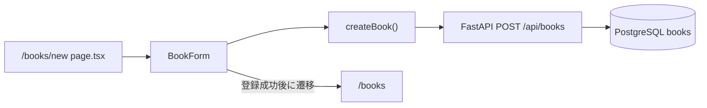

# Step 6: 本の新規登録画面

## このStepの目的

Step 6では、ブラウザで入力した本の情報をNext.jsからFastAPIへ送信し、PostgreSQLへ登録する流れを確認します。

## 追加・変更したファイル

| ファイル | 役割 |
| --- | --- |
| `frontend/types/book.ts` | 登録フォームからAPIへ送る `BookInput` 型を追加した |
| `frontend/lib/api.ts` | `POST /api/books` を呼び出す `createBook()` を追加した |
| `frontend/components/BookForm.tsx` | 本の登録フォーム、入力状態、送信処理、エラー表示を担当する |
| `frontend/app/books/new/page.tsx` | `/books/new` の画面を定義し、`BookForm` を表示する |
| `frontend/app/books/page.tsx` | 一覧画面から新規登録画面へ移動するリンクを追加した |
| `frontend/app/globals.css` | フォーム、ボタン、ヘッダー行の見た目を追加した |
| `backend/app/main.py` | `http://127.0.0.1:3000` からのブラウザAPI通信をCORSで許可した |

## 呼び出し関係



## なぜ必要か

Step 5ではDBに登録済みの本を画面に表示するだけでした。Step 6では逆方向に、画面の入力値をAPIへ送り、DBへ保存します。

この処理により、利用者がブラウザだけで本を追加できるようになります。

## `BookInput` が保証できること・できないこと

`BookInput` は、フロントエンドから登録APIへ送るデータの形をTypeScriptで表します。

保証できること:

- `title` と `author` が文字列であること
- `published_year` が数値または `null` であること
- `isbn` が文字列または `null` であること

保証できないこと:

- 入力値がDBに保存できるかどうか
- ISBNが重複していないかどうか
- APIが正常に応答するかどうか

最終的な検証はFastAPI側のPydanticスキーマとDB制約で行います。

## `createBook()` が保証できること・できないこと

`createBook()` は `BookInput` をJSONとして `POST /api/books` に送信します。

保証できること:

- 成功時は作成された `Book` を返す
- 失敗時は画面表示用のエラーメッセージを返す
- 通信処理をUIコンポーネントから分離する

保証できないこと:

- サーバーが起動していること
- DB登録が必ず成功すること
- すべてのAPIエラー詳細を人間向けに完全変換すること

## `BookForm` が保証できること・できないこと

`BookForm` はフォーム入力と送信状態を管理します。

保証できること:

- タイトルと著者名が空の場合は送信前に止める
- 出版年が入力された場合、1以上の整数でなければ送信前に止める
- 送信中は登録ボタンを無効化し、二重送信を防ぐ
- 登録成功後に `/books` へ移動する

保証できないこと:

- ブラウザ以外から直接APIを呼ばれた場合の入力制御
- ISBN重複の事前検出
- サーバー側で発生するすべての異常の予防

## 動作確認で利用したコマンド

### フロントエンドのlint

目的: ESLintでフロントエンドの静的解析エラーがないことを確認する。

実行ディレクトリ: `frontend`

```powershell
npm run lint
```

### フロントエンドの本番ビルド

目的: TypeScriptとNext.jsの本番ビルドが成功することを確認する。

実行ディレクトリ: `frontend`

```powershell
npm run build
```

### Next.js開発サーバーの起動

目的: `/books/new` をブラウザまたはHTTP経由で確認できる状態にする。

実行ディレクトリ: `frontend`

```powershell
npm run dev -- --hostname 127.0.0.1 --port 3000
```

### 新規登録画面の疎通確認

目的: `/books/new` が `200 OK` を返すことを確認する。

実行ディレクトリ: プロジェクト直下

```powershell
Invoke-WebRequest -Uri http://127.0.0.1:3000/books/new -UseBasicParsing
```

### FastAPIサーバーの起動

目的: フロントエンドの登録処理が呼び出すAPIを起動する。

実行ディレクトリ: `backend`

```powershell
.\.venv\Scripts\python.exe -m uvicorn app.main:app --host 127.0.0.1 --port 8000
```

### ヘルスチェックAPIの疎通確認

目的: FastAPIが起動していることを確認する。

実行ディレクトリ: プロジェクト直下

```powershell
Invoke-WebRequest -Uri http://127.0.0.1:8000/health -UseBasicParsing
```

### CORSプリフライトの疎通確認

目的: `http://127.0.0.1:3000` で開いたブラウザから `POST /api/books` を呼び出せることを確認する。

実行ディレクトリ: プロジェクト直下

```powershell
Invoke-WebRequest -Uri http://127.0.0.1:8000/api/books -Method Options -Headers @{ Origin = 'http://127.0.0.1:3000'; 'Access-Control-Request-Method' = 'POST'; 'Access-Control-Request-Headers' = 'content-type' } -UseBasicParsing
```

### 本の一覧APIの疎通確認

目的: 登録画面が利用するバックエンドの基本APIが応答することを確認する。

実行ディレクトリ: プロジェクト直下

```powershell
Invoke-WebRequest -Uri http://127.0.0.1:8000/api/books -UseBasicParsing
```

## 画面遷移の確認手順

Step 6では、登録成功後に `/books/new` から `/books` へ画面が切り替わることも確認対象です。

### 正常登録時

1. Next.js開発サーバーとFastAPIサーバーを起動する
2. ブラウザで `http://127.0.0.1:3000/books/new` を開く
3. 次の値を入力する

| 項目 | 入力値 |
| --- | --- |
| タイトル | `画面遷移確認用の本` |
| 著者名 | `確認太郎` |
| 出版年 | `2026` |
| ISBN | `9780000000006` |

4. `登録する` ボタンを押す
5. URLが `http://127.0.0.1:3000/books` に変わることを確認する
6. 一覧画面に `画面遷移確認用の本` が表示されることを確認する

期待結果:

- 登録成功後に `/books` へ移動する
- 登録した本が一覧に表示される
- 同じ登録操作で同じ本が二重登録されない

### 入力エラー時

1. ブラウザで `http://127.0.0.1:3000/books/new` を開く
2. タイトルまたは著者名を空欄にする
3. `登録する` ボタンを押す

期待結果:

- `/books/new` のまま画面が切り替わらない
- 入力エラーメッセージが表示される
- 本は登録されない

## 確認したこと

- TypeScriptとESLintでエラーがないこと
- Next.jsの本番ビルドが成功すること
- `/books/new` のページがビルド対象に含まれること
- 起動したNext.jsで `/books/new` が `200 OK` を返すこと
- 起動したFastAPIで `/health` と `/api/books` が `200 OK` を返すこと
- `http://127.0.0.1:3000` からのCORSプリフライトが `200 OK` を返すこと
- 正常登録時は `/books/new` から `/books` へ遷移することを確認対象にした
- 入力エラー時は `/books/new` から遷移しないことを確認対象にした
- 登録処理のAPI呼び出しをUIコンポーネントから分離していること

## 発生した問題と原因

### `APIに接続できませんでした。` が表示された

原因:

- ブラウザで開いていた画面は `http://127.0.0.1:3000/books/new` だった
- FastAPIのCORS設定は `http://localhost:3000` だけを許可していた
- ブラウザ上では `localhost` と `127.0.0.1` は別のオリジンとして扱われる
- そのため、ブラウザから `POST /api/books` を送る前のCORS確認で拒否され、`fetch` が失敗した

解決方法:

- `backend/app/main.py` の `allow_origins` に `http://127.0.0.1:3000` を追加した
- FastAPIサーバーを再起動して設定を反映する

補足:

- PowerShellから `POST /api/books` を直接呼び出すと成功したため、DB登録処理そのものは正常だった
- 失敗箇所はPostgreSQLではなく、ブラウザからAPIへ送る通信のCORS設定だった

## 実装部分のコードレベル説明

### `frontend/types/book.ts`

```ts
export type BookInput = {
  title: string;
  author: string;
  published_year: number | null;
  isbn: string | null;
};
```

`BookInput` は、登録フォームからAPIへ送る値の型です。
`title` と `author` は文字列、`published_year` は `number | null`、`isbn` は `string | null` です。

フォーム上では入力値をすべて文字列として扱いますが、APIへ送る直前に `published_year` を数値または `null` へ変換します。
この変換後の形が `BookInput` です。

### `frontend/lib/api.ts`

```ts
export async function createBook(book: BookInput): Promise<ApiResult<Book>> {
  const response = await fetch(`${API_BASE_URL}/api/books`, {
    method: "POST",
    headers: {
      "Content-Type": "application/json",
    },
    body: JSON.stringify(book),
  });
```

`createBook(book)` は `POST /api/books` を呼び出す関数です。
引数 `book` は `BookInput` なので、画面側はAPIへ送る形に整えた値だけを渡します。

`fetch()` では `method: "POST"`、`headers: { "Content-Type": "application/json" }`、`body: JSON.stringify(book)` を指定します。
これにより、FastAPI側ではJSONリクエスト本文として `BookCreate` に渡されます。

`response.ok` が `false` の場合は、`response.json().catch(() => null)` でエラー本文を可能な範囲で読み取ります。
`409` や `422` の場合は `getErrorMessage()` が画面表示用メッセージへ変換します。

成功した場合は `await response.json()` で作成後の本を受け取り、`ApiResult<Book>` として返します。

### `frontend/components/BookForm.tsx`

```tsx
function buildBookInput(formState: FormState): BookInput | string {
  const title = formState.title.trim();
  const author = formState.author.trim();

  if (title === "" || author === "") {
    return "タイトルと著者名を入力してください。";
  }
```

```tsx
async function handleSubmit(event: FormEvent<HTMLFormElement>) {
  event.preventDefault();
  const bookInput = buildBookInput(formState);

  if (typeof bookInput === "string") {
    setMessage(bookInput);
    return;
  }

  const result = await onSubmitBook(bookInput);
  if (result.ok) {
    router.push("/books");
    router.refresh();
  }
}
```

`BookForm` はフォームのClient Componentです。
`"use client"` があるため、`useState` や `onSubmit` などブラウザ上の状態管理とイベント処理を使えます。

`FormState` は画面上の入力状態です。
`publishedYear` も含めてすべて文字列で持ちます。
これはHTMLのinputから得られる値が文字列だからです。

`buildBookInput(formState)` は、画面用の文字列状態をAPI用の `BookInput` へ変換します。
`title` と `author` は `trim()` して空ならエラーメッセージ文字列を返します。
`publishedYear` が入力されている場合は `Number()` で数値化し、整数かつ1以上でなければエラーメッセージを返します。
問題がなければ `BookInput` オブジェクトを返します。

`handleSubmit(event)` はフォーム送信時の入口です。
最初に `event.preventDefault()` でブラウザの通常送信を止めます。
`isSubmitting` が `true` の場合は二重送信を防ぐため、すぐ `return` します。

次に `buildBookInput()` を呼びます。
戻り値が文字列なら入力エラーなので、`setMessage(bookInput)` で画面に表示します。
戻り値がオブジェクトなら、`setIsSubmitting(true)` にして送信中状態へ入り、`onSubmitBook(bookInput)` を呼びます。

Step6の新規登録では、`onSubmitBook` の既定値が `createBook` なので、登録APIが呼ばれます。
成功時は `router.push("/books")` で一覧画面へ移動し、`router.refresh()` でサーバー側データを更新します。
失敗時は `setMessage(result.message)` でAPIエラーを表示し、`setIsSubmitting(false)` で再送信できる状態に戻します。

### `frontend/app/books/new/page.tsx`

```tsx
export default function NewBookPage() {
  return (
    <main>
      <BookForm />
    </main>
  );
}
```

`NewBookPage()` は `/books/new` に対応する画面です。
この画面は `BookForm` を配置するだけで、入力状態やAPI通信の詳細は `BookForm` と `createBook()` に任せています。

初学者が読む順番は、`BookInput`、`createBook()`、`BookForm` の `FormState`、`buildBookInput()`、`handleSubmit()`、`NewBookPage()` です。
