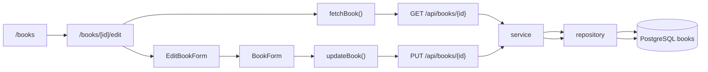

# Step 7: 本の1件取得と更新

## このStepの目的

Step 7では、登録済みの本をIDで1件取得し、編集画面に既存値を表示してから更新できるようにしました。

Step 7-Aでは `GET /api/books/{id}` と `/books/[id]/edit` の土台を作り、Step 7-Bでは `PUT /api/books/{id}` と編集フォームからの更新処理を追加しました。

## 追加・変更したファイル

| ファイル | 役割 |
| --- | --- |
| `backend/app/repositories/book.py` | IDによる1件取得、ISBN重複確認、既存レコード更新のDB処理を追加 |
| `backend/app/services/book.py` | 本が存在しない場合の判定、ISBN重複判定、更新日時の設定を追加 |
| `backend/app/routers/books.py` | `GET /api/books/{book_id}` と `PUT /api/books/{book_id}` を追加 |
| `backend/app/schemas/book.py` | 更新入力用の `BookUpdate` を追加 |
| `frontend/lib/api.ts` | `fetchBook()` と `updateBook()` を追加 |
| `frontend/components/BookForm.tsx` | 登録と編集で再利用できるように初期値、送信処理、ボタン文言をprops化 |
| `frontend/app/books/[id]/edit/page.tsx` | 編集画面を追加し、URLのIDから本を取得 |
| `frontend/app/books/[id]/edit/EditBookForm.tsx` | 編集画面専用のクライアント側送信処理を追加 |
| `frontend/app/books/page.tsx` | 一覧から編集画面へ移動するリンクを追加 |
| `frontend/app/globals.css` | 一覧のメタ情報と編集リンクの配置を調整 |

## 呼び出し関係



## なぜ必要か

Step 6までは、新しい本を登録して一覧へ表示できる状態でした。ただし、登録済みデータを後から修正するには、まず対象の本をIDで取得し、画面に既存値を表示する必要があります。

今回の変更により、一覧画面から編集画面へ移動し、既存値を確認してから更新できます。

## 保証できること

- IDを指定して本を1件取得できる
- 存在しないIDでは `404 Not Found` を返せる
- 編集画面に既存のタイトル、著者名、出版年、ISBNを表示できる
- 編集フォームから `PUT /api/books/{id}` を呼び出せる
- 更新成功後に `/books` へ戻れる
- 更新時もタイトル、著者名、出版年、ISBNの基本検証を行える
- 更新時に他の本とISBNが重複した場合は `409 Conflict` を返せる

## 保証できないこと

- 複数ユーザーが同時に同じ本を編集した場合の競合解決
- 更新履歴の保存
- 削除処理
- 認証されたユーザーだけが編集できる制御

## 動作確認で利用したコマンド

### backendの構文チェック

目的: Pythonファイルに構文エラーがないことを確認する。

実行ディレクトリ: `backend`

```powershell
.\.venv\Scripts\python.exe -m compileall app
```

### frontendのlint

目的: ESLintでTypeScript/Next.jsの静的解析エラーがないことを確認する。

実行ディレクトリ: `frontend`

```powershell
npm run lint
```

### frontendの本番ビルド

目的: Next.jsの本番ビルドと型チェックが成功することを確認する。

実行ディレクトリ: `frontend`

```powershell
npm run build
```

### FastAPIルート定義の確認

目的: `GET /api/books/{book_id}` と `PUT /api/books/{book_id}` がアプリに登録されていることを確認する。

実行ディレクトリ: `backend`

```powershell
.\.venv\Scripts\python.exe -c "from app.main import app; print([route.path + ' ' + ','.join(sorted(route.methods or [])) for route in app.routes if route.path.startswith('/api/books')])"
```

### service層の1件取得・更新確認

目的: DBセッションを使って、本の作成、1件取得、更新、存在しないIDの例外を確認する。

実行ディレクトリ: `backend`

```powershell
@'
from time import time_ns

from app.database import SessionLocal
from app.schemas.book import BookCreate, BookUpdate
from app.services.book import BookNotFoundError, create_book, get_book, update_book

suffix = str(time_ns())[-6:]
db = SessionLocal()
try:
    book = create_book(
        db,
        BookCreate(
            title="Step7 Service Check",
            author="Codex",
            published_year=2026,
            isbn=f"s7-{suffix}",
        ),
    )
    loaded = get_book(db, book.id)
    updated = update_book(
        db,
        book.id,
        BookUpdate(
            title="Step7 Service Updated",
            author="Codex",
            published_year=2027,
            isbn=f"s7u-{suffix}",
        ),
    )
    print(loaded.id, loaded.title)
    print(updated.id, updated.title, updated.published_year, updated.isbn)

    try:
        get_book(db, 999999)
    except BookNotFoundError:
        print("not_found_ok")
finally:
    db.close()
'@ | .\.venv\Scripts\python.exe -
```

## 画面遷移の確認手順

### 編集画面を開く

1. Next.jsとFastAPIを起動する。
2. ブラウザで `http://127.0.0.1:3000/books` を開く。
3. 一覧内の任意の本の `編集` リンクを押す。

期待される遷移先URL:

```text
http://127.0.0.1:3000/books/{id}/edit
```

期待される画面結果:

- 見出しに `本の編集` が表示される
- フォームに既存のタイトル、著者名、出版年、ISBNが入っている
- `更新する` ボタンが表示される

### 更新を実行する

入力値:

| 項目 | 入力値 |
| --- | --- |
| タイトル | `Step7 画面更新確認` |
| 著者名 | `確認太郎` |
| 出版年 | `2027` |
| ISBN | `9780000000007` |

期待される遷移先URL:

```text
http://127.0.0.1:3000/books
```

期待される画面結果:

- 一覧画面に戻る
- 更新後のタイトル、著者名、出版年、ISBNが一覧に表示される

### 存在しないIDを開く

1. ブラウザで `http://127.0.0.1:3000/books/999999/edit` を開く。

期待される画面結果:

- `本を取得できませんでした` が表示される
- 一覧へ戻るリンクが表示される

## 実装部分のコードレベル説明

### `backend/app/repositories/book.py`

```python
def get_book_by_id(db: Session, book_id: int) -> Book | None:
    return db.get(Book, book_id)

def update_book(
    db: Session,
    book: Book,
    book_update: BookUpdate,
    updated_at: datetime,
) -> Book:
    update_values = book_update.model_dump()
    for field_name, value in update_values.items():
        setattr(book, field_name, value)
```

`get_book_by_id(db, book_id)` は、主キーで本を1件取得します。
内部では `db.get(Book, book_id)` を使います。
見つかった場合は `Book` オブジェクト、見つからない場合は `None` を返します。

`get_other_book_by_isbn(db, isbn, book_id)` は、更新時のISBN重複確認用です。
`Book.isbn == isbn` かつ `Book.id != book_id` という条件を使うことで、更新対象自身は重複判定から除外します。

`update_book(db, book, book_update, updated_at)` は既存の `Book` オブジェクトを更新します。
`book_update.model_dump()` で更新値を辞書にし、`for field_name, value in update_values.items()` で各属性を `setattr()` します。
最後に `book.updated_at = updated_at` で更新日時を変え、`commit()` と `refresh()` でDB確定と再読み込みを行います。

### `backend/app/services/book.py`

```python
def get_book(db: Session, book_id: int) -> Book:
    book = get_book_by_id_repository(db, book_id)
    if book is None:
        raise BookNotFoundError()
    return book
```

```python
def update_book(db: Session, book_id: int, book_update: BookUpdate) -> Book:
    book = get_book(db, book_id)
    return update_book_repository(db, book, book_update, updated_at=datetime.now(UTC))
```

`get_book(db, book_id)` は、repositoryの `get_book_by_id_repository()` を呼びます。
戻り値が `None` の場合は `BookNotFoundError` を発生させます。
これにより、以降の処理は「本が存在する」前提で書けます。

`update_book(db, book_id, book_update)` は、まず `get_book()` で対象の存在確認を行います。
存在しなければ `BookNotFoundError` がそのままrouterへ伝わります。

次に、ISBNが入力されている場合だけ `get_other_book_by_isbn()` で重複確認します。
重複があれば `DuplicateIsbnError` を発生させます。
問題がなければ現在時刻を作り、repositoryの `update_book_repository()` に更新処理を任せます。

### `backend/app/routers/books.py`

```python
@router.get("/{book_id}", response_model=BookResponse)
def get_book_endpoint(book_id: int, db: Session = Depends(get_db)) -> Book:
    return get_book(db, book_id)

@router.put("/{book_id}", response_model=BookResponse)
def update_book_endpoint(
    book_id: int,
    book_update: BookUpdate,
    db: Session = Depends(get_db),
) -> Book:
    return update_book(db, book_id, book_update)
```

`get_book_endpoint(book_id, db)` は `GET /api/books/{book_id}` の入口です。
service層の `get_book()` を呼び、成功時は `BookResponse` に変換して `200 OK` で返します。
`BookNotFoundError` が出た場合は `HTTPException(status_code=404, ...)` に変換します。

`update_book_endpoint(book_id, book_update, db)` は `PUT /api/books/{book_id}` の入口です。
`book_update: BookUpdate` により、FastAPIが更新リクエストJSONを検証します。
成功時は更新後の本を `BookResponse` として返します。
存在しないIDは `404`、ISBN重複は `409` に変換します。

### `frontend/lib/api.ts`

```ts
export async function fetchBook(bookId: number): Promise<ApiResult<Book>> {
  const response = await fetch(`${API_BASE_URL}/api/books/${bookId}`, {
    cache: "no-store",
  });
```

```ts
export async function updateBook(
  bookId: number,
  book: BookInput,
): Promise<ApiResult<Book>> {
  const response = await fetch(`${API_BASE_URL}/api/books/${bookId}`, {
    method: "PUT",
    headers: { "Content-Type": "application/json" },
    body: JSON.stringify(book),
  });
```

`fetchBook(bookId)` は `GET /api/books/{id}` を呼び、編集画面の初期値に使う本を取得します。
`updateBook(bookId, book)` は `PUT /api/books/{id}` を呼び、編集フォームの送信結果を更新APIへ送ります。

どちらも失敗時は `ApiResult` の `{ ok: false; message }` を返すため、画面側はHTTP例外を直接扱わず、表示用メッセージだけを見ればよい構造です。

### `frontend/app/books/[id]/edit/page.tsx`

```tsx
export default async function EditBookPage({ params }: EditBookPageProps) {
  const { id } = await params;
  const bookId = Number(id);
  const result = await fetchBook(bookId);
  return <EditBookForm book={result.data} />;
}
```

`EditBookPage({ params })` はURLの `[id]` を受け取るServer Componentです。
`const { id } = await params` でURLパラメーターを取り出し、`Number(id)` で数値化します。
整数でない、または1未満の場合はAPIを呼ばずにエラー表示を返します。

IDが妥当な場合は `fetchBook(bookId)` を呼びます。
取得に失敗した場合はエラー表示、成功した場合は `<EditBookForm book={result.data} />` を返します。

### `frontend/app/books/[id]/edit/EditBookForm.tsx`

```tsx
export function EditBookForm({ book }: EditBookFormProps) {
  return (
    <BookForm
      initialBook={book}
      onSubmitBook={(bookInput: BookInput) => updateBook(book.id, bookInput)}
    />
  );
}
```

`EditBookForm` は編集画面専用のClient Componentです。
受け取った `book` を `BookForm` の `initialBook` に渡します。
これにより、`BookForm` 内の `getInitialFormState()` が既存値をフォーム初期値へ変換します。

`onSubmitBook={(bookInput) => updateBook(book.id, bookInput)}` により、同じ `BookForm` を使いながら、送信先だけ新規登録ではなく更新APIへ差し替えています。

初学者が読む順番は、`EditBookPage()`、`fetchBook()`、`EditBookForm`、`BookForm` の `initialBook`、`updateBook()`、backend router/service/repositoryです。
