# Step 8: 本の削除APIと一覧画面からの削除

## このStepの目的

Step 8では、登録済みの本を削除できるようにしました。
Step 8-Aでは `DELETE /api/books/{id}` を追加し、Step 8-Bでは一覧画面から確認後に削除APIを呼び出して画面表示を更新できるようにしました。

## 追加・変更したファイル

| ファイル | 役割 |
| --- | --- |
| `backend/app/repositories/book.py` | SQLAlchemyのDBセッションを使って対象の `Book` を削除する `delete_book()` を追加 |
| `backend/app/services/book.py` | IDで対象の本を取得し、存在しない場合は `BookNotFoundError` にする削除処理を追加 |
| `backend/app/routers/books.py` | `DELETE /api/books/{book_id}` を追加し、成功時は `204 No Content`、存在しないIDでは `404 Not Found` を返すようにした |
| `frontend/lib/api.ts` | `DELETE /api/books/{id}` を呼び出す `deleteBook()` を追加 |
| `frontend/app/books/BooksList.tsx` | 一覧表示、削除確認、削除API呼び出し、削除後の画面状態更新を担当するClient Componentを追加 |
| `frontend/app/books/page.tsx` | 一覧本体を `BooksList` に分離して呼び出すように変更 |
| `frontend/app/globals.css` | 削除ボタンと一覧内アクションの表示を追加 |

## 呼び出し関係

```mermaid
flowchart LR
    User["利用者"]
    BooksList["BooksList"]
    DeleteApiClient["deleteBook()"]
    DeleteApi["DELETE /api/books/{id}"]
    Service["service delete_book()"]
    Repository["repository delete_book()"]
    DB[("PostgreSQL books")]

    User -->|"削除ボタンを押す"| BooksList
    BooksList -->|"確認後に呼び出し"| DeleteApiClient
    DeleteApiClient --> DeleteApi
    DeleteApi --> Service
    Service --> Repository
    Repository --> DB
    DB --> Repository
    Repository --> Service
    Service --> DeleteApi
    DeleteApi -->|"204 No Content"| DeleteApiClient
    DeleteApiClient --> BooksList
    BooksList -->|"一覧から削除済みの本を除外"| User
```



## なぜ必要か

Step 7までで登録済みの本を取得・編集できるようになりましたが、不要になった本を削除する手段はありませんでした。
CRUDの基本を一通り学ぶためには、登録、取得、更新に加えて削除の流れも必要です。

削除は成功時にレスポンス本文を返す必要がないため、APIは `204 No Content` を返します。
フロントエンドでは `204` の場合にJSONを読まず、成功したら一覧の状態から対象の本を取り除きます。

## 保証できること

- 指定したIDの本をDBから削除できる
- 削除成功時に `204 No Content` を返せる
- 存在しないIDの削除では `404 Not Found` を返せる
- 一覧画面で確認を承認した場合だけ削除APIを呼び出せる
- 削除成功後、画面上の一覧から対象の本を消せる
- 削除失敗時、画面にエラーメッセージを表示できる

## 保証できないこと

- 認証済みユーザーだけが削除できる制御
- 削除履歴の保存
- 誤削除後の復元
- 複数ユーザーが同時操作した場合の画面状態の完全な同期

## 動作確認で利用したコマンド

### backendの構文チェック

目的: Pythonファイルに構文エラーがないことを確認する。

実行ディレクトリ: `backend`

```powershell
.\.venv\Scripts\python.exe -m compileall app
```

### frontendのlint

目的: ESLintでTypeScript/Next.jsの静的解析エラーがないことを確認する。

実行ディレクトリ: `frontend`

```powershell
npm run lint
```

### frontendの本番ビルド

目的: Next.jsの本番ビルドと型チェックが成功することを確認する。

実行ディレクトリ: `frontend`

```powershell
npm run build
```

### FastAPIルート定義の確認

目的: `DELETE /api/books/{book_id}` がアプリに登録されていることを確認する。

実行ディレクトリ: `backend`

```powershell
.\.venv\Scripts\python.exe -c "from app.main import app; print([route.path + ' ' + ','.join(sorted(route.methods or [])) for route in app.routes if route.path.startswith('/api/books')])"
```

### service層の削除確認

目的: 本の作成、削除、削除後の404相当の例外、存在しないID削除時の例外を確認する。

実行ディレクトリ: `backend`

```powershell
@'
from time import time_ns

from app.database import SessionLocal
from app.schemas.book import BookCreate
from app.services.book import BookNotFoundError, create_book, delete_book, get_book

suffix = str(time_ns())[-6:]
db = SessionLocal()
try:
    book = create_book(
        db,
        BookCreate(
            title="Step8 Service Check",
            author="Codex",
            published_year=2026,
            isbn=f"s8-{suffix}",
        ),
    )
    book_id = book.id
    delete_book(db, book_id)

    try:
        get_book(db, book_id)
    except BookNotFoundError:
        print("deleted_not_found_ok")

    try:
        delete_book(db, 999999)
    except BookNotFoundError:
        print("missing_delete_not_found_ok")
finally:
    db.close()
'@ | .\.venv\Scripts\python.exe -
```

### DELETE APIのHTTP確認

目的: FastAPIを一時起動し、実HTTPで削除成功時の `204`、削除後取得時の `404`、存在しないID削除時の `404` を確認する。

実行ディレクトリ: `backend`

```powershell
$process = Start-Process -FilePath ".\.venv\Scripts\python.exe" -ArgumentList "-m", "uvicorn", "app.main:app", "--host", "127.0.0.1", "--port", "8010" -WorkingDirectory (Get-Location) -WindowStyle Hidden -PassThru
try {
    Start-Sleep -Seconds 3
    $suffix = (Get-Random -Minimum 100000 -Maximum 999999)
    $body = @{
        title = "Step8 HTTP Check"
        author = "Codex"
        published_year = 2026
        isbn = "s8h-$suffix"
    } | ConvertTo-Json
    $created = Invoke-RestMethod -Uri "http://127.0.0.1:8010/api/books" -Method Post -ContentType "application/json" -Body $body
    $deleteResponse = Invoke-WebRequest -UseBasicParsing -Uri "http://127.0.0.1:8010/api/books/$($created.id)" -Method Delete
    Write-Output "delete_status=$($deleteResponse.StatusCode)"
    try {
        Invoke-WebRequest -UseBasicParsing -Uri "http://127.0.0.1:8010/api/books/$($created.id)" -Method Get -ErrorAction Stop | Out-Null
    } catch {
        Write-Output "get_after_delete_status=$($_.Exception.Response.StatusCode.value__)"
    }
    try {
        Invoke-WebRequest -UseBasicParsing -Uri "http://127.0.0.1:8010/api/books/999999" -Method Delete -ErrorAction Stop | Out-Null
    } catch {
        Write-Output "missing_delete_status=$($_.Exception.Response.StatusCode.value__)"
    }
} finally {
    Stop-Process -Id $process.Id -Force
}
```

### 確認用データの残存確認

目的: HTTP確認中に作成された確認用データが残っていないことを確認する。

実行ディレクトリ: `backend`

```powershell
@'
from app.database import SessionLocal
from app.repositories.book import delete_book, list_books

db = SessionLocal()
try:
    leftover_books = [book for book in list_books(db) if book.title == "Step8 HTTP Check"]
    for book in leftover_books:
        delete_book(db, book)
    print(f"leftover_deleted={len(leftover_books)}")
finally:
    db.close()
'@ | .\.venv\Scripts\python.exe -
```

## ブラウザで確認する操作手順

1. FastAPIとNext.jsを起動する。
2. ブラウザで `http://127.0.0.1:3000/books` を開く。
3. 一覧に表示されている任意の本の `削除` ボタンを押す。
4. 確認ダイアログでキャンセルを選ぶ。
5. 対象の本が一覧から消えないことを確認する。
6. 再度 `削除` ボタンを押し、確認ダイアログでOKを選ぶ。

期待されるURL:

```text
http://127.0.0.1:3000/books
```

期待される画面上の結果:

- OKを選んだ場合だけ対象の本が一覧から消える
- 削除中はボタンが無効になる
- 削除に失敗した場合はエラーメッセージが表示される

## 実装部分のコードレベル説明

### `backend/app/repositories/book.py`

```python
def delete_book(db: Session, book: Book) -> None:
    db.delete(book)
    db.commit()
```

`delete_book(db, book)` はDB削除を担当するrepository関数です。
引数 `book` は、すでに存在確認済みの `Book` オブジェクトです。
内部では `db.delete(book)` で削除対象としてマークし、`db.commit()` でDBへ確定します。

この関数は存在確認を行いません。
存在確認はservice層の責務にしているため、repository層はDB操作だけに集中します。

### `backend/app/services/book.py`

```python
def delete_book(db: Session, book_id: int) -> None:
    book = get_book(db, book_id)
    delete_book_repository(db, book)
```

`delete_book(db, book_id)` は削除処理の業務ルール入口です。
最初に `get_book(db, book_id)` を呼び、対象の本が存在するか確認します。

`get_book()` は対象が存在しない場合に `BookNotFoundError` を発生させます。
そのため、`delete_book()` は `Book | None` を直接扱わず、存在する `Book` だけをrepositoryへ渡せます。

対象が存在する場合は `delete_book_repository(db, book)` を呼びます。
戻り値は `None` です。
削除成功時に画面へ返すデータは不要なので、service層も削除結果の本文を作りません。

### `backend/app/routers/books.py`

```python
@router.delete("/{book_id}", status_code=status.HTTP_204_NO_CONTENT)
def delete_book_endpoint(
    book_id: int,
    db: Session = Depends(get_db),
) -> Response:
    delete_book(db, book_id)
    return Response(status_code=status.HTTP_204_NO_CONTENT)
```

`delete_book_endpoint(book_id, db)` は `DELETE /api/books/{book_id}` のHTTP入口です。
service層の `delete_book()` を呼び、成功した場合は `Response(status_code=status.HTTP_204_NO_CONTENT)` を返します。

`204 No Content` は、処理は成功したがレスポンス本文はない、という意味です。
そのため、このendpointには `response_model` を付けていません。

`BookNotFoundError` が発生した場合は、`HTTPException(status_code=404, ...)` に変換します。
これにより、存在しないIDを削除しようとした場合は `404 Not Found` になります。

### `frontend/lib/api.ts`

```ts
export async function deleteBook(bookId: number): Promise<ApiResult<null>> {
  const response = await fetch(`${API_BASE_URL}/api/books/${bookId}`, {
    method: "DELETE",
  });

  if (!response.ok) {
    return { ok: false, message: "本の削除に失敗しました。" };
  }

  return { ok: true, data: null };
}
```

`deleteBook(bookId)` は `DELETE /api/books/{id}` を呼び出すAPI通信関数です。
`fetch()` には `method: "DELETE"` だけを指定し、リクエスト本文は送りません。

削除成功時のAPIレスポンスは `204 No Content` なので、`response.json()` は呼びません。
成功したら `{ ok: true, data: null }` を返します。

`response.ok` が `false` の場合だけ、エラー本文を `response.json().catch(() => null)` で読み取ります。
`404` の場合は `getErrorMessage()` が「指定された本は見つかりません。」に変換します。

### `frontend/app/books/BooksList.tsx`

```tsx
const [books, setBooks] = useState<Book[]>(initialBooks);
const [deletingBookId, setDeletingBookId] = useState<number | null>(null);
const [errorMessage, setErrorMessage] = useState<string | null>(null);
```

```tsx
async function handleDelete(book: Book): Promise<void> {
  const confirmed = window.confirm(`「${book.title}」を削除しますか？`);
  if (!confirmed) {
    return;
  }

  const result = await deleteBook(book.id);
  if (result.ok) {
    setBooks((currentBooks) =>
      currentBooks.filter((currentBook) => currentBook.id !== book.id),
    );
  }
}
```

`BooksList` は一覧表示と削除操作を担当するClient Componentです。
`initialBooks` はServer Componentの `BooksPage()` から渡される初期一覧です。

`const [books, setBooks] = useState<Book[]>(initialBooks)` により、画面上の一覧をReact stateとして保持します。
削除後にこのstateを更新することで、ページ全体を再読み込みしなくても一覧から対象を消せます。

`deletingBookId` は現在削除中の本IDです。
削除処理中はボタンを無効化し、二重削除を防ぎます。

`errorMessage` は削除失敗時に画面へ表示するメッセージです。
削除開始時に `setErrorMessage(null)` で前回のエラーを消します。

`handleDelete(book)` が削除ボタン押下時の入口です。
最初に `window.confirm()` で確認を出し、キャンセルされた場合はAPIを呼ばずに `return` します。

OKの場合は `setDeletingBookId(book.id)` で削除中状態にし、`deleteBook(book.id)` を呼びます。
失敗した場合は `setErrorMessage(result.message)` と `setDeletingBookId(null)` を実行して、エラー表示と再操作可能状態に戻します。

成功した場合は `setBooks((currentBooks) => currentBooks.filter(...))` を実行します。
`filter()` により、削除した本の `id` と一致しない本だけを残すため、画面上の一覧から対象の本が消えます。

初学者が読む順番は、backendの `delete_book_endpoint()`、serviceの `delete_book()`、repositoryの `delete_book()`、frontendの `deleteBook()`、`BooksList` の `handleDelete()`、`setBooks()` です。
