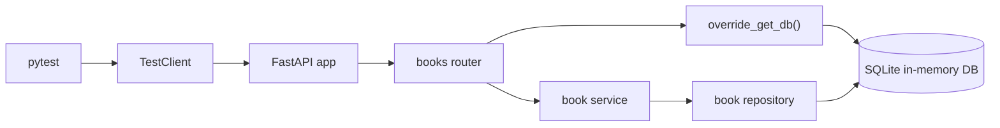

# Step 9: APIテスト

## このStepの目的

Step 9では、手動確認だけに依存せず、バックエンドAPIが期待どおり動くことを自動テストで確認できるようにしました。

`pytest` と FastAPI の `TestClient` を使い、CRUDの正常系と代表的な異常系を繰り返し確認します。
テストでは開発用PostgreSQLではなく、テストごとに作り直すSQLiteのインメモリDBを使います。

## 追加・変更したファイル

| ファイル | 役割 |
| --- | --- |
| `backend/requirements.txt` | APIテストに必要な `pytest` と `httpx2` を追加 |
| `backend/tests/conftest.py` | テスト用DBと `TestClient` を準備し、FastAPIのDB依存を差し替える |
| `backend/tests/test_books_api.py` | 本のCRUD APIの正常系、`404`、`409`、`422` を確認する |
| `backend/app/main.py` | Playwrightで起動するNext.js確認用URLをCORS許可オリジンに追加 |
| `frontend/playwright.config.ts` | PlaywrightでChromiumを使うためのE2Eテスト設定 |
| `frontend/scripts/run-e2e.ps1` | FastAPIとNext.jsを起動し、Playwright実行後に停止するPowerShellスクリプト |
| `frontend/e2e/books-crud.spec.ts` | `/books` 画面から本の登録、編集、削除を確認し、スクリーンショットを保存する |
| `README.md` | バックエンドの現在のフォルダ構成に `services`、`repositories`、`tests` を反映 |
| `LEARNING_PROGRESS.md` | Step 9の完了状況と学習記録を更新 |

## 呼び出し関係



## なぜ必要か

Step 8までの確認は、手動でAPIを呼び出したり画面を操作したりする方法が中心でした。
手動確認だけだと、あとから変更したときに既存機能の壊れを見落としやすくなります。

自動テストを用意すると、登録、一覧取得、1件取得、更新、削除、代表的なエラー応答を同じ手順で何度も確認できます。
これにより、今後の修正でCRUD APIの基本仕様が壊れていないかを早く確認できます。

## 保証できること

- `POST /api/books` で本を登録できる
- `GET /api/books` で登録済みの本を一覧取得できる
- `GET /api/books/{id}` で本を1件取得できる
- `PUT /api/books/{id}` で本を更新できる
- `DELETE /api/books/{id}` で本を削除できる
- 存在しないIDで `404 Not Found` が返る
- 入力値が不正な場合に `422 Unprocessable Entity` が返る
- ISBN重複時に `409 Conflict` が返る
- テストごとにDBを作り直すため、繰り返し実行しても結果が安定する

## 保証できないこと

- 実際のPostgreSQL接続、権限、マイグレーション適用状態
- フロントエンド画面からの操作
- ブラウザのNetworkタブで見える実通信
- 複数ユーザーが同時に操作した場合の競合

## 動作確認で利用したコマンド

### テスト依存関係の確認

目的: `pytest` が仮想環境に入っているか確認する。

実行ディレクトリ: `backend`

```powershell
.\.venv\Scripts\python.exe -m pytest --version
```

### テスト依存関係のインストール

目的: `requirements.txt` に追加したテスト依存関係を仮想環境へインストールする。

実行ディレクトリ: `backend`

```powershell
.\.venv\Scripts\python.exe -m pip install -r requirements.txt
```

### backendのAPIテスト

目的: CRUD APIの正常系と代表的な異常系が自動テストで通ることを確認する。

実行ディレクトリ: `backend`

```powershell
.\.venv\Scripts\python.exe -m pytest
```

### Playwright依存関係のインストール

目的: ブラウザ操作によるE2Eテストに必要なパッケージをインストールする。

実行ディレクトリ: `frontend`

```powershell
npm install
```

### Playwrightブラウザのインストール

目的: Playwrightが利用するChromiumをインストールする。

実行ディレクトリ: `frontend`

```powershell
npx playwright install chromium
```

### Playwright E2Eテスト

目的: FastAPIとNext.jsを起動し、画面から本の登録、編集、削除ができることを確認する。

実行ディレクトリ: `frontend`

```powershell
npm run test:e2e
```

保存したエビデンス:

```text
C:\Users\rnm21\AI_Coding_study\Library\test\evidence\step9-playwright\01-books-initial.png
C:\Users\rnm21\AI_Coding_study\Library\test\evidence\step9-playwright\02-book-created.png
C:\Users\rnm21\AI_Coding_study\Library\test\evidence\step9-playwright\03-book-updated.png
C:\Users\rnm21\AI_Coding_study\Library\test\evidence\step9-playwright\04-book-deleted.png
```

## 実装部分のコードレベル説明

### `backend/tests/conftest.py`

```python
@pytest.fixture
def client() -> Generator[TestClient, None, None]:
    test_engine = create_test_engine()
    testing_session_local = sessionmaker(
        bind=test_engine,
        autocommit=False,
        autoflush=False,
    )

    Base.metadata.create_all(bind=test_engine)
```

`client()` は各テストで使う `TestClient` を準備するfixtureです。
入口はテスト関数の引数 `client` です。
テスト関数に `client` を書くと、pytestがこのfixtureを自動で呼び出します。

最初に `create_test_engine()` でテスト用DB接続を作ります。
戻り値はSQLAlchemyの `Engine` です。
その後 `sessionmaker()` で、テスト用DBへ接続する `Session` の作成方法を定義します。

`Base.metadata.create_all(bind=test_engine)` は、SQLAlchemyモデルからテスト用DBに `books` テーブルを作ります。
この処理により、開発用PostgreSQLのデータを使わずにAPIテストを実行できます。

```python
    def override_get_db() -> Generator[Session, None, None]:
        db = testing_session_local()
        try:
            yield db
        finally:
            db.close()

    app.dependency_overrides[get_db] = override_get_db
```

`override_get_db()` はFastAPIのDB依存をテスト用DBへ差し替える関数です。
引数はありません。
戻り値は `yield` されるSQLAlchemy `Session` です。

通常のAPIでは `app.database.get_db()` がPostgreSQL用のDBセッションを返します。
テスト中は `app.dependency_overrides[get_db]` により、routerが受け取る `db` がSQLite用セッションに変わります。

これにより、router、service、repositoryの呼び出し関係は本番と同じまま、DBだけをテスト用にできます。

```python
    with TestClient(app) as test_client:
        yield test_client

    app.dependency_overrides.clear()
    Base.metadata.drop_all(bind=test_engine)
```

`TestClient(app)` はFastAPIアプリへHTTPリクエストを送るためのクライアントです。
テスト関数は、この `test_client` を使って `client.post()` や `client.get()` を呼びます。

`yield` より後ろは後片付けです。
`app.dependency_overrides.clear()` でDB依存の差し替えを解除し、`Base.metadata.drop_all()` でテスト用DBのテーブルを削除します。
正常系でも異常系でも、テスト終了時に実行されます。

```python
def create_test_engine() -> Engine:
    return create_engine(
        "sqlite+pysqlite:///:memory:",
        connect_args={"check_same_thread": False},
        poolclass=StaticPool,
    )
```

`create_test_engine()` はテスト用DBの `Engine` を返します。
`sqlite+pysqlite:///:memory:` は、ファイルを作らずメモリ上にSQLite DBを作る指定です。

`StaticPool` は、同じメモリDBをテスト中の接続で共有するために指定しています。
これがないと、テーブルを作った接続とAPIが使う接続が分かれ、API側からテーブルが見えない場合があります。

### `backend/tests/test_books_api.py`

```python
def book_payload(
    title: str = "テスト駆動入門",
    author: str = "山田太郎",
    published_year: int | None = 2026,
    isbn: str | None = "test-isbn-001",
) -> dict[str, Any]:
    return {
        "title": title,
        "author": author,
        "published_year": published_year,
        "isbn": isbn,
    }
```

`book_payload()` はAPIへ送るJSON相当の辞書を作る補助関数です。
入口は各テスト関数です。
引数を省略すると、正常な本データを返します。
一部だけ変えたい場合は、`isbn="..."` や `title="..."` のように指定します。

戻り値は `dict[str, Any]` です。
`client.post(..., json=book_payload())` のように使います。

```python
def create_book(client: TestClient, isbn: str = "test-isbn-001") -> dict[str, Any]:
    response = client.post(
        "/api/books",
        json=book_payload(isbn=isbn),
    )
    assert response.status_code == 201
    return response.json()
```

`create_book()` はテスト内で本を1件登録する補助関数です。
引数 `client` は `conftest.py` のfixtureが用意した `TestClient` です。
引数 `isbn` は重複テストで値を変えるために受け取ります。

内部では `POST /api/books` を呼び、HTTPステータスが `201 Created` であることを確認します。
戻り値は登録後のJSONです。
登録された `id` や `isbn` を後続のテスト処理で使います。

```python
def test_book_crud_flow(client: TestClient) -> None:
    created_book = create_book(client)
    book_id = created_book["id"]

    list_response = client.get("/api/books")
    assert list_response.status_code == 200
```

`test_book_crud_flow()` はCRUDの代表的な正常系を1本の流れとして確認します。
最初に本を登録し、返ってきた `id` を使って一覧取得、1件取得、更新、削除、削除後取得を確認します。

このテストでは次の順番で処理します。

1. `POST /api/books` で登録する
2. `GET /api/books` で一覧に含まれることを確認する
3. `GET /api/books/{id}` で1件取得できることを確認する
4. `PUT /api/books/{id}` で更新できることを確認する
5. `DELETE /api/books/{id}` で削除できることを確認する
6. 削除後の `GET /api/books/{id}` が `404` になることを確認する

```python
def test_missing_book_returns_404(client: TestClient) -> None:
    missing_id = 999999

    get_response = client.get(f"/api/books/{missing_id}")
    assert get_response.status_code == 404
```

`test_missing_book_returns_404()` は存在しないIDを指定した場合の異常系を確認します。
`GET`、`PUT`、`DELETE` のどれでも存在確認が行われ、対象がなければ `404 Not Found` が返ることを確認します。

```python
def test_invalid_input_returns_422(client: TestClient) -> None:
    blank_title_response = client.post(
        "/api/books",
        json=book_payload(title="   ", isbn="invalid-title-isbn"),
    )
    assert blank_title_response.status_code == 422
```

`test_invalid_input_returns_422()` はPydanticによる入力検証を確認します。
タイトルが空白だけの場合、`BookCreate.strip_required_text()` によりエラーになります。
出版年が `0` の場合、`Field(ge=1)` の条件に合わないためエラーになります。

どちらもrouterの処理へ入る前にFastAPIが検証し、HTTPステータス `422 Unprocessable Entity` を返します。

```python
def test_duplicate_isbn_returns_409(client: TestClient) -> None:
    first_book = create_book(client, isbn="duplicate-isbn-001")
    second_book = create_book(client, isbn="duplicate-isbn-002")

    duplicate_create_response = client.post(
        "/api/books",
        json=book_payload(isbn=first_book["isbn"]),
    )
    assert duplicate_create_response.status_code == 409
```

`test_duplicate_isbn_returns_409()` はISBN重複の異常系を確認します。
まず別々のISBNで2冊登録します。
その後、1冊目と同じISBNで新規登録しようとすると、service層の `DuplicateIsbnError` が発生し、routerで `409 Conflict` に変換されます。

同じテスト内で、2冊目を1冊目と同じISBNへ更新しようとした場合も `409 Conflict` になることを確認します。

## 初学者がコードを読む順番

1. `backend/tests/test_books_api.py` の `test_book_crud_flow()` を読む
2. `client.post()`、`client.get()`、`client.put()`、`client.delete()` がどのAPIを呼んでいるか確認する
3. `backend/app/routers/books.py` で対応するrouter関数を読む
4. routerから呼ばれる `backend/app/services/book.py` を読む
5. serviceから呼ばれる `backend/app/repositories/book.py` を読む
6. テスト用DBの差し替え方法を `backend/tests/conftest.py` で確認する

### `backend/app/main.py`

```python
app.add_middleware(
    CORSMiddleware,
    allow_origins=[
        "http://localhost:3000",
        "http://127.0.0.1:3000",
        "http://localhost:3011",
        "http://127.0.0.1:3011",
    ],
    allow_credentials=True,
    allow_methods=["*"],
    allow_headers=["*"],
)
```

`allow_origins` は、ブラウザからFastAPIへ直接リクエストすることを許可する画面側URLの一覧です。
通常開発ではNext.jsを `3000` 番で起動します。
Playwrightでは既存の `next dev` と衝突しないように、ビルド済みNext.jsを `3011` 番で起動します。

そのため、`http://localhost:3011` と `http://127.0.0.1:3011` もCORS許可対象に追加しました。
この設定がない場合、ブラウザがAPI通信をブロックし、画面には「APIに接続できませんでした。」と表示されます。

### `frontend/playwright.config.ts`

```ts
export default defineConfig({
  testDir: "./e2e",
  timeout: 30_000,
  expect: {
    timeout: 10_000,
  },
  use: {
    baseURL: "http://127.0.0.1:3011",
    trace: "retain-on-failure",
  },
  projects: [
    {
      name: "chromium",
      use: { ...devices["Desktop Chrome"] },
    },
  ],
});
```

`playwright.config.ts` はE2Eテスト全体の設定です。
入口は `npm run test:e2e` で、内部的には `playwright test` がこの設定を読み込みます。

`baseURL` は `http://127.0.0.1:3011` です。
テスト内の `page.goto("/books")` は、この値と組み合わされて `http://127.0.0.1:3011/books` へアクセスします。

サーバー起動は `frontend/scripts/run-e2e.ps1` が担当します。
Playwrightの `webServer` 管理ではWindows上でFastAPIプロセス終了待ちが残る場合があったため、起動と停止をPowerShell側で明示的に扱います。

### `frontend/scripts/run-e2e.ps1`

```powershell
if (-not (Test-HttpOk -Url "http://127.0.0.1:8000/health")) {
    $backendProcess = Start-Process `
        -FilePath ".\.venv\Scripts\python.exe" `
        -ArgumentList "-m", "uvicorn", "app.main:app", "--host", "127.0.0.1", "--port", "8000" `
        -WorkingDirectory $backendDir `
        -WindowStyle Hidden `
        -PassThru
    $startedBackend = $true
}
```

`run-e2e.ps1` は `npm run test:e2e` から呼び出されるE2E実行用スクリプトです。
最初に `http://127.0.0.1:8000/health` を確認し、FastAPIが起動していなければ `Start-Process` で起動します。

`-WindowStyle Hidden` は、テスト用サーバーの別ウィンドウを表示しないための指定です。
`-PassThru` により起動したプロセス情報を受け取り、最後に停止できるようにしています。

```powershell
if (-not (Test-HttpOk -Url "http://127.0.0.1:3011/books")) {
    $frontendProcess = Start-Process `
        -FilePath "npm.cmd" `
        -ArgumentList "run", "start", "--", "--hostname", "127.0.0.1", "--port", "3011" `
        -WorkingDirectory $frontendDir `
        -WindowStyle Hidden `
        -PassThru
    $startedFrontend = $true
}
```

Next.jsは `3011` 番で起動します。
既存の `next dev` が `3000` 番で動いている場合でも、`next start` を別ポートで起動することで衝突を避けます。

```powershell
try {
    & npx playwright test
    exit $LASTEXITCODE
}
finally {
    if ($startedFrontend -and $frontendProcess -ne $null) {
        Stop-Process -Id $frontendProcess.Id -Force -ErrorAction SilentlyContinue
    }

    if ($startedBackend -and $backendProcess -ne $null) {
        Stop-Process -Id $backendProcess.Id -Force -ErrorAction SilentlyContinue
    }
}
```

`npx playwright test` の終了コードを、そのまま `npm run test:e2e` の終了コードにします。
`finally` では、このスクリプト自身が起動したFastAPIとNext.jsだけを停止します。
すでに利用者が起動していたサーバーは停止しません。

### `frontend/e2e/books-crud.spec.ts`

```ts
test("画面から本を登録、編集、削除できる", async ({ page, request }) => {
  await mkdir(evidenceDir, { recursive: true });

  const suffix = Date.now().toString();
  const createdTitle = `Playwright Step9 ${suffix}`;
  const updatedTitle = `Playwright Step9 Updated ${suffix}`;
  const isbn = `pw9-${suffix.slice(-12)}`;
```

このテストは、ブラウザ画面からCRUDの主要操作を確認します。
引数 `page` はブラウザページ操作用、`request` はAPIを直接呼び出す後片付け用です。

最初にエビデンス保存先ディレクトリを作ります。
`suffix` はテストデータの重複を避けるための値です。
タイトルとISBNに含めることで、同じテストを繰り返しても既存データと衝突しにくくしています。

```ts
  await page.goto("/books");
  await saveEvidence(page, "01-books-initial.png");

  await page.getByRole("link", { name: "本を登録" }).click();
  await expect(page).toHaveURL(/\/books\/new$/);
```

`page.goto("/books")` は一覧画面を開きます。
`baseURL` は `playwright.config.ts` にあるため、実際には `http://127.0.0.1:3011/books` にアクセスします。

`saveEvidence()` は現在の画面のスクリーンショットを保存します。
その後、`本を登録` リンクをクリックし、URLが `/books/new` へ遷移したことを確認します。

```ts
  await page.getByLabel("タイトル").fill(createdTitle);
  await page.getByLabel("著者名").fill("Playwright Tester");
  await page.getByLabel("出版年").fill("2026");
  await page.getByLabel("ISBN").fill(isbn);
  await page.getByRole("button", { name: "登録する" }).click();
```

フォーム入力は、画面に表示されるラベル名で対象を探しています。
これにより、HTMLの `name` 属性よりも利用者視点に近いテストになります。

`登録する` ボタンを押すと、フロントエンドの `createBook()` が呼ばれ、FastAPIの `POST /api/books` へJSONが送られます。
登録成功後は `BookForm` の `router.push("/books")` により一覧画面へ戻ります。

```ts
  const createdBookItem = page.locator("article").filter({ hasText: createdTitle });
  await createdBookItem.getByRole("link", { name: "編集" }).click();
```

登録した本のカードだけを `article` とタイトル文字列で絞り込み、その中の `編集` リンクをクリックします。
複数の本が一覧にある場合でも、対象の本だけを操作できます。

```ts
  page.once("dialog", async (dialog) => {
    expect(dialog.message()).toContain(updatedTitle);
    await dialog.accept();
  });

  const updatedBookItem = page.locator("article").filter({ hasText: updatedTitle });
  await updatedBookItem.getByRole("button", { name: "削除" }).click();
```

削除では `window.confirm()` が表示されます。
Playwrightでは `page.once("dialog", ...)` で確認ダイアログを捕まえ、メッセージに削除対象のタイトルが含まれることを確認してから承認します。

削除成功後は、一覧から対象の見出しが消えたことを確認します。

```ts
async function deleteBooksByIsbn(
  request: APIRequestContext,
  isbn: string,
): Promise<void> {
  const response = await request.get(`${apiBaseUrl}/api/books`);
```

`deleteBooksByIsbn()` はテストデータの事前削除と後片付け用の補助関数です。
画面操作の確認対象ではないため、APIを直接呼び出して対象ISBNの本を削除します。

この関数により、途中でテストが失敗したあとに再実行しても、同じISBNのデータが残って `409 Conflict` になる可能性を下げています。
