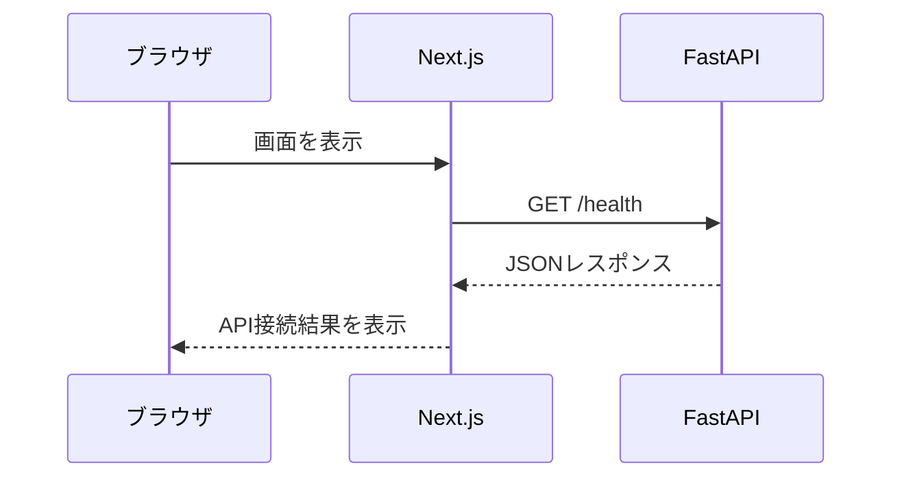
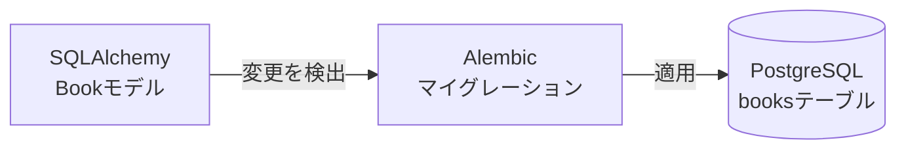
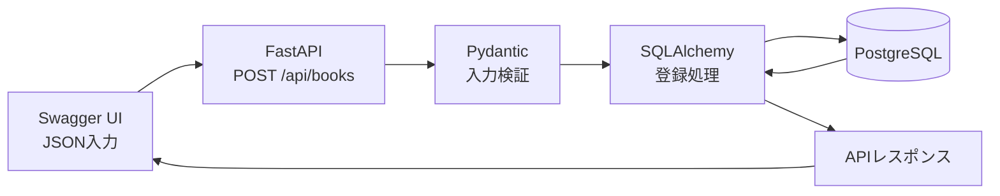
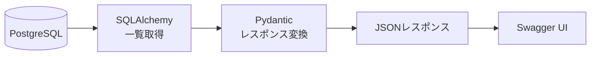
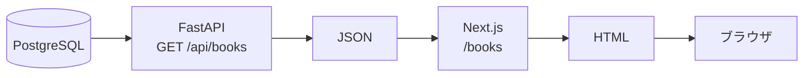
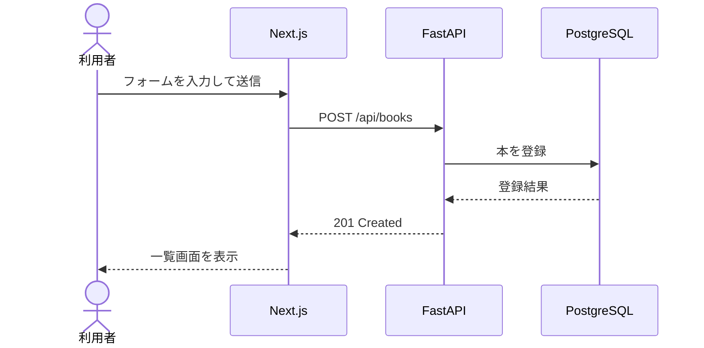
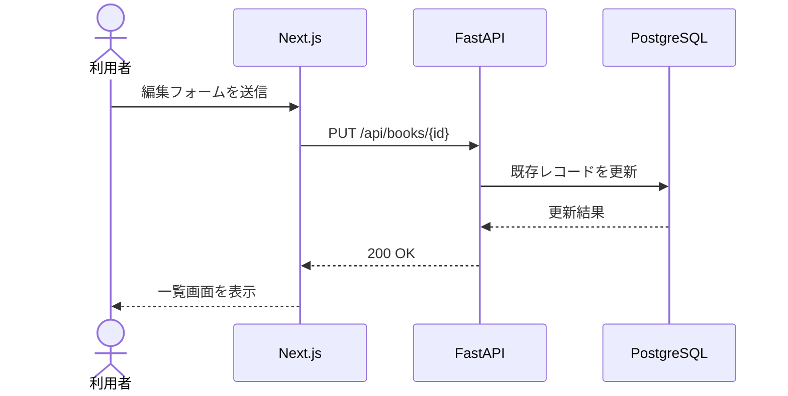

# 図書管理システム 学習ロードマップ

## このドキュメントの目的

本ドキュメントは、図書管理システムを題材に、Next.js、FastAPI、PostgreSQLを使ったWebアプリ開発の全体像を段階的に学ぶための進行計画です。

システムの仕様は `README.md` をSSoT（Single Source of Truth）とします。本ドキュメントは仕様そのものではなく、仕様をどの順番と粒度で実装・学習するかを定めます。

## 学習方針

- 一度にすべてを実装しない
- 小さな機能単位で実装、確認、振り返りを行う
- 技術ごとに完成させるのではなく、画面からDBまでの流れを段階的につなぐ
- 各ステップで正常系と代表的な異常系を確認する
- コードが動くだけでなく、データの流れを説明できる状態を目指す
- 1機能ごとにコミットする

## 各ステップの学習サイクル

各ステップは、次の順序で進めます。

1. 今回扱うデータの流れを確認する
2. 関係する技術とファイルの役割を確認する
3. 最小限のコードを実装する
4. Swagger UIやブラウザで正常系を確認する
5. 代表的な異常系を1つ以上確認する
6. 入力から出力までの流れを自分の言葉で説明する
7. READMEと実装に差がないか確認する
8. 機能単位でコミットする

各ステップの終了時には、次の質問に答えられることを確認します。

- 入力データはどこから来たか
- データはどのファイルや処理を通ったか
- 結果はどこへ返ったか
- エラーはどこで検出され、どのように利用者へ伝わったか

## Step 0: Next.jsとFastAPIの疎通確認

### 目的

データベースやCRUDを追加する前に、フロントエンドとバックエンド間のHTTP通信を理解します。

### 実装内容

- Next.jsの最小画面を作成する
- FastAPIに `GET /health` を作成する
- `/health` からJSONを返す
- Next.jsから `/health` を呼び出す
- APIの結果を画面へ表示する
- ローカル開発に必要なCORSを設定する

### データの流れ



### 学ぶこと

- フロントエンドとバックエンドの役割
- HTTPリクエストとレスポンス
- GETメソッド
- JSON
- APIのURL
- CORSが必要になる理由
- ブラウザの開発者ツールによる通信確認

### 完了条件

- Next.jsの画面を表示できる
- FastAPIのSwagger UIを表示できる
- Next.jsにAPI接続成功を表示できる
- 開発者ツールのNetworkタブで通信内容を確認できる

### コミット例

```text
feat: connect frontend to health API
```

## Step 1: PostgreSQLとの接続

### 目的

FastAPIからPostgreSQLへ接続し、環境変数、ORM、マイグレーションの役割を理解します。

### 実装内容

- PostgreSQLに開発用データベースを作成する
- バックエンドの環境変数を設定する
- SQLAlchemyの接続設定を作成する
- DBセッション管理を作成する
- Alembicを初期設定する
- FastAPIからPostgreSQLへの接続を確認する

### 学ぶこと

- データベース接続文字列
- 環境変数を使う理由
- SQLAlchemyとORMの役割
- DBセッションの役割
- Alembicとマイグレーションの役割

### 完了条件

- FastAPIからPostgreSQLへ接続できる
- 接続情報がソースコードへ直接記述されていない
- Alembicコマンドを実行できる

### コミット例

```text
feat: configure PostgreSQL connection
```

## Step 2: booksテーブルの作成

### 目的

Pythonのモデル定義から、マイグレーションを通してDBテーブルを作成する流れを理解します。

### 実装内容

- SQLAlchemyの `Book` モデルを作成する
- Alembicでマイグレーションファイルを生成する
- 生成された変更内容を確認する
- PostgreSQLへマイグレーションを適用する
- テーブルと制約を確認する

### データの流れ



### 学ぶこと

- モデルとテーブルの関係
- 主キーと自動採番
- `NOT NULL`
- `UNIQUE`
- NULLを許可する意味
- 日時カラム
- マイグレーションの適用と取り消し

### 完了条件

- READMEの設計どおりに `books` テーブルが作成される
- ISBNに一意制約が設定されている
- マイグレーションを取り消して再適用できる

### コミット例

```text
feat: add books table
```

## Step 3: 本の新規登録API

### 目的

画面を作る前に、APIが入力を受け取り、検証してDBへ保存する流れを理解します。

### 実装内容

- 本の登録用Pydanticスキーマを作成する
- DB登録処理を作成する
- `POST /api/books` を作成する
- Swagger UIから本を登録する
- 必須項目や文字数を検証する
- ISBN重複時のエラーを処理する

### データの流れ



### 学ぶこと

- POSTメソッド
- リクエストボディ
- Pydanticによる入力検証
- APIスキーマとDBモデルの違い
- DBへのINSERT
- HTTPステータス `201`、`409`、`422`

### 完了条件

- 正常な入力で本を登録できる
- 必須項目がなければ `422` が返る
- 不正な入力値がDBに保存されない
- ISBNが重複した場合は `409` が返る
- ISBN未入力の本を複数登録できる

### コミット例

```text
feat: add book creation API
```

## Step 4: 本の一覧取得API

### 目的

DBから取得したデータを、APIのレスポンスとしてJSONへ変換する流れを理解します。

### 実装内容

- 本のレスポンス用Pydanticスキーマを作成する
- DB一覧取得処理を作成する
- `GET /api/books` を作成する
- Swagger UIでレスポンスを確認する

### データの流れ



### 学ぶこと

- SELECT
- 複数レコードの取得
- レスポンススキーマ
- PythonオブジェクトからJSONへの変換
- 空配列とエラーの違い

### 完了条件

- 登録済みの本がJSON配列で返る
- 本が0件の場合は空配列が返る
- レスポンスに仕様外の内部情報が含まれない

### コミット例

```text
feat: add book list API
```

## Step 5: 本の一覧画面

### 目的

DBからフロントエンドまでデータを流し、Web画面に表示する一連の処理を理解します。

### 実装内容

- TypeScriptで `Book` 型を定義する
- FastAPIとの通信処理を作成する
- `/books` に本の一覧を表示する
- 本が0件の場合の案内を表示する
- API通信中と通信失敗時の表示を用意する
- `/` から `/books` へ誘導する

### データの流れ



### 学ぶこと

- Next.jsのルーティング
- TypeScriptの型
- `fetch` によるAPI通信
- 配列データの画面表示
- ローディング、空表示、エラー表示
- ブラウザのNetworkタブによるAPI確認

### 完了条件

- DBに登録された本が一覧画面に表示される
- 0件の場合に案内が表示される
- API通信に失敗した場合にエラーが表示される

### コミット例

```text
feat: display book list
```

## Step 6: 本の新規登録画面

### 目的

フォーム入力をAPIへ送信し、DBへの登録結果を画面へ反映する流れを理解します。

### 実装内容

- `/books/new` を作成する
- `BookForm` を作成する
- 入力状態を管理する
- フォームから `POST /api/books` を呼び出す
- 登録中の二重送信を防止する
- 入力エラーとAPIエラーを表示する
- 登録成功後に一覧画面へ移動する

### データの流れ



### 学ぶこと

- フォームの状態管理
- submitイベント
- JSON形式のPOSTリクエスト
- フロントエンドとバックエンドの入力検証
- APIエラーの画面表示
- 登録後の画面遷移

### 完了条件

- 画面から有効な本を登録できる
- 登録結果が一覧画面に表示される
- 不正な入力では登録されず、理由が表示される
- 送信中に同じ本が重複登録されない

### コミット例

```text
feat: add book registration form
```

## Step 7-A: 本の1件取得

### 目的

URLに含まれるIDを使って、特定の本を取得する流れを理解します。

### 実装内容

- DBからIDで本を取得する処理を作成する
- `GET /api/books/{id}` を作成する
- 存在しないIDでは `404` を返す
- `/books/[id]/edit` を作成する
- 取得した既存値をフォームへ表示する

### 学ぶこと

- パスパラメーター
- 主キーによる1件取得
- Next.jsの動的ルート
- 初期データをフォームへ設定する方法
- HTTPステータス `404`

### 完了条件

- IDを指定して本を1件取得できる
- 編集画面に既存値が表示される
- 存在しないIDでは適切なエラーが表示される

### コミット例

```text
feat: load book for editing
```

## Step 7-B: 本の更新

### 目的

既存レコードを更新し、その結果を画面へ反映する流れを理解します。

### 実装内容

- DB更新処理を作成する
- `PUT /api/books/{id}` を作成する
- 登録画面と編集画面で `BookForm` を共通利用する
- 編集フォームから更新APIを呼び出す
- 更新成功後に一覧画面へ移動する

### データの流れ



### 学ぶこと

- PUTメソッド
- INSERTとUPDATEの違い
- フォーム部品の再利用
- 更新時の入力検証
- 更新対象が存在しない場合の処理

### 完了条件

- 登録済みの本を編集できる
- 更新結果が一覧画面に反映される
- 存在しない本は更新できない
- ISBNの重複が適切に処理される

### コミット例

```text
feat: update book
```

## Step 8-A: 本の削除API

### 目的

APIからDBのレコードを削除する流れと、レスポンスボディを返さない成功レスポンスを理解します。

### 実装内容

- DB削除処理を作成する
- `DELETE /api/books/{id}` を作成する
- Swagger UIから削除する
- 存在しないIDでは `404` を返す

### 学ぶこと

- DELETEメソッド
- DBからのレコード削除
- HTTPステータス `204`
- 削除対象が存在しない場合の処理

### 完了条件

- 指定した本を削除できる
- 削除成功時に `204 No Content` が返る
- 削除した本を取得できない
- 存在しないIDでは `404` が返る

### コミット例

```text
feat: add book deletion API
```

## Step 8-B: 一覧画面からの削除

### 目的

利用者の操作を受けて削除APIを呼び出し、画面の状態を更新する流れを理解します。

### 実装内容

- 一覧画面に削除ボタンを追加する
- 削除前に確認を表示する
- 承認された場合だけ削除APIを呼び出す
- 削除後に一覧表示を更新する
- 削除失敗時にエラーを表示する

### 学ぶこと

- クリックイベント
- 利用者への確認
- `204 No Content` の扱い
- 削除後の画面状態更新
- APIエラー時の状態維持

### 完了条件

- 確認を承認した場合だけ本が削除される
- キャンセルした場合は削除されない
- 削除した本が一覧から消える
- 削除失敗時にエラーが表示される

### コミット例

```text
feat: delete books from list
```

## Step 9: APIテスト

### 目的

手動確認だけに依存せず、既存機能が壊れていないことを繰り返し確認できる状態を作ります。

### 実装内容

- バックエンドのテスト環境を準備する
- CRUDの代表的な正常系をテストする
- 代表的な異常系をテストする
- テストの実行方法を `ELPLANATION/EXPLANATION_STEP9.md` へ追記する

### 優先するテスト

1. 本を登録できる
2. 登録した本を一覧取得できる
3. IDを指定して本を取得できる
4. 本を更新できる
5. 本を削除できる
6. 存在しないIDでは `404` が返る
7. 不正な入力では `422` が返る
8. ISBN重複時には `409` が返る

### 学ぶこと

- 自動テストの目的
- テストの準備、実行、後片付け
- 正常系と異常系
- 回帰テスト
- テストデータと開発データを分ける理由

### 完了条件

- 代表的なCRUDのテストが自動実行できる
- 正常系と異常系の両方を確認できる
- テストを繰り返しても結果が安定している
- `ELPLANATION/EXPLANATION_STEP9.md` の手順でテストを実行できる

### コミット例

```text
test: add book API tests
```

## Step 10: 全体の振り返り

### 目的

完成した機能を使い、Webアプリ全体のデータの流れと各技術の責務を整理します。

### 確認内容

- 一覧、登録、編集、削除を画面から実行する
- ブラウザのNetworkタブで各HTTP通信を確認する
- Swagger UIから同じAPIを操作する
- PostgreSQLで保存結果を確認する
- 各ディレクトリとファイルの責務を説明する
- READMEと実装の差を確認する

### 説明できるようにする内容

- Next.jsが担当すること
- FastAPIが担当すること
- Pydanticが担当すること
- SQLAlchemyが担当すること
- Alembicが担当すること
- PostgreSQLが担当すること
- GET、POST、PUT、DELETEの違い
- `200`、`201`、`204`、`404`、`409`、`422` の意味
- 画面操作からDB更新までのデータの流れ

### 完了条件

- CRUDすべての流れを自分の言葉で説明できる
- エラーが発生した層を切り分けられる
- READMEの仕様と実装が一致している
- 次に追加する機能を、既存構成のどこへ実装するか判断できる

## 進捗チェックリスト

- [x] Step 0: Next.jsとFastAPIの疎通確認
- [x] Step 1: PostgreSQLとの接続
- [x] Step 2: booksテーブルの作成
- [x] Step 3: 本の新規登録API
- [x] Step 4: 本の一覧取得API
- [x] Step 5: 本の一覧画面
- [x] Step 6: 本の新規登録画面
- [x] Step 7-A: 本の1件取得
- [x] Step 7-B: 本の更新
- [x] Step 8-A: 本の削除API
- [x] Step 8-B: 一覧画面からの削除
- [x] Step 9: APIテスト
- [ ] Step 10: 全体の振り返り

## Step 11: Docker化の前提整理
### 目的
Docker化の実装に入る前に、build や起動を止める要因を洗い出し、Next.js / FastAPI / PostgreSQL をコンテナ化しても破綻しない前提をそろえる。
### 実装・確認ポイント

- `backend/requirements.txt` の依存関係を確認する
- backend と frontend の起動コマンドを整理する
- `DATABASE_URL` と `NEXT_PUBLIC_API_BASE_URL` の役割を整理する
- `.env` と Compose の環境変数注入の役割分担を決める
- Docker化で混乱しやすい URL の見え方の違いを整理する
### 学ぶこと

- Docker化前に前提条件を固定する理由
- build failure の切り分け方
- コンテナ視点とブラウザ視点の URL の違い
- 環境変数の責務分離
### 完了基準

- Docker化の阻害要因が一覧化されている
- backend / frontend の起動条件を説明できる
- どの環境変数をどこで使うか説明できる

### コミット例
```text
chore: prepare dockerization prerequisites
```

## Step 12: backend のコンテナ化
### 目的
FastAPI backend を Docker コンテナ内で起動できるようにし、ローカル Python 環境に依存しない実行方法を作る。
### 実装・確認ポイント

- `backend/Dockerfile` を作成する
- Python のベースイメージを決める
- `requirements.txt` を使って依存関係をインストールする
- `uvicorn` を `0.0.0.0:8000` で待ち受ける
- コンテナ内で Alembic を実行できる状態にする
### 学ぶこと

- Dockerfile の基本構文
- Python アプリのコンテナ化
- `localhost` と `0.0.0.0` の違い
- コンテナ起動コマンドの設計
### 完了基準

- backend イメージを build できる
- backend コンテナが `8000` 番ポートで起動できる
- `/health` へ疎通できる前提が整う

### コミット例
```text
feat: containerize backend
```

## Step 13: frontend のコンテナ化
### 目的
Next.js frontend を Docker コンテナ内で起動できるようにし、ローカル Node.js 環境に依存しない実行方法を作る。
### 実装・確認ポイント

- `frontend/Dockerfile` を作成する
- Node.js のベースイメージを決める
- `package-lock.json` を使って依存関係を再現する
- `next dev --hostname 0.0.0.0 --port 3000` で起動できるようにする
- ブラウザから利用する API URL の扱いを整理する
### 学ぶこと

- Node.js アプリのコンテナ化
- lock file を使う理由
- 開発用コンテナと本番用コンテナの違い
- `NEXT_PUBLIC_` 環境変数の意味
### 完了基準

- frontend イメージを build できる
- frontend コンテナが `3000` 番ポートで起動できる
- ブラウザから画面へ到達できる前提が整う

### コミット例
```text
feat: containerize frontend
```

## Step 14: Docker Compose で 3 サービスをまとめる
### 目的
frontend / backend / db を `docker compose` でまとめて起動できるようにし、開発環境全体を再現可能にする。
### 実装・確認ポイント

- `docker-compose.yml` を作成する
- `frontend` `backend` `db` の 3 サービスを定義する
- `ports` `volumes` `environment` を設定する
- PostgreSQL の永続化 volume を定義する
- `db` の healthcheck を設定する
### 学ぶこと

- Compose の役割
- サービス名によるコンテナ間通信
- volume による永続化
- 起動順と healthcheck の考え方
### 完了基準

- `docker compose up` で 3 サービスを起動できる
- backend から db へ接続できる構成になっている
- frontend と backend のポート公開が整理されている

### コミット例
```text
feat: add docker compose setup
```

## Step 15: 環境変数と migration 運用の整理
### 目的
Docker 前提で `DATABASE_URL`、`NEXT_PUBLIC_API_BASE_URL`、Alembic の運用方法をそろえ、環境差分による混乱を減らす。
### 実装・確認ポイント

- `backend/.env.example` を Docker 前提に見直す
- `frontend/.env.local.example` を見直す
- Alembic 実行手順を Docker 前提で整理する
- `docker compose exec backend alembic upgrade head` を前提にした運用を定義する
- `.env` と Compose のどちらを正とするか文書化する
### 学ぶこと

- 環境変数の設計
- migration の実行タイミング
- 設定ファイルと実行環境の責務分離
- 再現性のある起動手順の作り方
### 完了基準

- Docker 前提の環境変数サンプルがそろっている
- migration の実行方法を説明できる
- DB 初期化手順が一貫している

### コミット例
```text
chore: align docker env and migration flow
```

## Step 16: Docker上での疎通確認
### 目的
Compose で起動した frontend / backend / db が正しく連携し、画面と API の基本疎通が通ることを確認する。
### 実装・確認ポイント

- `docker compose up` で起動確認する
- backend の `/health` を確認する
- frontend の `/books` を確認する
- CORS や接続 URL に問題がないか確認する
- 必要に応じて Compose 設定や環境変数を調整する
### 学ぶこと

- コンテナ起動後の疎通確認手順
- ログを使った切り分け
- CORS と API 接続エラーの見分け方
- インフラ変更後の回帰確認
### 完了基準

- `/health` が正常応答する
- `/books` 画面が開ける
- backend と db の接続エラーが解消されている

### コミット例
```text
fix: verify docker connectivity
```

## Step 17: Playwright による Docker 環境の E2E 確認
### 目的
Docker 化によって既存の画面遷移や CRUD が壊れていないことを、Playwright で実際に検証する。
### 実装・確認ポイント

- Docker 起動後に Playwright を実行する
- 本の作成、一覧、編集、削除を確認する
- 失敗時はどの層で壊れているか切り分ける
- `test/evidence` に証跡を保存する
- 実行コマンドと証跡パスを説明ファイルへ記載する
### 学ぶこと

- E2E テストの役割
- Docker 環境での画面テスト
- 証跡保存の運用
- UI / API / DB の横断的な確認方法
### 完了基準

- Docker 環境で Playwright が通る
- CRUD の主要操作が確認できる
- 証跡が `test/evidence` に保存されている

### コミット例
```text
test: validate dockerized app with playwright
```

## Step 18: Docker化内容のドキュメント反映
### 目的
Docker 化で変わった実行基盤、操作手順、学習内容を README と説明ファイル、進捗ファイルへ反映し、SSoT と学習記録を一致させる。
### 実装・確認ポイント

- `README.md` に Docker 前提の仕様を反映する
- `ELPLANATION/EXPLANATION_STEP{番号}.md` に実装説明を書く
- 起動手順、確認手順、Playwright 証跡を記載する
- `LEARNING_PROGRESS.md` を更新する
- Step ごとの完了状態を確認する
### 学ぶこと

- 実装と仕様を同期する重要性
- 学習記録の残し方
- コードレベル説明の書き方
- インフラ変更を文章で再現可能にする方法
### 完了基準

- README と実装内容が一致している
- 説明ファイルにコードレベル説明と確認手順がある
- `LEARNING_PROGRESS.md` の該当箇所が更新されている

### コミット例
```text
docs: document docker-based development flow
```

## Step 19: backend の CI 導入
### 目的
backend で手動実行している lint と API テストを GitHub Actions で自動実行し、Python 側の品質確認を継続的に行えるようにする。
### 実装・確認ポイント

- GitHub Actions の workflow ファイルを追加する
- backend の依存関係を CI 上で install する
- `ruff check` と必要なら `ruff format --check` を実行する
- `pytest` を実行する
- push または pull request を想定したトリガーを設定する
### 学ぶこと

- GitHub Actions の基本構成
- job と step の役割
- CI 上での Python 環境構築
- ローカル実行コマンドを CI に移植する考え方
### 完了条件

- backend の lint と test が GitHub Actions 上で実行できる
- 失敗時にどの確認が落ちたか判別できる
- ローカルで使っている確認コマンドとの対応関係を説明できる

### コミット例
```text
ci: add backend quality checks
```

## Step 20: frontend の CI 導入
### 目的
frontend で手動実行している lint と build を GitHub Actions で自動化し、画面側の基本品質を継続的に確認できるようにする。
### 実装・確認ポイント

- frontend 用の Node.js セットアップを workflow に追加する
- `npm ci` を使って依存関係を install する
- `npm run lint` を実行する
- `npm run build` を実行する
- backend CI と分けるか同一 workflow にまとめるかを整理する
### 学ぶこと

- CI 上での Node.js 環境構築
- `npm ci` と `npm install` の違い
- build を CI に入れる意味
- frontend と backend の確認を段階的に分ける考え方
### 完了条件

- frontend の lint と build が GitHub Actions 上で通る
- 依存関係 install から build までの流れを説明できる
- backend CI と frontend CI の責務の違いを説明できる

### コミット例
```text
ci: add frontend lint and build checks
```

## Step 21: Docker Compose と Playwright を使う CI 導入
### 目的
Docker 化したアプリ全体を CI 上で起動し、Playwright による E2E 確認まで自動化する。
### 実装・確認ポイント

- CI 上で `docker compose up` を実行する
- migration 実行手順を CI に組み込む
- frontend / backend / db の起動待ちを行う
- Playwright を実行して CRUD の主要操作を確認する
- `test/evidence` 相当の証跡や Playwright のレポート保存方針を整理する
- テスト終了後の停止処理を明確にする
### 学ぶこと

- CI で複数サービスを扱う方法
- Docker Compose と E2E テストの組み合わせ
- 起動待ち、疎通確認、失敗時の切り分け
- ローカル E2E と CI E2E の違い
### 完了条件

- CI 上で Docker Compose 起動から Playwright 実行まで通る
- CRUD の主要動作が自動確認できる
- 失敗時に frontend / backend / db のどこを疑うべきか説明できる

### コミット例
```text
ci: run dockerized e2e checks
```

## Step 22: CI 運用内容のドキュメント反映
### 目的
追加した CI の対象、実行順序、確認観点、ローカル実行との差分を README と説明ファイル、進捗ファイルへ反映する。
### 実装・確認ポイント

- `README.md` に CI で自動確認している範囲を反映する
- `ELPLANATION/EXPLANATION_STEP{番号}.md` に workflow の役割と実行順序を書く
- `LEARNING_PROGRESS.md` に学びと詰まった点を記録する
- ローカル確認と CI 確認の役割分担を明文化する
### 学ぶこと

- CI を導入した後の文書更新の重要性
- 手動確認と自動確認の責務分離
- workflow をコードとして読むための整理方法
### 完了条件

- CI に関する仕様と説明がドキュメントに反映されている
- どの Step で何を自動化したか追える
- 次に CD やデプロイへ進む前提条件を説明できる

### コミット例
```text
docs: document ci workflow and checks
```

## Step 23: GitHub への初回アップロード手順整理
### 目的
ローカルでまとめたソースコードを GitHub の新しい repository に安全にアップロードするための手順を、PowerShell コマンドと GitHub 上の画面操作の両方から整理する。
### 実装・確認ポイント

- `ELPLANATION/EXPLANATION_STEP23.md` に初回アップロード手順を書く
- `git init` が必要な場合と不要な場合を分けて説明する
- `.gitignore` を使って push 対象を確認する観点を書く
- `git remote add origin` と `git push -u origin main` の意味を書く
- GitHub 上での確認画面と期待結果を書く
### 学ぶこと

- ローカル repository と GitHub repository の関係
- staging、commit、remote、push の役割
- 初回 push 前に不要ファイルを確認する重要性
### 完了条件

- GitHub 上の repository 作成から初回 push までの流れを説明できる
- PowerShell で打つコマンドの目的を 1 つずつ説明できる
- GitHub 上で何を確認すれば upload 成功と言えるか説明できる

### コミット例
```text
docs: add github upload guide
```

## Step 24: users テーブルとパスワード管理基盤
### 目的
認証機能の前提として、利用者を永続化するための `users` テーブルと、安全にパスワードを扱うための基盤を追加する。
### 実装・確認ポイント

- `users` テーブルの設計を決める
- `email` や `username` など識別子の方針を決める
- パスワード平文保存を避け、ハッシュ化して保存する
- 初期管理者を作成する方法を決める
- SQLAlchemy model、Pydantic schema、migration を追加する
### 学ぶこと

- 認証と利用者データの関係
- パスワードハッシュ化の必要性
- 認証用テーブル設計の基本
- 業務データと利用者データを分ける考え方
### 完了条件

- `users` テーブルが migration で作成できる
- パスワードがハッシュ化されて保存される
- 初期管理者作成方法を説明できる

### コミット例
```text
feat: add user model and password hashing
```

## Step 25: ログイン API と認証状態管理
### 目的
利用者が自分の資格情報でログインし、認証済みとして扱われる仕組みを追加する。
### 実装・確認ポイント

- ログイン API を追加する
- ログアウト処理を追加する
- セッションまたは JWT の方針を決める
- 認証済み利用者を取得する共通処理を追加する
- 認証失敗時のレスポンス方針を決める
- 最低限の認証失敗ログを残す
### 学ぶこと

- 認証フローの基本
- セッション認証と JWT 認証の違い
- 認証情報を安全に扱う考え方
- 未認証と認証失敗の違い
### 完了条件

- 正しい資格情報でログインできる
- 不正な資格情報では認証失敗になる
- 認証状態を使って利用者情報を取得できる

### コミット例
```text
feat: add login and authentication flow
```

## Step 26: 認可と認証必須 API 化
### 目的
ログイン済みであっても全操作を許可せず、権限に応じてできることを制御する。
### 実装・確認ポイント

- 一般ユーザーと管理者などのロール方針を決める
- 認可チェックの共通処理を追加する
- 図書 API のうち保護すべき操作を認証必須にする
- 権限不足時のレスポンスを統一する
- frontend 側で未認証・権限不足を扱う表示方針を決める
### 学ぶこと

- 認証と認可の違い
- ロールベースアクセス制御の基本
- API ごとの保護範囲を決める考え方
- フロントエンドとバックエンドで権限エラーを扱う方法
### 完了条件

- 未認証利用者が保護 API を実行できない
- 権限不足利用者が禁止操作を実行できない
- 許可された利用者のみ必要な操作を実行できる

### コミット例
```text
feat: enforce authorization on protected APIs
```

## Step 27: 監査ログ
### 目的
誰がいつどのデータを変更したかを追跡できるようにし、通常ログとは別に重要操作の履歴を残す。
### 実装・確認ポイント

- 監査対象の操作を定義する
- 作成、更新、削除の履歴を残す
- 実行者、対象、操作種別、実行時刻を保存する
- 利用者が特定できない操作の扱いを決める
- 調査時に追える形で記録項目を整理する
### 学ぶこと

- 通常ログと監査ログの違い
- 変更履歴を残す意味
- 内部統制や問い合わせ対応の観点
- データ変更と利用者を結び付ける方法
### 完了条件

- 重要操作の履歴が保存される
- 実行者と対象データを追跡できる
- 監査ログの確認方法を説明できる

### コミット例
```text
feat: add audit trail for book operations
```

## Step 28: 構造化ログと例外ハンドリング統一
### 目的
認証認可導入後に増える失敗パターンを追跡しやすくするため、アプリ全体のログ形式と例外処理を統一する。
### 実装・確認ポイント

- API ごとの構造化ログを追加する
- `request_id` をログとレスポンスに載せる
- 共通例外ハンドラを追加する
- `500 Internal Server Error` のレスポンス形式を統一する
- 利用者向けメッセージと内部ログを分離する
- 認証失敗、権限不足、想定外例外を切り分けられるようにする
### 学ぶこと

- 構造化ログの役割
- request 単位で追跡する考え方
- 利用者向けエラーと内部調査用情報の分離
- 商用運用で障害調査しやすい API 設計
### 完了条件

- API ごとのログ項目を一定形式で出力できる
- 想定外例外でも統一レスポンスを返せる
- `request_id` を使って障害を追跡できる

### コミット例
```text
feat: add structured logging and global exception handlers
```

## Docker化チェックリスト
- [x] Step 11: Docker化の前提整理
- [x] Step 12: backend のコンテナ化
- [x] Step 13: frontend のコンテナ化
- [x] Step 14: Docker Compose で 3 サービスをまとめる
- [x] Step 15: 環境変数と migration 運用の整理
- [x] Step 16: Docker上での疎通確認
- [x] Step 17: Playwright による Docker 環境の E2E 確認
- [x] Step 18: Docker化内容のドキュメント反映

## CI導入チェックリスト
- [x] Step 19: backend の CI 導入
- [x] Step 20: frontend の CI 導入
- [x] Step 21: Docker Compose と Playwright を使う CI 導入
- [x] Step 22: CI 運用内容のドキュメント反映

## GitHub運用チェックリスト
- [x] Step 23: GitHub への初回アップロード手順整理

## 認証認可導入チェックリスト
- [x] Step 24: users テーブルとパスワード管理基盤
- [ ] Step 25: ログイン API と認証状態管理
- [ ] Step 26: 認可と認証必須 API 化
- [ ] Step 27: 監査ログ
- [ ] Step 28: 構造化ログと例外ハンドリング統一
