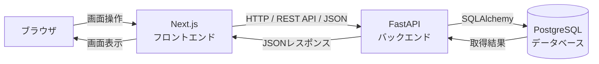

# 図書管理システム 全体説明

このドキュメントは、図書管理システムの完成状態を初学者向けに説明したものです。
「何がどこにあり、なぜそうなっているか」を中心にまとめています。

---

## 目次

1. [システム概要](#1-システム概要)
2. [技術スタック](#2-技術スタック)
3. [データの流れ](#3-データの流れ)
4. [バックエンドの3層構造](#4-バックエンドの3層構造)
5. [API一覧](#5-api一覧)
6. [データベース設計](#6-データベース設計)
7. [認証・認可の仕組み](#7-認証認可の仕組み)
8. [監査ログ](#8-監査ログ)
9. [エラーハンドリングと構造化ログ](#9-エラーハンドリングと構造化ログ)
10. [テスト戦略](#10-テスト戦略)
11. [Docker・CI環境](#11-dockerci環境)

---

## 1. システム概要

このシステムは、図書館の本を管理するためのWebアプリケーションです。

### できること

| 操作 | 誰でもできるか | 備考 |
|------|--------------|------|
| 本の一覧を見る | 誰でも | 未ログインでも閲覧できる |
| 本を登録・編集・削除する | 管理者のみ | ログインが必要 |
| 監査ログを見る | 管理者のみ | 誰がいつ操作したかを確認できる |

### 画面一覧

| URL | 画面名 | 用途 |
|-----|--------|------|
| `/books` | 本の一覧 | 登録されている本を表で表示。ログイン必須 |
| `/books/new` | 新規登録 | フォームから本を登録 |
| `/books/[id]/edit` | 編集 | 登録済みの本を更新 |
| `/login` | ログイン | IDとパスワードで認証 |

削除は専用画面を持たず、一覧画面の削除ボタン→確認ダイアログで行います。

---

## 2. 技術スタック

```
┌─────────────────────────────────────────────────────────┐
│  技術          役割                                       │
├─────────────────────────────────────────────────────────┤
│  Next.js       画面を作る（フロントエンド）TypeScript製    │
│  FastAPI       APIを提供する（バックエンド）Python製       │
│  PostgreSQL    データを永続保存する（データベース）         │
│  SQLAlchemy    PythonからDBを操作するライブラリ(ORM)       │
│  Alembic       DBのテーブル構造を変更するツール            │
│  Docker        アプリをコンテナとして動かす仕組み          │
│  GitHub Actions コードをpushするたびに自動でテストするCI   │
│  Playwright    ブラウザを自動操作してテストするツール       │
└─────────────────────────────────────────────────────────┘
```

### ORM（SQLAlchemy）とは

SQL文を直接書く代わりに、Pythonのクラス定義でDBテーブルを表現できる仕組みです。
例えば `Book` クラスが `books` テーブルに対応し、`book.title` でカラムにアクセスできます。

### Alembicとは

「DBのテーブル構造の変更履歴」をファイルとして管理するツールです。
新しいカラムを追加したいとき、Alembicのマイグレーションファイルを作成・実行することで、
本番環境でも安全に構造変更ができます。

---

## 3. データの流れ

### 概要



### 「本を登録する」1リクエストの具体的な流れ

```
[ユーザー]
  ↓ フォームに本の情報を入力して「登録」ボタンをクリック

[Next.js フロントエンド: lib/api.ts]
  ↓ POST /api/books にJSONを送る（HTTP通信）

[FastAPI バックエンド: routers/books.py]
  ↓ URLとHTTPメソッドを見て、担当する関数を呼び出す
  ↓ Cookieのトークンを確認し、adminかどうかを検証する

[services/book.py]
  ↓ 業務ルールを確認する（ISBNの重複がないかなど）

[repositories/book.py]
  ↓ DBへINSERT文を発行する（SQLAlchemy経由）

[PostgreSQL]
  ↓ データを保存して結果を返す

[FastAPI → Next.js → ブラウザ]
  ↓ JSONで登録結果を返す
  ↓ 一覧画面にリダイレクトして新しいデータが表示される
```

### フロントエンドの通信先について

フロントエンドには2つの実行環境があり、APIのURLが異なります。

| 実行環境 | 使うURL | 説明 |
|---------|---------|------|
| Next.jsサーバー（SSR） | `INTERNAL_API_BASE_URL` | コンテナ内部での通信に使う |
| ブラウザ | `window.location.hostname:8000` | ブラウザからFastAPIへ直接通信する |

ブラウザからは `window.location.hostname` を使ってURLを動的に組み立てています。
これにより `localhost:3000` でも `127.0.0.1:3000` でも、ログインCookieの保存先と
API通信先のホスト名が一致し、Cookieが正しく送られます。

---

## 4. バックエンドの3層構造

バックエンドは **routers → services → repositories** の3層に分けて実装されています。

```
routers/books.py        ← URLとHTTPメソッドの定義、認証チェック
       ↓
services/book.py        ← 業務ルール（重複チェック、監査ログ記録）
       ↓
repositories/book.py    ← DBの読み書き専門
```

### なぜ3層に分けるか

| 層 | 役割 | ここに書いてはいけないもの |
|----|------|--------------------------|
| routers | URLの定義、認証、レスポンス形式 | SQL、業務ルール |
| services | 業務ルール、複数の操作のまとめ | SQLの直接記述、HTTPの詳細 |
| repositories | DBのCRUD処理 | 業務ルール、エラー変換 |

分けることで「どこで何が起きているか」を探しやすくなります。
例えばISBNの重複チェックロジックを変えたいなら `services/book.py` だけ見ればよい、
SQLのパフォーマンスを改善したいなら `repositories/book.py` だけ見ればよい、という状態になっています。

### 各ファイルの具体的な責務

```
backend/app/
├── main.py              アプリ起動、ミドルウェア登録、エラーハンドラー登録
├── database.py          DB接続設定、セッション管理
├── errors.py            アプリ全体で使う例外クラスの定義
├── observability.py     構造化ログ出力、request_id管理
├── models/
│   ├── book.py          booksテーブルのSQLAlchemy定義
│   ├── user.py          usersテーブルのSQLAlchemy定義
│   └── audit_log.py     audit_logsテーブルのSQLAlchemy定義
├── schemas/
│   ├── book.py          本のAPIリクエスト/レスポンスのPydantic定義
│   ├── auth.py          認証APIのPydantic定義
│   ├── user.py          ユーザーのPydantic定義
│   ├── audit.py         監査ログのPydantic定義
│   └── error.py         エラーレスポンスのPydantic定義
├── routers/
│   ├── books.py         /api/books 系のエンドポイント
│   ├── auth.py          /api/auth 系のエンドポイント
│   ├── admin.py         /api/admin/bootstrap エンドポイント
│   └── audit_logs.py    /api/audit-logs エンドポイント
├── services/
│   ├── book.py          本の業務ロジック（重複チェック、監査ログ呼び出し）
│   ├── auth.py          認証処理（ログイン、トークン検証、現在ユーザー取得）
│   ├── security.py      パスワードハッシュ、JWTトークン生成・検証
│   ├── audit_log.py     監査ログ記録ロジック
│   └── user.py          ユーザー作成ロジック
└── repositories/
    ├── book.py          booksテーブルのCRUD
    ├── user.py          usersテーブルの検索・作成
    └── audit_log.py     audit_logsテーブルへの追加・取得
```

### modelsとschemasの違い

よく混乱するのが `models` と `schemas` の違いです。

| | models | schemas |
|--|--------|---------|
| 役割 | DBテーブルの定義（SQLAlchemy） | APIの入出力の定義（Pydantic） |
| どこで使う | repositories層でDBと話すとき | routers層でリクエスト/レスポンスを扱うとき |
| 例 | `Book` クラス → `books` テーブル | `BookCreate` クラス → POST時の入力 |

---

## 5. API一覧

| メソッド | URL | 用途 | 認証要否 |
|---------|-----|------|---------|
| GET | `/health` | 疎通確認 | 不要 |
| GET | `/api/books` | 本の一覧取得 | 不要 |
| GET | `/api/books/{id}` | 本を1件取得 | 不要 |
| POST | `/api/books` | 本の新規登録 | **admin必須** |
| PUT | `/api/books/{id}` | 本の更新 | **admin必須** |
| DELETE | `/api/books/{id}` | 本の削除 | **admin必須** |
| POST | `/api/admin/bootstrap` | 初期管理者を1回だけ作成 | 不要（ユーザー0件のときのみ） |
| POST | `/api/auth/login` | ログイン | 不要 |
| POST | `/api/auth/logout` | ログアウト | 不要 |
| GET | `/api/auth/me` | 現在の認証ユーザー取得 | 認証済みユーザー |
| GET | `/api/audit-logs` | 監査ログ取得 | **admin必須** |

### エラーレスポンスの共通形式

全てのエラーは以下の形式で返します。

```json
{
  "detail": "認証が必要です",
  "error_code": "authentication_required",
  "request_id": "2e4f7d2a6f0e4ef1b32d5f4af3a6a4dd"
}
```

- `detail`: 日本語の説明（画面にそのまま表示できる）
- `error_code`: プログラムで判定するための固定文字列
- `request_id`: このリクエスト固有のID（ログとレスポンスを紐づけて調査できる）

入力エラー（422）の場合は `errors` 配列が追加され、どのフィールドが不正だったかも返します。

---

## 6. データベース設計

### booksテーブル

本の情報を保存するテーブルです。

| カラム | 型 | 制約 | 説明 |
|--------|-----|------|------|
| `id` | INTEGER | PK, 自動採番 | 本の識別子 |
| `title` | VARCHAR(255) | NOT NULL | タイトル |
| `author` | VARCHAR(255) | NOT NULL | 著者名 |
| `published_year` | INTEGER | NULL可, 1以上 | 出版年 |
| `isbn` | VARCHAR(20) | NULL可, UNIQUE | ISBN |
| `created_at` | TIMESTAMP WITH TIME ZONE | NOT NULL | 登録日時(UTC) |
| `updated_at` | TIMESTAMP WITH TIME ZONE | NOT NULL | 更新日時(UTC) |

**ISBNがNULLになる設計理由**: ISBNを未入力にすると `NULL` として保存します。
`UNIQUE` 制約はDBの仕様上 `NULL` 同士を同一視しないため、
ISBN未入力の本を複数登録しても重複エラーになりません。

### usersテーブル

ログインできる利用者の情報を保存するテーブルです。

| カラム | 型 | 制約 | 説明 |
|--------|-----|------|------|
| `id` | INTEGER | PK, 自動採番 | 利用者の識別子 |
| `email` | VARCHAR(255) | NOT NULL, UNIQUE | メールアドレス |
| `username` | VARCHAR(50) | NOT NULL, UNIQUE | ユーザー名 |
| `password_hash` | VARCHAR(255) | NOT NULL | ハッシュ化済みパスワード |
| `role` | VARCHAR(20) | NOT NULL | 現在は `admin` のみ |
| `is_active` | BOOLEAN | NOT NULL | 有効フラグ |
| `created_at` | TIMESTAMP WITH TIME ZONE | NOT NULL | 作成日時 |
| `updated_at` | TIMESTAMP WITH TIME ZONE | NOT NULL | 更新日時 |

パスワードは平文で保存せず、`scrypt` でハッシュ化してから保存します。

### audit_logsテーブル

「誰がいつどの本を操作したか」の履歴を保存するテーブルです。

| カラム | 型 | 制約 | 説明 |
|--------|-----|------|------|
| `id` | INTEGER | PK, 自動採番 | 識別子 |
| `actor_user_id` | INTEGER | NULL可 | 実行者のユーザーID |
| `actor_email` | VARCHAR(255) | NULL可 | 実行時点のメールアドレス |
| `action` | VARCHAR(20) | NOT NULL | `create` / `update` / `delete` |
| `target_type` | VARCHAR(50) | NOT NULL | 現在は `book` のみ |
| `target_id` | INTEGER | NOT NULL | 操作した本のID |
| `target_title` | VARCHAR(255) | NOT NULL | 操作時点の本のタイトル |
| `occurred_at` | TIMESTAMP WITH TIME ZONE | NOT NULL | 操作日時 |

**外部キーを使わない設計理由**: 本が削除されても「削除した」という記録を残し続けるため、
`books.id` への外部キーではなく `target_id` と `target_title` のスナップショット（操作時点のコピー）を保持します。

---

## 7. 認証・認可の仕組み

### 全体フロー

```
[ログイン]
  ユーザーがemail/usernameとパスワードを入力
        ↓
  POST /api/auth/login
        ↓
  DBからユーザーを検索し、パスワードを照合（scrypt）
        ↓
  一致したらJWTトークンを生成
        ↓
  HttpOnly Cookie (library_access_token) に保存して返す
        ↓
  以降のリクエストでは自動的にCookieが送られる

[認証が必要なAPIへのアクセス]
  CookieのJWTトークンを取り出す
        ↓
  署名を検証し、有効期限（30分）を確認
        ↓
  payloadのuser_idでDBからユーザーを取得
        ↓
  roleが'admin'かどうかを確認
        ↓
  OKならAPIの処理を実行 / NGなら401または403を返す
```

### パスワードのハッシュ化（scrypt）

パスワードは「元の文字列に戻せない一方向の変換」をかけて保存します。

```
登録時: パスワード文字列 → scrypt変換 → ハッシュ文字列をDBに保存
照合時: 入力されたパスワード → scrypt変換 → DBのハッシュと比較
```

`scrypt` はパスワードの解析を計算コストで困難にするアルゴリズムです。
`bcrypt` より安全とされており、Pythonの標準ライブラリに含まれています。

### JWTトークンの構造

JWTは `ヘッダー.ペイロード.署名` の3パーツをBase64でエンコードした文字列です。

```
payload（ペイロード）の中身:
{
  "sub": "1",            ← ユーザーID
  "email": "admin@...",  ← メールアドレス
  "role": "admin",       ← ロール
  "iat": 1719000000,     ← 発行日時（Unix時刻）
  "exp": 1719001800      ← 有効期限（30分後）
}
```

署名は `AUTH_SECRET_KEY` という環境変数の値を使ってHMAC-SHA256で生成します。
この秘密鍵がなければトークンを偽造できないため、サーバー側でのみ検証できます。

### HttpOnly Cookieを使う理由

トークンをLocalStorageではなくHttpOnly Cookieに保存しています。
HttpOnly CookieはJavaScriptから読めないため、XSS攻撃でトークンを盗まれるリスクを減らせます。

---

## 8. 監査ログ

本の作成・更新・削除が成功するたびに、`audit_logs` テーブルに1件記録されます。

### どこで記録するか

```
routers/books.py
  → services/book.py
      → repositories/book.py（DB操作）
      → services/audit_log.py（監査ログ追加）
      → db.commit()（まとめてコミット）
```

「本の保存」と「監査ログの記録」は同じDBトランザクション内で行います。
そのため、どちらかが失敗すると両方ロールバックされます。
本の保存だけ成功して監査ログがない、という中途半端な状態になりません。

### 削除後も追跡できる仕組み

本を削除した後も「誰が削除したか」を追跡できるよう、
削除前に `target_id` と `target_title` を監査ログへコピーしてから削除します。

---

## 9. エラーハンドリングと構造化ログ

### エラー例外クラス

```
AppError（基底クラス）
  ├── AuthenticationRequiredError  → 401 / 認証が必要です
  ├── AuthorizationError           → 403 / この操作は管理者だけが実行できます
  ├── ResourceNotFoundError        → 404 / 指定されたリソースは見つかりません
  └── ConflictError                → 409 / 重複データが存在します
```

services層で `BookNotFoundError` のようなドメイン固有例外を発生させ、
routers層で `ResourceNotFoundError` に変換しています。
こうすることでservices層がHTTPの知識を持たずに済みます。

### 構造化ログ

1リクエストにつき1行、JSON形式でログを出力します。

```json
{
  "timestamp": "2026-06-25T10:00:00.123456+00:00",
  "level": "INFO",
  "event": "request.completed",
  "request_id": "a1b2c3d4...",
  "method": "POST",
  "path": "/api/books",
  "status_code": 201,
  "duration_ms": 42.5,
  "client_ip": "127.0.0.1"
}
```

構造化ログにすることで、`request_id` をキーにしてログとAPIレスポンスを紐づけられます。
障害調査のときに「このリクエストで何が起きたか」を追跡しやすくなります。

---

## 10. テスト戦略

このシステムでは3種類のテストを使い分けています。

### pytest（バックエンドAPIテスト）

`backend/tests/` 配下に配置。FastAPIの `TestClient` を使い、
実際にHTTPリクエストを発行してレスポンスを検証します。

```
対象: APIの入力・出力・ステータスコード・エラー処理
テストDB: SQLiteのインメモリDB（高速、テストごとに初期化）
実行: pytest コマンド
```

主なテストファイル:
- `test_books_api.py` — 本のCRUD全パターン
- `test_auth_api.py` — ログイン・認証・ログアウト
- `test_audit_logs_api.py` — 監査ログの記録確認
- `test_error_handling_api.py` — エラーレスポンスの形式確認

### Playwright（E2Eテスト）

`frontend/e2e/` 配下に配置。実際のブラウザを自動操作して画面レベルで確認します。

```
対象: ブラウザ操作→Next.js→FastAPI→PostgreSQLまでの全体フロー
実行環境: ローカル直接起動（ポート3000）またはDocker Compose（ポート3000）
```

主なテストファイル:
- `books-crud.spec.ts` — 本のCRUD画面操作
- `login-page.spec.ts` — ログイン画面の動作確認
- `docker-compose-books-crud.spec.ts` — Docker Compose上での全体E2E
- `docker-compose-connectivity.spec.ts` — サービス間の疎通確認

### なぜ2種類のテストが必要か

| | pytest | Playwright |
|-|--------|-----------|
| 速さ | 速い（DB直接、ブラウザなし） | 遅い（ブラウザ操作が必要） |
| 粒度 | API単体で細かく確認できる | 画面からDBまでの全体を確認できる |
| 向いている用途 | 業務ロジックの細かいパターン | 「実際に動くか」の最終確認 |

pytestで細かいAPI仕様を確認し、Playwrightで「ユーザーが実際に使えるか」を確認する役割分担です。

---

## 11. Docker・CI環境

### Docker Composeの構成

```
┌──────────────────────────────────────────────┐
│  docker-compose.yml が定義する3サービス        │
│                                              │
│  ┌──────────┐   ┌──────────┐   ┌──────────┐ │
│  │ frontend │ → │ backend  │ → │    db    │ │
│  │ Next.js  │   │ FastAPI  │   │ Postgres │ │
│  │ :3000    │   │  :8000   │   │  :5432   │ │
│  └──────────┘   └──────────┘   └──────────┘ │
└──────────────────────────────────────────────┘
```

起動順序は `depends_on` で制御されています。
- `backend` は `db` のヘルスチェックが通ってから起動
- `frontend` は `backend` が起動してから起動

backendコンテナは起動時に `alembic upgrade head` を自動実行するため、
DBのマイグレーションを別途手動実行する必要はありません。

### 環境変数

ローカルとDocker Composeで接続先URLが異なるため、環境変数で切り替えています。

| 変数 | ローカル直接実行 | Docker Compose |
|------|----------------|----------------|
| `DATABASE_URL` | `postgresql+psycopg://...@localhost:5432/library` | `postgresql+psycopg://...@db:5432/library` |
| `NEXT_PUBLIC_API_BASE_URL` | `http://localhost:8000` | `http://localhost:8000` |
| `INTERNAL_API_BASE_URL` | `http://localhost:8000` | `http://backend:8000` |

`INTERNAL_API_BASE_URL` だけDocker Compose時に差分があります。
Next.jsサーバーが `backend:8000` というコンテナ内部のホスト名で直接FastAPIに通信するためです。

### GitHub Actions の3つのワークフロー

```
push / pull_requestのたびに自動実行される

backend-ci.yml
  → ruff check（Pythonのlint）
  → ruff format --check（フォーマット確認）
  → pytest（APIテスト）

frontend-ci.yml
  → npm run lint（ESLintのチェック）
  → npm run build（ビルドエラーがないか確認）

e2e-ci.yml
  → docker compose up（3サービスを起動）
  → Playwright（画面E2Eテストを実行）
  → docker compose down（後片付け）
```

ローカルでの手動確認は「開発中の切り分け・デバッグ」を担当し、
CIでの自動実行は「変更のたびに壊れていないか継続確認する」を担当します。
この2つの役割分担があることで、コードを変更するたびに全部手動で確認する必要がなくなります。
